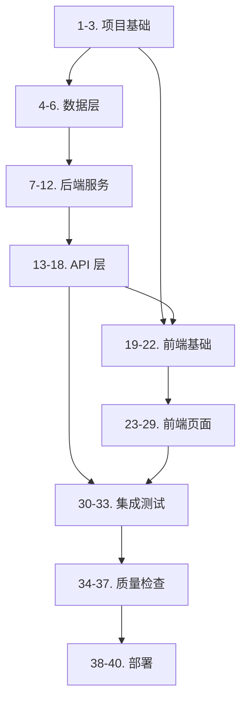

# 实施待办清单 - 勤务时间管理 App（企业版）

## 实施计划概述

本待办清单基于已批准的需求文档（specification.md）和设计文档（design.md）制定，将功能拆分为独立的、可执行的编码待办项，遵循测试驱动开发（TDD）原则。

---

## 待办清单

### 阶段 1：项目基础设置

- [ ] 1. 配置 Monorepo 项目结构
  - 创建 `apps/web/` 前端应用目录（React 19 + Vite + TypeScript）
  - 创建 `apps/api/` 后端应用目录（Node.js + Fastify + TypeScript）
  - 配置根目录 `package.json` 作为 Workspace
  - 配置 TypeScript 共享配置
  - _需求：PF-001_

- [ ] 2. 配置代码质量和开发工具
  - 安装并配置 ESLint（前后端统一规则）
  - 安装并配置 Prettier
  - 配置 Husky + lint-staged 进行提交前检查
  - 配置 Vitest 测试框架（前后端）
  - _需求：PF-001_

- [ ] 3. 配置数据库连接
  - 安装 Drizzle ORM 和 PostgreSQL 驱动
  - 创建数据库连接配置模块
  - 配置环境变量管理（.env 文件）
  - 编写数据库连接测试
  - _需求：DM-001_

---

### 阶段 2：数据层实现

- [ ] 4. 定义数据库 Schema（Drizzle）
  - 创建 `users` 表 Schema（id, email, password_hash, name, role, department_id, is_active）
  - 创建 `attendances` 表 Schema（user_id, work_date, check_in/out_time, break_duration, overtime_duration, gps_data, status）
  - 创建 `overtime_requests` 表 Schema（user_id, request_date, start/end_time, reason, status, approver_id）
  - 创建 `leave_requests` 表 Schema（user_id, leave_type, start/end_date, reason, status, approver_id）
  - 创建 `approvals` 表 Schema（request_id, request_type, approver_id, status, comment）
  - 创建 `departments` 和 `work_locations` 表 Schema
  - 编写 Schema 单元测试验证字段类型和约束
  - _需求：DM-001_

- [ ] 5. 创建数据库迁移脚本
  - 编写初始迁移 SQL（创建所有表）
  - 创建索引（users_email, attendances_user_date, overtime_user 等）
  - 编写迁移测试验证表结构
  - _需求：DM-001_

- [ ] 6. 实现 Repository 层
  - 创建 `UserRepository` 接口和实现（findById, findByEmail, create, update, delete）
  - 创建 `AttendanceRepository` 接口和实现（findByUserAndDate, create, update, findHistory）
  - 创建 `RequestRepository` 接口和实现（createOvertime, createLeave, findPending, updateStatus）
  - 为每个 Repository 编写单元测试（使用内存 mock 和真实数据库两种模式）
  - _需求：DM-001, DM-002_

---

### 阶段 3：后端服务层实现

- [ ] 7. 实现认证服务（AuthService）
  - 实现 `login(email, password)` 方法：验证凭据、生成 JWT
  - 实现 `logout(token)` 方法：使令牌失效
  - 实现 `getCurrentUser(token)` 方法：解析 JWT 获取用户信息
  - 实现密码 bcrypt 加密工具函数
  - 编写 AuthService 单元测试（包括密码验证、JWT 生成/解析）
  - _需求：UM-001, UM-002, SC-001_

- [ ] 8. 实现认证中间件
  - 创建 JWT 验证中间件（验证 Token 有效性）
  - 创建角色权限中间件（检查用户角色）
  - 创建速率限制中间件（100 次/分钟）
  - 编写中间件单元测试
  - _需求：SC-001, SC-002_

- [ ] 9. 实现出勤服务（AttendanceService）
  - 实现 `clockIn(userId, gpsData)` 方法：记录出勤时间、验证位置
  - 实现 `clockOut(userId, gpsData)` 方法：记录退勤时间、计算工时
  - 实现 `startBreak(userId)` 和 `endBreak(userId)` 方法
  - 实现 `getTodayAttendance(userId)` 方法
  - 实现工时计算逻辑（扣除休息时间、计算加班）
  - 实现 GPS 位置验证工具（Haversine 公式计算距离）
  - 编写 AttendanceService 单元测试（包括边界情况：未出勤退勤、超时等）
  - _需求：AM-001, AM-002, GPS-001, GPS-002_

- [ ] 10. 实现申请服务（RequestService）
  - 实现 `submitOvertime(userId, dto)` 方法：创建加班申请
  - 实现 `submitLeave(userId, dto)` 方法：创建请假申请
  - 实现 `approveRequest(requestId, approverId, comment)` 方法
  - 实现 `rejectRequest(requestId, approverId, comment)` 方法
  - 实现 `getMyRequests(userId, status)` 和 `getPendingRequests(approverId)` 方法
  - 编写 RequestService 单元测试
  - _需求：AM-003, AM-004, AP-001, AP-002_

- [ ] 11. 实现报表服务（ReportService）
  - 实现 `generateDailyReport(userId, date)` 方法
  - 实现 `generateMonthlyReport(userId, year, month)` 方法
  - 实现 `generateTeamReport(start, end, department)` 方法
  - 实现 CSV 导出功能
  - 实现 Excel 导出功能（使用 xlsx 库）
  - 编写 ReportService 单元测试
  - _需求：RP-001, RP-002, RP-003_

- [ ] 12. 实现用户服务（UserService）
  - 实现 `createUser(dto)` 方法：创建用户（管理员专用）
  - 实现 `updateUser(id, dto)` 方法
  - 实现 `deleteUser(id)` 方法（软删除）
  - 实现 `listUsers(page, limit, role, department)` 方法
  - 编写 UserService 单元测试
  - _需求：UM-003_

---

### 阶段 4：后端 API 层实现

- [ ] 13. 实现认证路由（/api/auth）
  - 创建 `POST /login` 端点：请求验证、调用 AuthService
  - 创建 `POST /logout` 端点
  - 创建 `GET /me` 端点：获取当前用户
  - 编写路由集成测试（使用 Supertest）
  - _需求：UM-001, UM-002_

- [ ] 14. 实现出勤路由（/api/attendance）
  - 创建 `POST /clock-in` 端点
  - 创建 `POST /clock-out` 端点
  - 创建 `POST /break-start` 和 `POST /break-end` 端点
  - 创建 `GET /today` 端点
  - 创建 `GET /history` 端点（支持分页和日期范围）
  - 编写路由集成测试
  - _需求：AM-001, AM-002_

- [ ] 15. 实现申请路由（/api/requests）
  - 创建 `POST /overtime` 端点
  - 创建 `POST /leave` 端点
  - 创建 `GET /my` 端点
  - 创建 `GET /pending` 端点
  - 创建 `POST /:id/approve` 端点
  - 创建 `POST /:id/reject` 端点
  - 编写路由集成测试
  - _需求：AM-003, AM-004, AP-001, AP-002_

- [ ] 16. 实现报表路由（/api/reports）
  - 创建 `GET /daily` 端点
  - 创建 `GET /monthly` 端点
  - 创建 `GET /team` 端点
  - 创建 `POST /export` 端点
  - 编写路由集成测试
  - _需求：RP-001, RP-002, RP-003_

- [ ] 17. 实现用户管理路由（/api/users）
  - 创建 `GET /` 端点（管理员专用）
  - 创建 `POST /` 端点
  - 创建 `PUT /:id` 端点
  - 创建 `DELETE /:id` 端点
  - 编写路由集成测试
  - _需求：UM-003_

- [ ] 18. 实现全局错误处理
  - 创建统一错误响应格式
  - 实现错误分类处理（ValidationError, UnauthorizedError, ForbiddenError 等）
  - 实现错误日志记录
  - 编写错误处理测试
  - _需求：EH-001_

---

### 阶段 5：前端基础设置

- [ ] 19. 配置前端项目
  - 初始化 Vite + React 19 + TypeScript 项目
  - 安装并配置 shadcn/ui 组件库
  - 安装 react-hook-form 和 zod 用于表单处理
  - 安装 React Router 6 用于路由
  - 安装 Axios 用于 HTTP 请求
  - 安装 Recharts 用于图表
  - 安装 React Leaflet 用于地图展示
  - _需求：PF-001, UX-001_

- [ ] 20. 配置前端代码规范
  - 配置 ESLint + Prettier
  - 配置 TypeScript strict 模式
  - 配置 Testing Library 用于组件测试
  - _需求：PF-001_

- [ ] 21. 创建前端基础组件
  - 创建 AuthContext（认证状态管理）
  - 创建 API 服务层（Axios 实例、拦截器、错误处理）
  - 创建时区转换工具函数（UTC ↔ Asia/Tokyo）
  - 创建 GPS 工具函数
  - 编写工具函数单元测试
  - _需求：DM-001, GPS-001_

- [ ] 22. 创建通用 UI 组件
  - 创建 AttendanceButton 组件（出勤/退勤按钮）
  - 创建 RequestForm 组件（申请表单）
  - 创建 RequestStatus 组件（状态标识）
  - 创建 DataTable 组件（通用表格）
  - 创建 Pagination 组件
  - 为每个组件编写单元测试
  - _需求：UX-001_

---

### 阶段 6：前端页面实现

- [ ] 23. 实现登录页面（LoginScreen）
  - 创建登录表单（邮箱、密码）
  - 实现表单验证（zod schema）
  - 实现登录逻辑（调用 Auth API）
  - 实现错误提示显示
  - 实现登录成功跳转
  - 编写组件测试（Testing Library）
  - _需求：UM-001_

- [ ] 24. 实现仪表板页面（DashboardScreen）
  - 显示今日勤务状态（未出勤/出勤中/已退勤）
  - 显示快捷操作按钮（出勤/退勤/休息）
  - 显示待审批数量（管理者）
  - 显示本月工时统计
  - 编写组件测试
  - _需求：UX-001, RP-001_

- [ ] 25. 实现出勤管理页面（AttendanceScreen）
  - 显示今日勤务详情
  - 显示打卡按钮（出勤/退勤/休息开始/休息结束）
  - 实现 GPS 位置获取和显示
  - 显示历史勤务记录列表
  - 实现日期范围筛选
  - 编写组件测试
  - _需求：AM-001, AM-002, GPS-001_

- [ ] 26. 实现申请页面（RequestScreen）
  - 创建加班申请表单
  - 创建请假申请表单
  - 显示我的申请列表（带状态标识）
  - 实现申请状态筛选
  - （管理者）显示待审批列表
  - 实现审批操作（承認/却下）
  - 编写组件测试
  - _需求：AM-003, AM-004, AP-001, AP-002_

- [ ] 27. 实现报表页面（ReportScreen）
  - 实现日报表视图
  - 实现月报表视图
  - 实现团队报表视图（管理者）
  - 集成 Recharts 图表展示
  - 实现 CSV/Excel 导出功能
  - 实现日期范围筛选
  - 编写组件测试
  - _需求：RP-001, RP-002, RP-003_

- [ ] 28. 实现用户管理页面（AdminScreen）
  - 显示用户列表
  - 实现创建用户表单
  - 实现编辑用户功能
  - 实现停用/激活用户
  - （仅管理员可见）
  - 编写组件测试
  - _需求：UM-003_

- [ ] 29. 实现导航和布局
  - 创建主布局组件（Sidebar + Header + Content）
  - 实现角色菜单（根据角色显示不同菜单项）
  - 实现登出功能
  - 实现深色/浅色主题切换
  - 编写组件测试
  - _需求：UX-001, SC-002_

---

### 阶段 7：集成测试

- [ ] 30. 实现端到端认证流程测试
  - 测试登录 → 访问受保护页面 → 登出流程
  - 测试 Token 过期处理
  - 测试未授权访问重定向
  - _需求：UM-001, UM-002, SC-001_

- [ ] 31. 实现端到端出勤流程测试
  - 测试出勤打卡 → 休息记录 → 退勤打卡完整流程
  - 测试工时计算准确性
  - 测试 GPS 位置记录
  - _需求：AM-001, AM-002, GPS-001_

- [ ] 32. 实现端到端审批流程测试
  - 测试员工提交加班申请 → 管理者审批 → 员工查看结果
  - 测试请假申请流程
  - 测试却下理由必填验证
  - _需求：AP-001, AP-002_

- [ ] 33. 实现端到端报表测试
  - 测试日报生成
  - 测试月报生成
  - 测试团队报表
  - 测试数据导出
  - _需求：RP-001, RP-002, RP-003_

---

### 阶段 8：质量检查和优化

- [ ] 34. 运行全量测试并修复问题
  - 运行 `npm run test` 确保所有测试通过
  - 检查测试覆盖率（目标 80%+）
  - 修复失败的测试
  - _需求：PF-001_

- [ ] 35. 运行代码质量检查
  - 运行 `npm run lint` 修复 ESLint 问题
  - 运行 `npm run typecheck` 修复 TypeScript 类型错误
  - 运行 `npm run doctor`（React Doctor）修复组件问题
  - _需求：PF-001_

- [ ] 36. 性能优化
  - 优化数据库查询（添加必要索引）
  - 优化前端加载（代码分割、懒加载）
  - 优化 API 响应时间（目标 <500ms）
  - _需求：PF-001_

- [ ] 37. 安全加固
  - 验证所有 API 输入使用 Zod 校验
  - 验证 SQL 无注入风险
  - 验证 XSS 防护
  - 验证 CSRF 防护
  - _需求：SC-001, SC-002_

---

### 阶段 9：文档和部署

- [ ] 38. 编写 API 文档
  - 使用 OpenAPI/Swagger 生成 API 文档
  - 记录所有端点、请求/响应格式
  - 记录错误码说明
  - _需求：DM-002_

- [ ] 39. 编写部署文档
  - 编写 Docker 配置（Dockerfile, docker-compose.yml）
  - 编写环境变量配置说明
  - 编写数据库初始化步骤
  - _需求：PF-001_

- [ ] 40. 配置 CI/CD
  - 配置 GitHub Actions 工作流
  - 实现自动化测试
  - 实现自动化部署
  - _需求：PF-001_

---

## 依赖关系图

---

## 测试覆盖矩阵

| 需求编号 | 对应待办项 | 测试类型 |
|----------|-----------|----------|
| UM-001, UM-002 | 7, 13, 23, 30 | 单元 + 集成 + E2E |
| UM-003 | 12, 17, 28 | 单元 + 集成 |
| AM-001, AM-002 | 9, 14, 25, 31 | 单元 + 集成 + E2E |
| AM-003, AM-004 | 10, 15, 26 | 单元 + 集成 |
| AP-001, AP-002 | 10, 15, 26, 32 | 单元 + 集成 + E2E |
| GPS-001, GPS-002 | 9, 21, 25, 31 | 单元 + 集成 |
| RP-001, RP-002, RP-003 | 11, 16, 27, 33 | 单元 + 集成 + E2E |
| SC-001, SC-002 | 7, 8, 37 | 单元 + 安全测试 |
| PF-001 | 1, 2, 34-37 | 性能测试 |
| EH-001 | 18 | 单元 + 集成 |
| UX-001 | 19-22, 23-29 | 组件测试 |
| DM-001, DM-002 | 4-6, 38 | 单元 + 集成 |

---

## 执行顺序建议

1. **第 1 周**：待办 1-6（项目基础 + 数据层）
2. **第 2 周**：待办 7-12（后端服务层）
3. **第 3 周**：待办 13-18（后端 API 层）
4. **第 4 周**：待办 19-22（前端基础）
5. **第 5 周**：待办 23-29（前端页面）
6. **第 6 周**：待办 30-37（集成测试 + 质量检查）
7. **第 7 周**：待办 38-40（文档 + 部署）

---

## 完成标准

所有待办项完成后，系统应满足：
- ✅ 所有单元测试通过，覆盖率 ≥ 80%
- ✅ 所有集成测试通过
- ✅ 所有 E2E 测试通过
- ✅ ESLint/Prettier/TypeScript 检查通过
- ✅ React Doctor 检查通过
- ✅ API 响应时间 < 500ms（95% 请求）
- ✅ 页面加载时间 < 2 秒
- ✅ 安全测试通过（无 SQL 注入、XSS 漏洞）