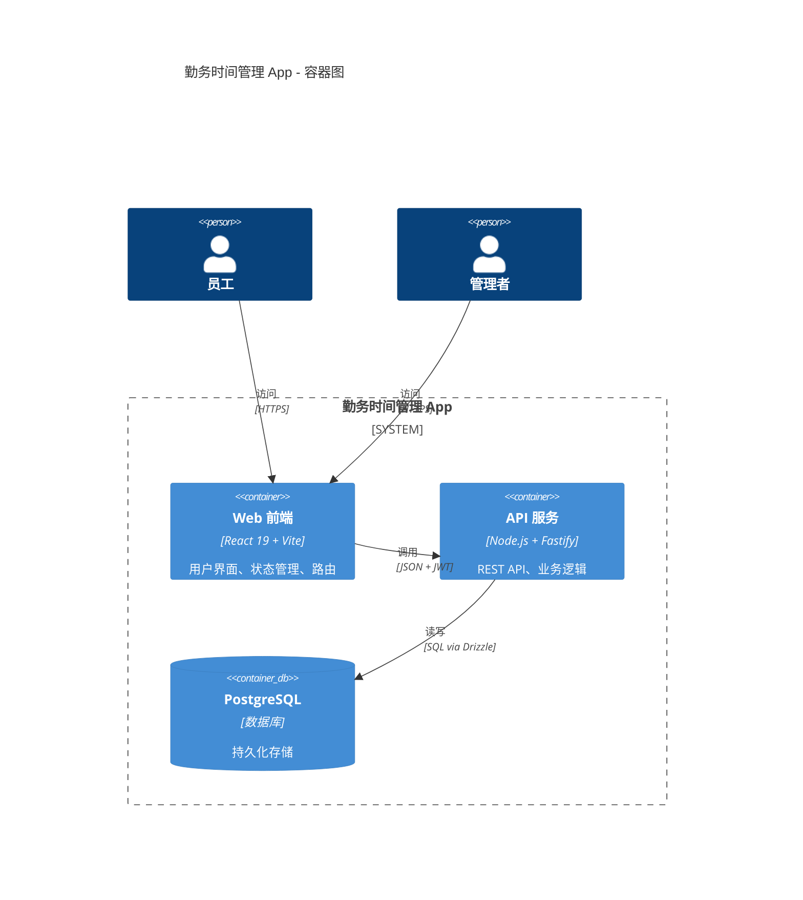
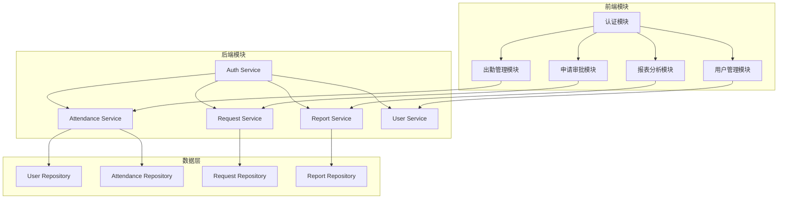
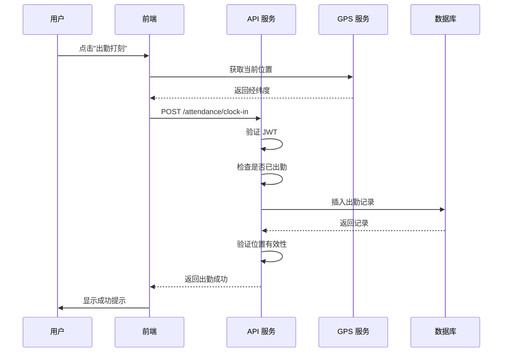
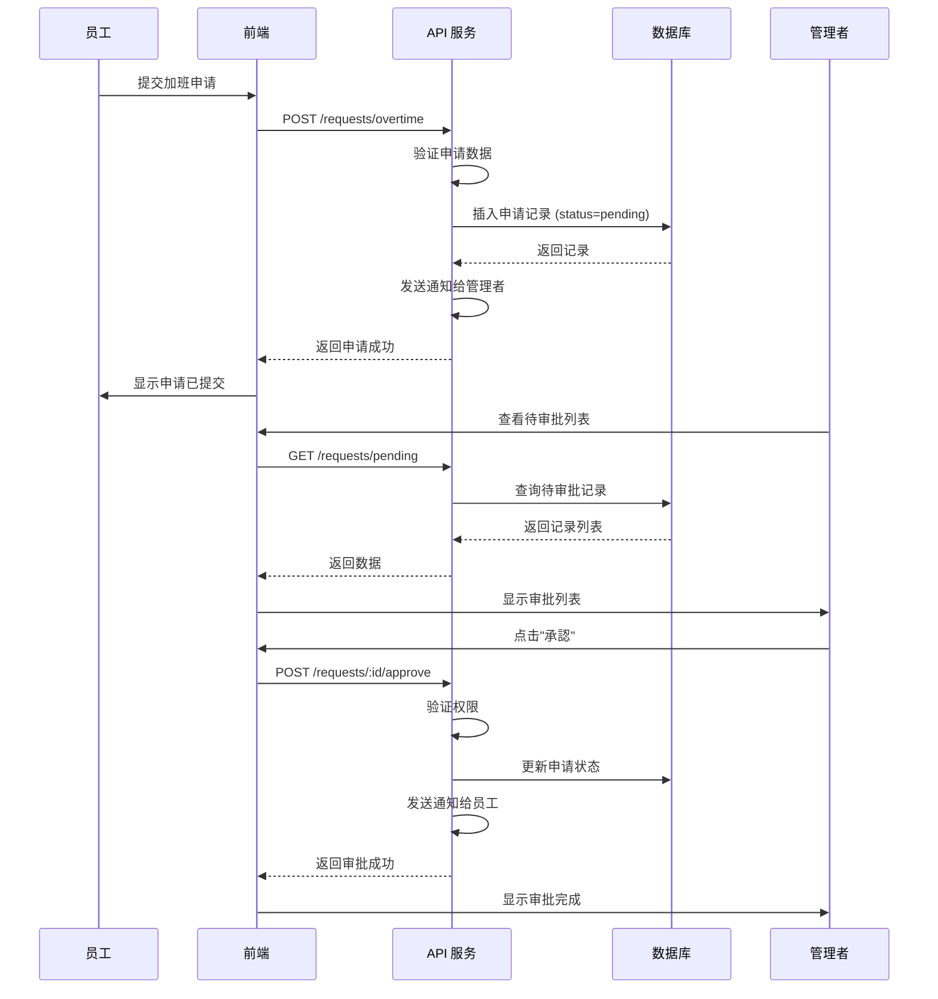
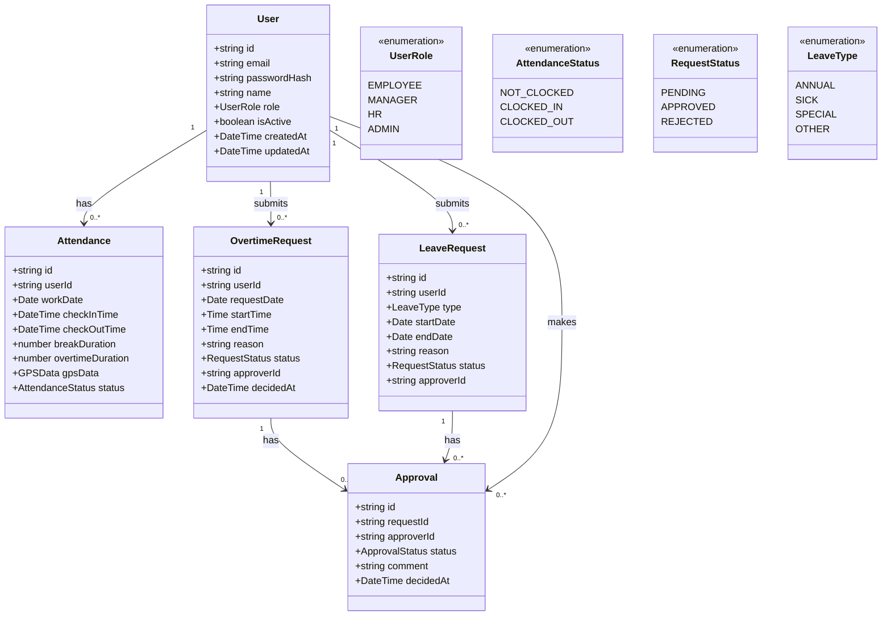
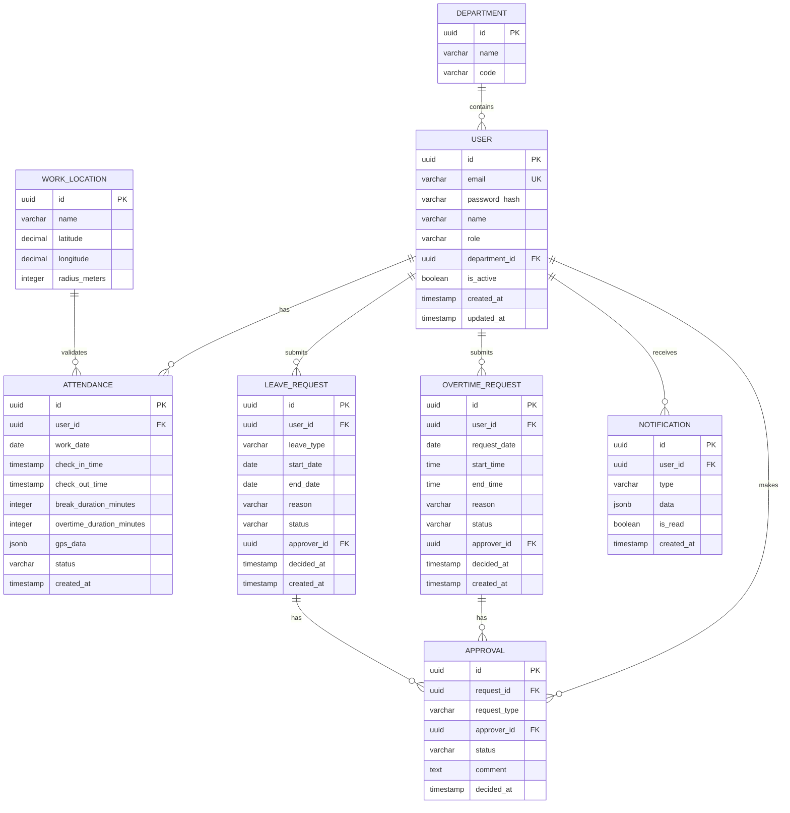
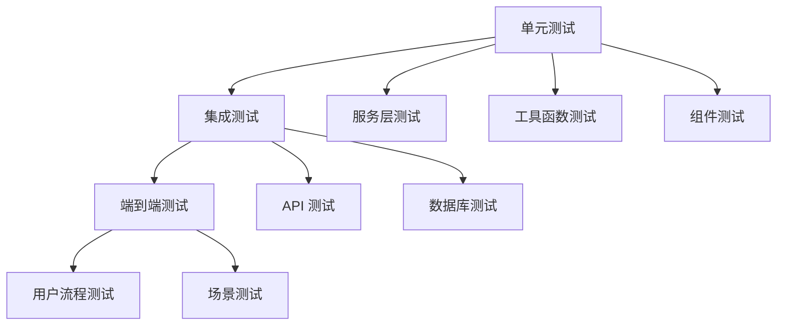
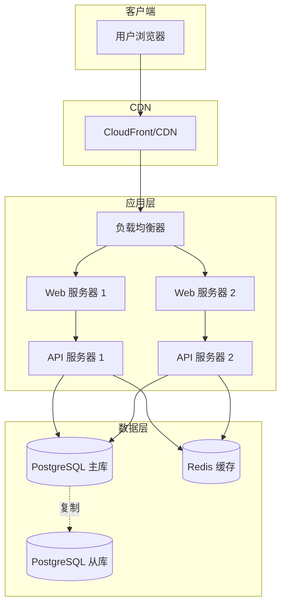

# 设计文档 - 勤务时间管理 App（企业版）

## 1. 概述

### 1.1 系统总结

本系统是一个 React 全栈勤务时间管理应用，提供出勤打卡、工时统计、GPS 定位、审批流程和报表分析功能。系统采用前后端分离架构，支持多角色访问控制。

### 1.2 目的与价值

- **目的**：实现企业级勤务管理数字化，替代传统纸质/Excel 考勤
- **价值**：提高数据准确性、支持合规审计、减少管理成本
- **目标用户**：员工、管理者、HR、系统管理员
- **关键技术**：React 19、Fastify、PostgreSQL、Drizzle ORM

### 1.3 使用场景

| 场景 | 用户 | 操作 |
|------|------|------|
| 每日打卡 | 员工 | 出勤/退勤打刻、休息记录 |
| 加班申请 | 员工 | 提交加班申请、查看审批状态 |
| 审批管理 | 管理者 | 审批加班/请假申请 |
| 报表导出 | HR | 导出月度勤务数据用于薪酬计算 |
| 位置验证 | 系统 | 自动验证打卡位置是否在有效范围内 |

---

## 2. 技术架构

### 2.1 C4 组件图

```mermaid
C4Context
  title 勤务时间管理 App - 系统上下文图

  Person(employee, "员工（従業員）", "日常打卡、查看工时")
  Person(manager, "管理者（マネージャー）", "审批申请、查看团队报表")
  Person(hr, "HR/人事", "数据导出、薪酬计算")
  Person(admin, "系统管理员", "用户管理、系统配置")

  System_Boundary(system, "勤务时间管理 App") {
    Container(web_app, "Web 应用", "React 19 + TypeScript", "用户界面、交互逻辑")
    Container(api, "API 服务", "Node.js + Fastify", "业务逻辑、数据访问")
    ContainerDb(db, "PostgreSQL", "数据库", "用户、勤务、审批数据")
  }

  External_Boundary(external, "外部系统") {
    System_Ext payroll, "薪酬系统", "外部系统集成")
    System_Ext hr_system, "人事系统", "员工数据同步")
  }

  Rel(employee, web_app, "使用", "HTTPS")
  Rel(manager, web_app, "使用", "HTTPS")
  Rel(hr, web_app, "使用", "HTTPS")
  Rel(admin, web_app, "使用", "HTTPS")
  Rel(web_app, api, "调用", "REST API + JWT")
  Rel(api, db, "读写", "Drizzle ORM")
  Rel_Back(api, payroll, "数据导出", "REST/Webhook")
  Rel_Back(api, hr_system, "数据同步", "REST API")
```

### 2.2 容器图



### 2.3 技术选型

| 层 | 技术 | 版本 | 选型理由 |
|----|------|------|----------|
| **前端框架** | React | 19+ | 组件化、生态丰富、性能优秀 |
| **构建工具** | Vite | 5+ | 快速启动、热更新、Tree-shaking |
| **语言** | TypeScript | 5+ | 类型安全、IDE 支持 |
| **UI 组件** | shadcn/ui | latest | 可定制、无障碍、现代设计 |
| **表单处理** | react-hook-form | 7+ | 性能优秀、易用 |
| **表单校验** | zod | 3+ | TypeScript 优先、schema 定义 |
| **状态管理** | React Context + Hooks | - | 轻量、足够满足需求 |
| **路由** | React Router | 6+ | 成熟稳定、支持嵌套路由 |
| **HTTP 客户端** | Axios | 1+ | 拦截器、错误处理、取消请求 |
| **图表** | Recharts | 2+ | React 友好、易定制 |
| **地图** | React Leaflet | 4+ | 开源、轻量、支持 GPS 展示 |
| **后端框架** | Fastify | 4+ | 高性能、低开销、插件生态 |
| **ORM** | Drizzle ORM | latest | 类型安全、SQL-like、轻量 |
| **数据库** | PostgreSQL | 15+ | 可靠、功能丰富、JSON 支持 |
| **认证** | JWT (jsonwebtoken) | 9+ | 无状态、可扩展 |
| **密码加密** | bcrypt | 5+ | 安全、成熟 |
| **测试** | Vitest | 1+ | 快速、兼容 Jest API |
| **前端测试** | Testing Library | 14+ | 用户视角测试 |
| **代码质量** | ESLint + Prettier | - | 代码风格统一 |

---

## 3. 业务实现

### 3.1 模块划分



### 3.2 目录结构

```
E:/IdeaProjects/GienHarness/
├── apps/
│   ├── web/                          # 前端应用
│   │   ├── src/
│   │   │   ├── components/           # 通用组件
│   │   │   │   ├── ui/               # shadcn/ui 组件
│   │   │   │   ├── attendance/       # 出勤相关组件
│   │   │   │   ├── request/          # 申请相关组件
│   │   │   │   └── report/           # 报表相关组件
│   │   │   ├── screens/              # 页面组件
│   │   │   │   ├── LoginScreen.tsx
│   │   │   │   ├── DashboardScreen.tsx
│   │   │   │   ├── AttendanceScreen.tsx
│   │   │   │   ├── RequestScreen.tsx
│   │   │   │   ├── ReportScreen.tsx
│   │   │   │   └── AdminScreen.tsx
│   │   │   ├── services/             # API 服务
│   │   │   │   ├── api.ts            # Axios 实例
│   │   │   │   ├── auth.service.ts
│   │   │   │   ├── attendance.service.ts
│   │   │   │   ├── request.service.ts
│   │   │   │   └── report.service.ts
│   │   │   ├── hooks/                # 自定义 Hooks
│   │   │   ├── context/              # React Context
│   │   │   │   └── AuthContext.tsx
│   │   │   ├── utils/                # 工具函数
│   │   │   │   ├── timezone.ts       # 时区转换
│   │   │   │   ├── gps.ts            # GPS 计算
│   │   │   │   └── validation.ts     # 校验函数
│   │   │   ├── types/                # TypeScript 类型
│   │   │   └── App.tsx
│   │   └── package.json
│   │
│   └── api/                          # 后端应用
│       ├── src/
│       │   ├── index.ts              # 入口
│       │   ├── server.ts             # Fastify 服务器
│       │   ├── routes/               # 路由
│       │   │   ├── auth.routes.ts
│       │   │   ├── attendance.routes.ts
│       │   │   ├── request.routes.ts
│       │   │   ├── report.routes.ts
│       │   │   └── user.routes.ts
│       │   ├── controllers/          # 控制器
│       │   ├── services/             # 业务服务
│       │   │   ├── auth.service.ts
│       │   │   ├── attendance.service.ts
│       │   │   ├── request.service.ts
│       │   │   ├── report.service.ts
│       │   │   └── user.service.ts
│       │   ├── repositories/         # 数据访问
│       │   │   ├── user.repository.ts
│       │   │   ├── attendance.repository.ts
│       │   │   └── request.repository.ts
│       │   ├── schemas/              # Zod Schema
│       │   │   ├── auth.schema.ts
│       │   │   ├── attendance.schema.ts
│       │   │   └── request.schema.ts
│       │   ├── middleware/           # 中间件
│       │   │   ├── auth.middleware.ts
│       │   │   └── rate-limit.middleware.ts
│       │   └── db/                   # 数据库
│       │       ├── schema.ts         # Drizzle Schema
│       │       └── index.ts          # 连接
│       └── package.json
│
├── packages/
│   ├── domain/                       # 领域层（可选）
│   │   ├── entities/                 # 实体
│   │   └── value-objects/            # 值对象
│   ├── application/                  # 应用服务层（可选）
│   └── shared/                       # 共享代码
│       ├── types/                    # 共享类型
│       └── utils/                    # 共享工具
│
├── designdoc/specs/
│   ├── requirements.md
│   ├── design.md
│   └── tasks.md
│
└── package.json                      # Monorepo 根配置
```

### 3.3 REST API 设计

#### 认证接口

| 方法 | 路径 | 描述 | 请求体 | 响应 |
|------|------|------|--------|------|
| POST | `/api/auth/login` | 用户登录 | `{ email, password }` | `{ token, user }` |
| POST | `/api/auth/logout` | 用户登出 | - | `{ success: true }` |
| GET | `/api/auth/me` | 获取当前用户 | - | `{ user }` |

#### 出勤接口

| 方法 | 路径 | 描述 | 请求体 | 响应 |
|------|------|------|--------|------|
| POST | `/api/attendance/clock-in` | 出勤打卡 | `{ latitude?, longitude? }` | `{ attendance }` |
| POST | `/api/attendance/clock-out` | 退勤打卡 | `{ latitude?, longitude? }` | `{ attendance }` |
| POST | `/api/attendance/break-start` | 休息开始 | - | `{ break }` |
| POST | `/api/attendance/break-end` | 休息结束 | - | `{ break }` |
| GET | `/api/attendance/today` | 今日勤务 | - | `{ attendance, breaks }` |
| GET | `/api/attendance/history` | 历史记录 | `?page&limit&start_date&end_date` | `{ data, total }` |

#### 申请接口

| 方法 | 路径 | 描述 | 请求体 | 响应 |
|------|------|------|--------|------|
| POST | `/api/requests/overtime` | 加班申请 | `{ date, start_time, end_time, reason }` | `{ request }` |
| POST | `/api/requests/leave` | 请假申请 | `{ type, start_date, end_date, reason }` | `{ request }` |
| GET | `/api/requests/my` | 我的申请列表 | `?status` | `{ data }` |
| GET | `/api/requests/pending` | 待审批列表 | - | `{ data }` |
| POST | `/api/requests/:id/approve` | 审批通过 | `{ comment? }` | `{ request }` |
| POST | `/api/requests/:id/reject` | 审批拒绝 | `{ comment }` | `{ request }` |

#### 报表接口

| 方法 | 路径 | 描述 | 请求体 | 响应 |
|------|------|------|--------|------|
| GET | `/api/reports/daily` | 日报表 | `?user_id&date` | `{ report }` |
| GET | `/api/reports/monthly` | 月报表 | `?user_id&month` | `{ report }` |
| GET | `/api/reports/team` | 团队报表 | `?start_date&end_date&department` | `{ report }` |
| POST | `/api/reports/export` | 导出报表 | `{ type, start_date, end_date, format }` | `{ file_url }` |

#### 用户接口

| 方法 | 路径 | 描述 | 请求体 | 响应 |
|------|------|------|--------|------|
| GET | `/api/users` | 用户列表 | `?page&limit&role` | `{ data, total }` |
| POST | `/api/users` | 创建用户 | `{ email, name, role, password }` | `{ user }` |
| PUT | `/api/users/:id` | 更新用户 | `{ name, role, is_active }` | `{ user }` |
| DELETE | `/api/users/:id` | 删除用户 | - | `{ success: true }` |

### 3.4 时序图

#### 出勤打卡流程



#### 加班审批流程



### 3.5 类图



### 3.6 核心业务方法示例

```typescript
// 出勤服务接口
interface AttendanceService {
  // 出勤打卡
  clockIn(userId: string, gps?: GPSData): Promise<Attendance>
  
  // 退勤打卡
  clockOut(userId: string, gps?: GPSData): Promise<Attendance>
  
  // 开始休息
  startBreak(userId: string): Promise<Break>
  
  // 结束休息
  endBreak(userId: string): Promise<Break>
  
  // 获取今日勤务
  getTodayAttendance(userId: string): Promise<TodayAttendance>
  
  // 计算工时
  calculateWorkHours(attendance: Attendance): Promise<WorkHours>
}

// 申请服务接口
interface RequestService {
  // 提交加班申请
  submitOvertime(userId: string, dto: OvertimeDto): Promise<OvertimeRequest>
  
  // 提交请假申请
  submitLeave(userId: string, dto: LeaveDto): Promise<LeaveRequest>
  
  // 审批申请
  approveRequest(requestId: string, approverId: string, comment?: string): Promise<Request>
  
  // 拒绝申请
  rejectRequest(requestId: string, approverId: string, comment: string): Promise<Request>
}

// 报表服务接口
interface ReportService {
  // 生成日报
  generateDailyReport(userId: string, date: Date): Promise<DailyReport>
  
  // 生成月报
  generateMonthlyReport(userId: string, year: number, month: number): Promise<MonthlyReport>
  
  // 生成团队报表
  generateTeamReport(start: Date, end: Date, department?: string): Promise<TeamReport>
  
  // 导出报表
  exportReport(report: Report, format: 'csv' | 'excel'): Promise<string>
}
```

---

## 4. 数据设计

### 4.1 实体关系图



### 4.2 核心表结构

#### users 表

| 字段 | 类型 | 约束 | 说明 |
|------|------|------|------|
| id | UUID | PK | 主键 |
| email | VARCHAR(255) | UNIQUE, NOT NULL | 邮箱 |
| password_hash | VARCHAR(255) | NOT NULL | 密码哈希 |
| name | VARCHAR(100) | NOT NULL | 姓名 |
| role | VARCHAR(50) | NOT NULL | 角色 |
| department_id | UUID | FK | 部门 ID |
| is_active | BOOLEAN | DEFAULT true | 是否激活 |
| created_at | TIMESTAMP | DEFAULT NOW() | 创建时间 (UTC) |
| updated_at | TIMESTAMP | DEFAULT NOW() | 更新时间 (UTC) |

#### attendances 表

| 字段 | 类型 | 约束 | 说明 |
|------|------|------|------|
| id | UUID | PK | 主键 |
| user_id | UUID | FK, NOT NULL | 用户 ID |
| work_date | DATE | NOT NULL | 工作日期 |
| check_in_time | TIMESTAMP | NULL | 出勤时间 (UTC) |
| check_out_time | TIMESTAMP | NULL | 退勤时间 (UTC) |
| break_duration_minutes | INTEGER | DEFAULT 0 | 休息时长 (分钟) |
| overtime_duration_minutes | INTEGER | DEFAULT 0 | 加班时长 (分钟) |
| gps_data | JSONB | NULL | GPS 数据 |
| status | VARCHAR(50) | NOT NULL | 状态 |
| created_at | TIMESTAMP | DEFAULT NOW() | 创建时间 (UTC) |

#### overtime_requests 表

| 字段 | 类型 | 约束 | 说明 |
|------|------|------|------|
| id | UUID | PK | 主键 |
| user_id | UUID | FK, NOT NULL | 用户 ID |
| request_date | DATE | NOT NULL | 申请日期 |
| start_time | TIME | NOT NULL | 开始时间 |
| end_time | TIME | NOT NULL | 结束时间 |
| reason | TEXT | NOT NULL | 理由 |
| status | VARCHAR(50) | DEFAULT 'pending' | 状态 |
| approver_id | UUID | FK, NULL | 审批人 ID |
| decided_at | TIMESTAMP | NULL | 审批时间 |
| created_at | TIMESTAMP | DEFAULT NOW() | 创建时间 (UTC) |

### 4.3 索引设计

```sql
-- users 表索引
CREATE INDEX idx_users_email ON users(email);
CREATE INDEX idx_users_department ON users(department_id);
CREATE INDEX idx_users_role ON users(role);

-- attendances 表索引
CREATE INDEX idx_attendances_user_date ON attendances(user_id, work_date);
CREATE INDEX idx_attendances_work_date ON attendances(work_date);
CREATE INDEX idx_attendances_status ON attendances(status);

-- overtime_requests 表索引
CREATE INDEX idx_overtime_user ON overtime_requests(user_id);
CREATE INDEX idx_overtime_status ON overtime_requests(status);
CREATE INDEX idx_overtime_date ON overtime_requests(request_date);

-- leave_requests 表索引
CREATE INDEX idx_leave_user ON leave_requests(user_id);
CREATE INDEX idx_leave_status ON leave_requests(status);

-- approvals 表索引
CREATE INDEX idx_approvals_request ON approvals(request_id);
CREATE INDEX idx_approvals_approver ON approvals(approver_id);
```

### 4.4 核心 SQL 示例

#### 获取用户月度工时统计

```sql
SELECT 
  work_date,
  check_in_time,
  check_out_time,
  break_duration_minutes,
  overtime_duration_minutes,
  EXTRACT(EPOCH FROM (check_out_time - check_in_time)) / 3600 - break_duration_minutes / 60 AS work_hours
FROM attendances
WHERE user_id = $1
  AND work_date >= $2
  AND work_date <= $3
ORDER BY work_date DESC;
```

#### 获取团队月度汇总

```sql
SELECT 
  u.id AS user_id,
  u.name AS user_name,
  COUNT(a.id) AS work_days,
  SUM(EXTRACT(EPOCH FROM (a.check_out_time - a.check_in_time)) / 3600) AS total_hours,
  SUM(a.break_duration_minutes) / 60 AS total_break_hours,
  SUM(a.overtime_duration_minutes) / 60 AS total_overtime_hours
FROM users u
LEFT JOIN attendances a ON u.id = a.user_id
  AND a.work_date >= $1
  AND a.work_date <= $2
WHERE u.department_id = $3
  AND u.is_active = true
GROUP BY u.id, u.name
ORDER BY u.name;
```

---

## 5. 错误处理

### 5.1 错误分类

| 类别 | HTTP 状态码 | 说明 |
|------|------------|------|
| 认证错误 | 401 | 未登录或 Token 过期 |
| 授权错误 | 403 | 无权限访问 |
| 资源不存在 | 404 | 请求的资源不存在 |
| 验证错误 | 400 | 请求数据验证失败 |
| 冲突错误 | 409 | 资源状态冲突 |
| 服务器错误 | 500 | 服务器内部错误 |

### 5.2 错误响应格式

```typescript
interface ErrorResponse {
  success: false
  error: {
    code: string           // 错误代码
    message: string        // 用户友好消息（日文）
    details?: object[]     // 详细错误信息
  }
}

// 示例
{
  "success": false,
  "error": {
    "code": "VALIDATION_ERROR",
    "message": "入力データが正しくありません",
    "details": [
      {
        "field": "email",
        "message": "メールアドレスの形式が正しくありません"
      }
    ]
  }
}
```

### 5.3 错误处理策略

```typescript
// 全局错误处理中间件
app.setErrorHandler((error, request, reply) => {
  if (error instanceof ValidationError) {
    return reply.status(400).send({
      success: false,
      error: { code: 'VALIDATION_ERROR', message: error.message }
    })
  }
  
  if (error instanceof UnauthorizedError) {
    return reply.status(401).send({
      success: false,
      error: { code: 'UNAUTHORIZED', message: '認証が必要です' }
    })
  }
  
  if (error instanceof ForbiddenError) {
    return reply.status(403).send({
      success: false,
      error: { code: 'FORBIDDEN', message: 'この操作は許可されていません' }
    })
  }
  
  // 记录服务器错误
  logger.error(error)
  
  return reply.status(500).send({
    success: false,
    error: { 
      code: 'INTERNAL_ERROR',
      message: 'システムエラーが発生しました。管理者にお問い合わせください'
    }
  })
})
```

---

## 6. 测试策略

### 6.1 测试层次



### 6.2 测试覆盖要求

| 类型 | 工具 | 覆盖率目标 | 说明 |
|------|------|-----------|------|
| 单元测试 | Vitest | 80%+ | 服务、工具、组件 |
| 集成测试 | Vitest + Supertest | 关键路径 | API、数据库 |
| 端到端测试 | Playwright (可选) | 核心流程 | 登录、打卡、审批 |

### 6.3 测试文件结构

```
apps/web/src/
├── components/
│   └── AttendanceButton.test.tsx
├── screens/
│   └── LoginScreen.test.tsx
├── services/
│   └── attendance.service.test.ts
└── utils/
    └── timezone.test.ts

apps/api/src/
├── services/
│   └── attendance.service.test.ts
├── routes/
│   └── attendance.routes.test.ts
└── repositories/
    └── attendance.repository.test.ts
```

---

## 7. 安全考虑

### 7.1 认证与授权

- **JWT Token**：有效期 24 小时，使用 HS256 算法签名
- **密码存储**：bcrypt 加密，cost factor = 12
- **角色权限**：基于角色的访问控制（RBAC）

### 7.2 输入验证

- 所有 API 输入使用 Zod Schema 验证
- 防止 SQL 注入（Drizzle ORM 参数化查询）
- 防止 XSS（React 自动转义）

### 7.3 安全头

```typescript
// Fastify 安全插件配置
app.register(import('@fastify/helmet'), {
  contentSecurityPolicy: {
    directives: {
      defaultSrc: ["'self'"],
      scriptSrc: ["'self'"],
      styleSrc: ["'self'", "'unsafe-inline'"]
    }
  }
})
```

### 7.4 速率限制

```typescript
// API 速率限制
app.register(import('@fastify/rate-limit'), {
  max: 100,          // 100 次/分钟
  timeWindow: '1 minute'
})
```

---

## 8. 部署架构



---

## 9. 附录

### 9.1 时区处理策略

- **存储**：所有时间戳以 UTC 存储到数据库
- **传输**：API 响应包含时区信息
- **展示**：前端转换为 Asia/Tokyo (UTC+9) 展示

### 9.2 GPS 计算工具

```typescript
// 计算两点距离（Haversine 公式）
function calculateDistance(
  lat1: number, lon1: number,
  lat2: number, lon2: number
): number {
  const R = 6371e3 // 地球半径（米）
  const φ1 = lat1 * Math.PI / 180
  const φ2 = lat2 * Math.PI / 180
  const Δφ = (lat2 - lat1) * Math.PI / 180
  const Δλ = (lon2 - lon1) * Math.PI / 180

  const a = Math.sin(Δφ / 2) ** 2 +
            Math.cos(φ1) * Math.cos(φ2) *
            Math.sin(Δλ / 2) ** 2
  const c = 2 * Math.atan2(Math.sqrt(a), Math.sqrt(1 - a))

  return R * c // 距离（米）
}