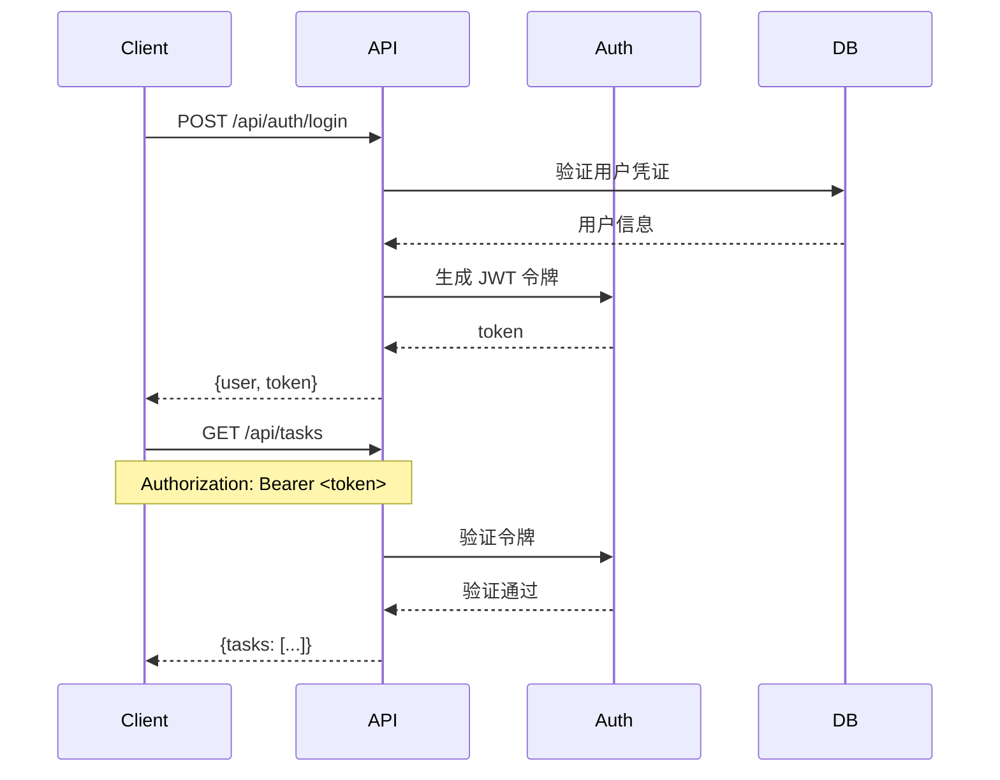
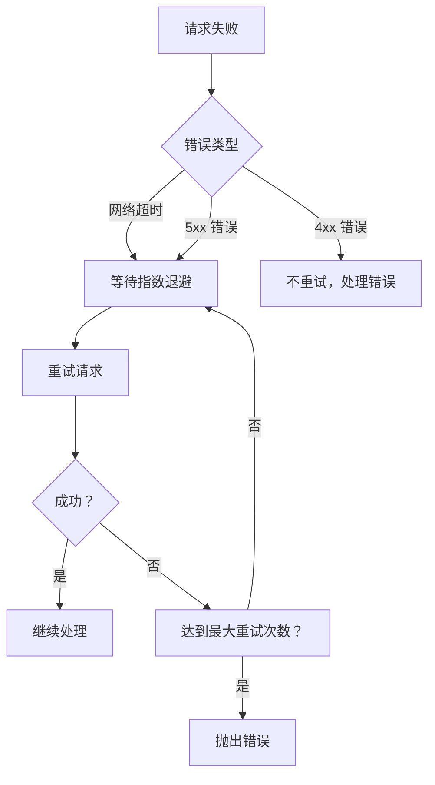
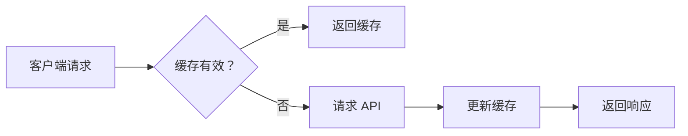

# API 参考文档

**本文档中引用的文件**
- [README.md](../../../README.md)
- [设计文档](../../../designdoc/specs/design.md)
- [需求规格文档](../../../designdoc/specs/requirements.md)

## 目录
1. [简介](#简介)
2. [认证和授权](#认证和授权)
3. [认证 API](#认证-api)
4. [任务 API](#任务-api)
5. [打卡 API](#打卡-api)
6. [错误处理](#错误处理)
7. [最佳实践](#最佳实践)

---

## 简介

AI Harness 是一个日文界面的「勤怠・タスク管理」迷你后台系统，用于练习 AI Agent 在约束下的可靠交付能力。系统提供用户认证、任务管理和打卡记录三大核心功能模块。

### 版本控制策略
- API 版本：v1.0
- URL 格式：`/api/{module}/{endpoint}`
- 内容协商：支持 JSON 格式
- 缓存策略：客户端缓存 + 服务端 ETag 验证

### 基础配置
- 服务器端口：开发模式使用 Vite 热重载
- 数据库：PostgreSQL 15+
- ORM：Drizzle ORM
- 请求超时：30 秒（默认）

**章节来源**
- [README.md](../../../README.md)
- [设计文档](../../../designdoc/specs/design.md)(L120-L226)

---

## 认证和授权

### 认证机制

系统采用 JWT（JSON Web Token）进行无状态认证。用户登录成功后，服务端生成 JWT 令牌并返回，客户端在后续请求中通过 Authorization 头部携带令牌。



**图表来源**
- [设计文档](../../../designdoc/specs/design.md)(L120-L147)

### 角色定义

| 角色 | 描述 | 权限范围 |
|------|------|----------|
| USER | 普通用户 | 管理自己的任务和打卡记录 |

### 认证头部要求

所有需要认证的 API 请求必须包含以下头部信息：

```
Authorization: Bearer <TOKEN>
Content-Type: application/json
```

**章节来源**
- [设计文档](../../../designdoc/specs/design.md)(L269-L327)

---

## 认证 API

### 用户登录

**端点：** `POST /api/auth/login`

**描述：** 用户通过邮箱和密码登录系统，成功则返回用户信息和 JWT 令牌

**认证要求：** 无需认证

**请求体格式：**
```json
{
  "email": "test@example.com",
  "password": "password123"
}
```

**响应格式（200）：**
```json
{
  "user": {
    "id": "uuid",
    "email": "test@example.com",
    "name": "テストユーザー"
  },
  "token": "jwt_token"
}
```

**响应示例（401）：**
```json
{
  "error": "INVALID_CREDENTIALS",
  "message": "メールアドレスまたはパスワードが正しくありません"
}
```

**验证规则：**
- 邮箱为必填项，格式必须有效
- 密码为必填项，长度至少 6 位

**章节来源**
- [设计文档](../../../designdoc/specs/design.md)(L122-L147)
- [需求规格文档](../../../designdoc/specs/requirements.md)(L11-L22)

### 用户登出

**端点：** `POST /api/auth/logout`

**描述：** 清除用户登录状态

**认证要求：** 需要认证

**响应格式（200）：**
```json
{
  "success": true,
  "message": "ログアウトしました"
}
```

**章节来源**
- [需求规格文档](../../../designdoc/specs/requirements.md)(L24-L33)

---

## 任务 API

### 获取任务列表

**端点：** `GET /api/tasks`

**描述：** 获取当前用户的所有任务列表，按创建时间倒序排列

**认证要求：** 需要认证

**查询参数：**
- `status`: 按状态筛选（可选，值：todo/in_progress/done）
- `dueDate`: 按截止日期筛选（可选，格式：YYYY-MM-DD）

**响应格式：**
```json
{
  "tasks": [
    {
      "id": "uuid",
      "title": "タスク 1",
      "description": "説明",
      "status": "todo",
      "dueDate": "2025-01-20",
      "createdAt": "2025-01-15T09:00:00Z"
    }
  ]
}
```

**章节来源**
- [设计文档](../../../designdoc/specs/design.md)(L149-L165)
- [需求规格文档](../../../designdoc/specs/requirements.md)(L50-L60)

### 创建任务

**端点：** `POST /api/tasks`

**描述：** 创建新任务

**认证要求：** 需要认证

**请求体格式：**
```json
{
  "title": "新しいタスク",
  "description": "説明（任意）",
  "dueDate": "2025-01-25"
}
```

**响应格式（201）：**
```json
{
  "id": "uuid",
  "title": "新しいタスク",
  "description": "説明（任意）",
  "status": "todo",
  "dueDate": "2025-01-25",
  "createdAt": "2025-01-15T09:00:00Z"
}
```

**验证规则：**
- 标题为必填项
- 截止日期为可选
- 描述为可选

**章节来源**
- [设计文档](../../../designdoc/specs/design.md)(L167-L180)
- [需求规格文档](../../../designdoc/specs/requirements.md)(L37-L48)

### 更新任务

**端点：** `PATCH /api/tasks/:id`

**描述：** 更新任务状态或内容

**认证要求：** 需要认证

**路径参数：**
- `id`: 任务 UUID

**请求体格式：**
```json
{
  "status": "in_progress",
  "title": "更新后的标题",
  "description": "更新后的描述"
}
```

**响应格式（200）：**
```json
{
  "id": "uuid",
  "status": "in_progress",
  "title": "更新后的标题",
  "description": "更新后的描述",
  "updatedAt": "2025-01-16T10:00:00Z"
}
```

**章节来源**
- [设计文档](../../../designdoc/specs/design.md)(L182-L193)
- [需求规格文档](../../../designdoc/specs/requirements.md)(L62-L72)

### 删除任务

**端点：** `DELETE /api/tasks/:id`

**描述：** 删除指定任务

**认证要求：** 需要认证

**路径参数：**
- `id`: 任务 UUID

**响应格式（204）：** No Content

**章节来源**
- [设计文档](../../../designdoc/specs/design.md)(L195-L197)
- [需求规格文档](../../../designdoc/specs/requirements.md)(L74-L83)

---

## 打卡 API

### 获取打卡记录列表

**端点：** `GET /api/attendance`

**描述：** 获取当前用户的打卡记录列表，按日期倒序排列

**认证要求：** 需要认证

**查询参数：**
- `startDate`: 开始日期（可选，格式：YYYY-MM-DD）
- `endDate`: 结束日期（可选，格式：YYYY-MM-DD）

**响应格式：**
```json
{
  "records": [
    {
      "id": "uuid",
      "checkInTime": "2025-01-15T09:00:00+09:00",
      "checkOutTime": "2025-01-15T18:00:00+09:00",
      "workDate": "2025-01-15"
    }
  ]
}
```

**时区说明：**
- 数据库存储：UTC
- API 返回：带时区标识的 ISO 8601 格式
- 前端展示：Asia/Tokyo (UTC+9)

**章节来源**
- [设计文档](../../../designdoc/specs/design.md)(L199-L213)
- [需求规格文档](../../../designdoc/specs/requirements.md)(L87-L97)

### 获取打卡统计

**端点：** `GET /api/attendance/statistics`

**描述：** 获取按日聚合的打卡统计信息

**认证要求：** 需要认证

**查询参数：**
- `startDate`: 开始日期（必填，格式：YYYY-MM-DD）
- `endDate`: 结束日期（必填，格式：YYYY-MM-DD）

**响应格式：**
```json
{
  "dailyStats": [
    {
      "date": "2025-01-15",
      "workHours": 8.5
    }
  ],
  "totalHours": 160.5
}
```

**章节来源**
- [设计文档](../../../designdoc/specs/design.md)(L215-L226)
- [需求规格文档](../../../designdoc/specs/requirements.md)(L99-L109)

---

## 错误处理

### HTTP 状态码

| 状态码 | 含义 | 使用场景 |
|--------|------|----------|
| 200 | OK | 请求成功 |
| 201 | Created | 资源创建成功 |
| 204 | No Content | 删除成功 |
| 400 | Bad Request | 请求参数错误（验证失败） |
| 401 | Unauthorized | 未认证或令牌无效 |
| 403 | Forbidden | 权限不足 |
| 404 | Not Found | 资源不存在 |
| 500 | Internal Server Error | 服务器错误 |

### 错误响应格式

```json
{
  "timestamp": "2025-01-15T09:00:00Z",
  "status": 400,
  "error": "VALIDATION_ERROR",
  "message": "入力内容に不備があります",
  "details": {
    "field": "error message"
  },
  "path": "/api/tasks"
}
```

### 错误码定义

| 错误码 | 含义 | 使用场景 |
|--------|------|----------|
| INVALID_CREDENTIALS | 凭证无效 | 登录失败 |
| UNAUTHORIZED | 未授权 | 令牌缺失或过期 |
| VALIDATION_ERROR | 验证错误 | 请求参数格式错误 |
| NOT_FOUND | 资源不存在 | 请求的资源不存在 |
| INTERNAL_ERROR | 内部错误 | 服务器未知错误 |

### 常见错误类型

#### 验证错误（400）

请求参数不符合要求时返回：

```json
{
  "error": "VALIDATION_ERROR",
  "message": "入力内容に不備があります",
  "details": {
    "email": "メールアドレスの形式が無効です",
    "password": "パスワードは 6 文字以上で入力してください"
  }
}
```

#### 认证错误（401）

未携带有效令牌时返回：

```json
{
  "error": "UNAUTHORIZED",
  "message": "認証が必要です"
}
```

#### 资源不存在（404）

请求的资源不存在时返回：

```json
{
  "error": "NOT_FOUND",
  "message": "タスクが見つかりません"
}
```

**章节来源**
- [设计文档](../../../designdoc/specs/design.md)(L269-L327)

---

## 最佳实践

### 请求重试策略



**重试策略说明：**
- 仅对网络超时和 5xx 错误进行重试
- 使用指数退避算法（1s, 2s, 4s, 8s）
- 最大重试次数：3 次
- 4xx 错误不重试，直接处理错误

### 速率限制

- 登录接口：10 次/分钟/IP
- 其他 API：100 次/分钟/用户

### 缓存策略



**缓存建议：**
- 任务列表：短时间缓存（1 分钟）+ ETag 验证
- 打卡统计：按日期缓存，日期变更时失效
- 用户信息：登录会话期间缓存

### 错误恢复

1. **自动重试**：网络错误和 5xx 错误自动重试（最多 3 次）
2. **降级处理**：非核心功能失败不影响主流程
3. **监控告警**：错误率超过阈值时触发告警

### 性能优化建议

1. **批量操作**：支持批量创建/更新任务
2. **分页查询**：大数据集使用分页（limit/offset）
3. **条件过滤**：使用状态、日期等条件减少数据传输
4. **缓存利用**：合理使用 ETag 和 Last-Modified

### 安全最佳实践

1. **HTTPS 传输**：生产环境强制使用 HTTPS
2. **输入验证**：所有输入参数必须验证（使用 zod）
3. **输出编码**：响应数据自动转义，防止 XSS
4. **日志审计**：记录关键操作日志（不记录敏感信息）
5. **权限最小化**：用户只能访问自己的数据

**章节来源**
- [设计文档](../../../designdoc/specs/design.md)(L378-L492)
- [需求规格文档](../../../designdoc/specs/requirements.md)(L136-L156)

---

## 数据模型参考

### User (用户)

| 字段 | 类型 | 约束 | 说明 |
|------|------|------|------|
| id | UUID | 主键 | 用户唯一标识 |
| email | VARCHAR(255) | 唯一，非空 | 登录邮箱 |
| password_hash | VARCHAR(255) | 非空 | 加密密码 |
| name | VARCHAR(100) | 可选 | 用户名称 |
| is_active | BOOLEAN | 默认 true | 账户状态 |
| created_at | TIMESTAMP | UTC | 创建时间 |
| updated_at | TIMESTAMP | UTC | 更新时间 |

### Task (任务)

| 字段 | 类型 | 约束 | 说明 |
|------|------|------|------|
| id | UUID | 主键 | 任务唯一标识 |
| user_id | UUID | 外键，非空 | 所属用户 |
| title | VARCHAR(255) | 非空 | 任务标题 |
| description | TEXT | 可选 | 任务描述 |
| status | VARCHAR(50) | 默认 'todo' | 任务状态 |
| due_date | DATE | 可选 | 截止日期 |
| created_at | TIMESTAMP | UTC | 创建时间 |
| updated_at | TIMESTAMP | UTC | 更新时间 |

**状态枚举值：**
- `todo`: 未着手
- `in_progress`: 着手中
- `done`: 完了

### AttendanceRecord (打卡记录)

| 字段 | 类型 | 约束 | 说明 |
|------|------|------|------|
| id | UUID | 主键 | 记录唯一标识 |
| user_id | UUID | 外键，非空 | 所属用户 |
| check_in_time | TIMESTAMP | UTC，非空 | 打卡时间 |
| check_out_time | TIMESTAMP | UTC，可选 | 签退时间 |
| work_date | DATE | 非空 | 工作日 |
| created_at | TIMESTAMP | UTC | 创建时间 |

**章节来源**
- [设计文档](../../../designdoc/specs/design.md)(L58-L118)
- [需求规格文档](../../../designdoc/specs/requirements.md)(L157-L191)
