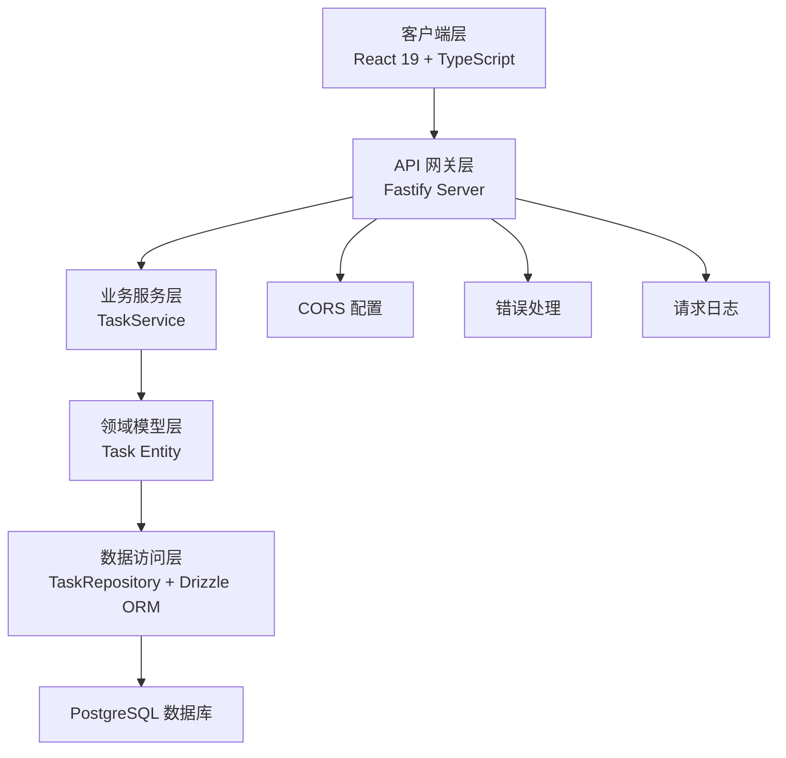
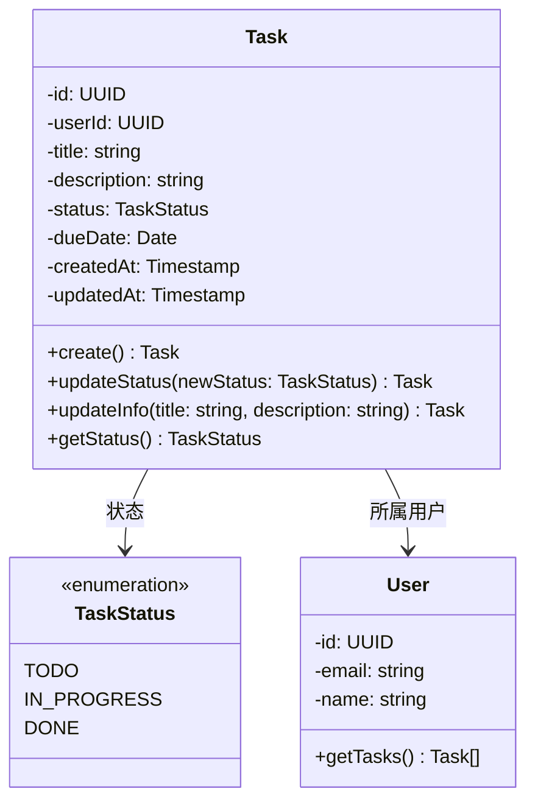
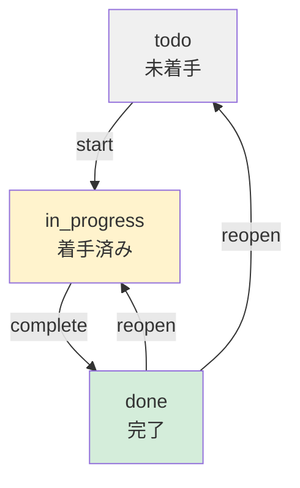

# 任务 API

**本文档中引用的文件**
- [设计文档](../../../designdoc/specs/design.md)
- [需求规格](../../../designdoc/specs/requirements.md)
- [任务清单](../../../designdoc/specs/tasks.md)

## 目录
1. [简介](#简介)
2. [项目架构概览](#项目架构概览)
3. [核心数据模型](#核心数据模型)
4. [API 端点](#api 端点)
5. [状态流转规则](#状态流转规则)
6. [错误处理与异常管理](#错误处理与异常管理)
7. [性能考虑](#性能考虑)
8. [总结](#总结)

## 简介

- **系统描述**: 任务管理 API 提供任务的 CRUD 操作，用于管理用户的工作任务，支持任务创建、查询、状态更新和删除功能
- **核心功能**: 
  - 创建任务（标题必填，可设置截止日期和描述）
  - 查看任务列表（按创建时间倒序，支持按状态筛选）
  - 更新任务状态（todo → in_progress → done）
  - 删除任务
- **技术架构**: 基于 Fastify + TypeScript 的 RESTful API，采用分层架构设计
- **用户角色**: 已认证的系统用户

## 项目架构概览



**图表来源**: [设计文档](../../../designdoc/specs/design.md)(L7-L41)

## 核心数据模型



### 关键属性说明

| 字段 | 类型 | 约束 | 说明 |
|------|------|------|------|
| id | UUID | 主键 | 任务唯一标识符 |
| userId | UUID | 外键，非空 | 任务所属用户 ID |
| title | VARCHAR(255) | 非空 | 任务标题（必填） |
| description | TEXT | 可选 | 任务详细描述 |
| status | VARCHAR(50) | 默认 'todo' | 任务状态（todo/in_progress/done） |
| dueDate | DATE | 可选 | 截止日期 |
| createdAt | TIMESTAMP | UTC | 创建时间（UTC 存储） |
| updatedAt | TIMESTAMP | UTC | 更新时间（UTC 存储） |

**章节来源**: [设计文档](../../../designdoc/specs/design.md)(L58-L118)

## API 端点

### 任务 CRUD 操作

#### 1. 创建任务

```http
POST /api/tasks
Content-Type: application/json
Authorization: Bearer {token}

Request Body:
{
  "title": "新しいタスク",
  "description": "説明（任意）",
  "dueDate": "2025-01-25"
}
```

**响应示例 (201 Created)**:
```json
{
  "id": "uuid",
  "userId": "uuid",
  "title": "新しいタスク",
  "description": "説明（任意）",
  "status": "todo",
  "dueDate": "2025-01-25",
  "createdAt": "2025-01-15T09:00:00.000Z",
  "updatedAt": "2025-01-15T09:00:00.000Z"
}
```

**验证规则**:
- `title`: 必填项，最大长度 255 字符
- `description`: 可选项
- `dueDate`: 可选项，格式 `YYYY-MM-DD`

**章节来源**: [设计文档](../../../designdoc/specs/design.md)(L149-L180)

---

#### 2. 获取任务列表

```http
GET /api/tasks?status=todo&startDate=2025-01-01&endDate=2025-01-31
Authorization: Bearer {token}
```

**查询参数**:
| 参数 | 类型 | 必填 | 说明 |
|------|------|------|------|
| status | string | 否 | 按状态筛选（todo/in_progress/done） |
| startDate | date | 否 | 开始日期（按 createdAt 筛选） |
| endDate | date | 否 | 结束日期（按 createdAt 筛选） |

**响应示例 (200 OK)**:
```json
{
  "tasks": [
    {
      "id": "uuid",
      "userId": "uuid",
      "title": "タスク 1",
      "description": "説明",
      "status": "todo",
      "dueDate": "2025-01-20",
      "createdAt": "2025-01-15T09:00:00.000Z",
      "updatedAt": "2025-01-15T09:00:00.000Z"
    },
    {
      "id": "uuid",
      "userId": "uuid",
      "title": "タスク 2",
      "description": null,
      "status": "in_progress",
      "dueDate": null,
      "createdAt": "2025-01-14T10:00:00.000Z",
      "updatedAt": "2025-01-14T15:00:00.000Z"
    }
  ]
}
```

**排序规则**: 按 `createdAt` 倒序排列

**章节来源**: [设计文档](../../../designdoc/specs/design.md)(L152-L165)

---

#### 3. 获取单个任务

```http
GET /api/tasks/:id
Authorization: Bearer {token}
```

**响应示例 (200 OK)**:
```json
{
  "id": "uuid",
  "userId": "uuid",
  "title": "タスク 1",
  "description": "説明",
  "status": "todo",
  "dueDate": "2025-01-20",
  "createdAt": "2025-01-15T09:00:00.000Z",
  "updatedAt": "2025-01-15T09:00:00.000Z"
}
```

**错误响应 (404 Not Found)**:
```json
{
  "error": "NOT_FOUND",
  "message": "タスクが見つかりません"
}
```

---

#### 4. 更新任务

```http
PATCH /api/tasks/:id
Content-Type: application/json
Authorization: Bearer {token}

Request Body:
{
  "status": "in_progress",
  "title": "更新されたタイトル",
  "description": "更新された説明"
}
```

**响应示例 (200 OK)**:
```json
{
  "id": "uuid",
  "userId": "uuid",
  "title": "更新されたタイトル",
  "description": "更新された説明",
  "status": "in_progress",
  "dueDate": "2025-01-20",
  "createdAt": "2025-01-15T09:00:00.000Z",
  "updatedAt": "2025-01-15T10:00:00.000Z"
}
```

**部分更新支持**: 可以只传递需要更新的字段

**章节来源**: [设计文档](../../../designdoc/specs/design.md)(L182-L193)

---

#### 5. 删除任务

```http
DELETE /api/tasks/:id
Authorization: Bearer {token}
```

**响应示例 (204 No Content)**: 无响应体

**错误响应 (404 Not Found)**:
```json
{
  "error": "NOT_FOUND",
  "message": "タスクが見つかりません"
}
```

**章节来源**: [设计文档](../../../designdoc/specs/design.md)(L195-L196)

## 状态流转规则



### 状态说明

| 状态 | 说明 | 可迁移到的状态 |
|------|------|----------------|
| `todo` | 未着手 | `in_progress` |
| `in_progress` | 进行中（已着手） | `done` |
| `done` | 已完成 | `todo`, `in_progress`（重新打开） |

### 业务规则

1. **创建时**: 任务创建时状态默认为 `todo`
2. **正常流程**: `todo` → `in_progress` → `done`
3. **重新打开**: 已完成的任务可以重新打开为 `todo` 或 `in_progress`
4. **权限控制**: 只能更新自己创建的任务

**章节来源**: [需求规格](../../../designdoc/specs/requirements.md)(L62-L72)

## 错误处理与异常管理

### 统一错误响应格式

```json
{
  "error": "错误码（程序使用）",
  "message": "错误消息（用户显示，日文）",
  "details": "详细错误信息（验证失败等）"
}
```

### 错误码定义

| 错误码 | HTTP 状态码 | 说明 |
|--------|------------|------|
| `INVALID_CREDENTIALS` | 401 | 认证失败（未授权访问） |
| `UNAUTHORIZED` | 401 | 未提供认证信息 |
| `VALIDATION_ERROR` | 400 | 请求参数验证失败 |
| `NOT_FOUND` | 404 | 资源不存在 |
| `INTERNAL_ERROR` | 500 | 服务器内部错误 |

### 错误响应示例

**验证错误 (400 Bad Request)**:
```json
{
  "error": "VALIDATION_ERROR",
  "message": "入力内容に不備があります",
  "details": [
    {
      "field": "title",
      "message": "タイトルは必須です"
    }
  ]
}
```

**认证错误 (401 Unauthorized)**:
```json
{
  "error": "UNAUTHORIZED",
  "message": "認証が必要です"
}
```

**资源不存在 (404 Not Found)**:
```json
{
  "error": "NOT_FOUND",
  "message": "タスクが見つかりません"
}
```

**服务器错误 (500 Internal Server Error)**:
```json
{
  "error": "INTERNAL_ERROR",
  "message": "サーバーエラーが発生しました"
}
```

**章节来源**: [设计文档](../../../designdoc/specs/design.md)(L269-L327)

## 性能考虑

### 数据库索引设计

```sql
-- 用户 ID + 状态复合索引（常用查询条件）
CREATE INDEX tasks_user_id_status_idx ON tasks(user_id, status);

-- 用户 ID 索引
CREATE INDEX tasks_user_id_idx ON tasks(user_id);

-- 状态索引
CREATE INDEX tasks_status_idx ON tasks(status);

-- 用户 ID + 状态复合索引
CREATE INDEX tasks_user_id_status_idx ON tasks(user_id, status);
```

### 查询优化策略

1. **避免 N+1 查询**: 使用批量查询而非循环查询
2. **分页支持**: 大数据量时支持分页查询（待实现）
3. **索引覆盖**: 确保常用查询条件有索引支持

### 缓存策略

- 当前版本未实现缓存，每次请求直接查询数据库
- 未来可考虑：任务列表的短期缓存（Redis）

**章节来源**: [设计文档](../../../designdoc/specs/design.md)(L378-L407)

## 总结

### 主要特点

1. **RESTful 设计**: 遵循 REST 规范，使用标准 HTTP 方法
2. **分层架构**: UI → 应用服务 → 领域 → 基础设施，职责清晰
3. **类型安全**: 全链路 TypeScript 类型约束
4. **时区处理**: UTC 存储，Asia/Tokyo 展示
5. **错误处理**: 统一错误响应格式，消息日文显示

### 技术亮点

1. **Fastify 框架**: 高性能 Node.js Web 框架
2. **Drizzle ORM**: 类型安全的 SQL ORM
3. **PostgreSQL**: 支持 JSONB、全文索引等高级特性
4. **Zod 验证**: 运行时类型验证
5. **Vitest 测试**: 快速单元测试框架

### 业务价值

- 提供完整的任务管理能力
- 支持任务状态跟踪和进度管理
- 帮助用户高效管理日常工作
- 为打卡考勤系统提供基础支撑

---

**文档版本**: 1.0  
**最后更新**: 基于设计文档 v1.0  
**实现状态**: 设计阶段（Phase C 待实现）
