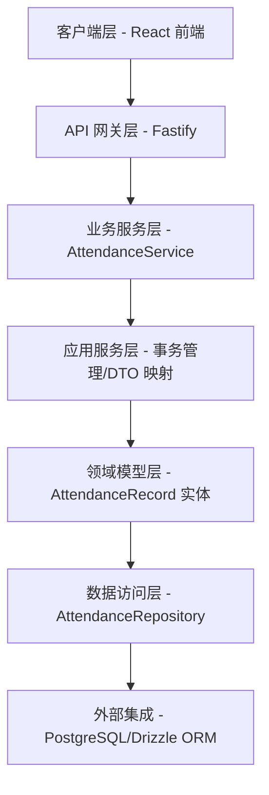
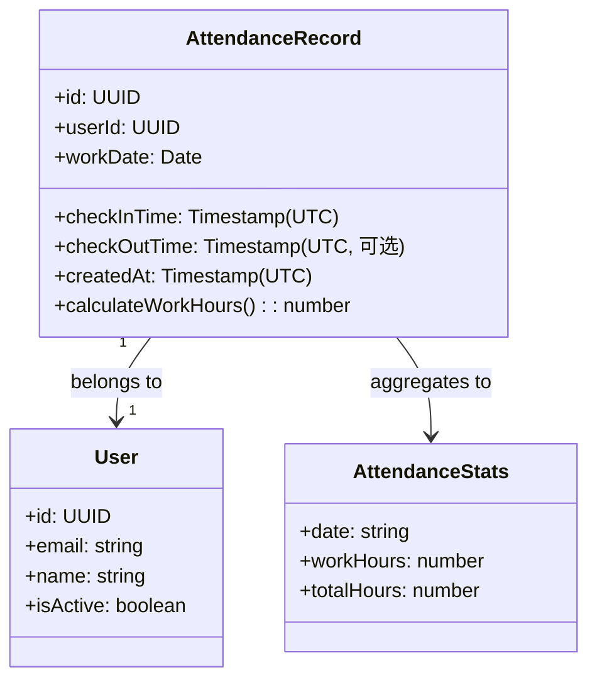

# 打卡 API

**本文档中引用的文件**
- [需求规格](../../../designdoc/specs/requirements.md)
- [设计文档](../../../designdoc/specs/design.md)
- [项目概述](../../../README.md)

## 目录
1. [简介](#简介)
2. [项目架构概览](#项目架构概览)
3. [核心数据模型](#核心数据模型)
4. [API 端点](#api 端点)
5. [时区处理策略](#时区处理策略)
6. [错误处理与异常管理](#错误处理与异常管理)
7. [性能考虑](#性能考虑)
8. [总结](#总结)

## 简介

- **系统描述**: 打卡 API 提供员工考勤记录管理功能，支持打卡记录的查询、统计和聚合计算。系统采用日文界面，服务于「勤怠・タスク管理」后台系统。
- **核心功能**:
  - 打卡记录列表查询（支持日期范围过滤）
  - 按日聚合统计（工作时长计算）
  - 时区转换（UTC 存储，Asia/Tokyo 展示）
- **技术架构**: 分层架构设计，包含 UI 层、应用服务层、领域层和基础设施层
- **用户角色**: 系统用户（查看个人打卡记录）、管理员（查看统计报表）

来源：[需求规格](../../../designdoc/specs/requirements.md)(L85-L109)、[设计文档](../../../designdoc/specs/design.md)(L199-L226)

## 项目架构概览



**图表来源**: 
- 分层架构参考 [设计文档](../../../designdoc/specs/design.md)(L5-L41)
- API 端点设计参考 [设计文档](../../../designdoc/specs/design.md)(L199-L226)

## 核心数据模型



### 关键属性说明

| 字段 | 类型 | 约束 | 说明 |
|------|------|------|------|
| id | UUID | 主键 | 打卡记录唯一标识 |
| userId | UUID | 外键，非空 | 关联用户 ID |
| checkInTime | TIMESTAMP | UTC，非空 | 打卡时间（UTC 存储） |
| checkOutTime | TIMESTAMP | UTC，可选 | 签退时间（UTC 存储） |
| workDate | DATE | 非空 | 工作日期 |
| createdAt | TIMESTAMP | UTC | 记录创建时间 |

**章节来源**: 数据模型定义参考 [需求规格](../../../designdoc/specs/requirements.md)(L182-L191)、Schema 定义参考 [设计文档](../../../designdoc/specs/design.md)(L107-L117)

## API 端点

### 打卡记录查询

#### GET /api/attendance

获取用户的打卡记录列表，支持日期范围过滤。

**请求参数**:
| 参数 | 类型 | 必填 | 说明 |
|------|------|------|------|
| startDate | string | 否 | 开始日期 (YYYY-MM-DD) |
| endDate | string | 否 | 结束日期 (YYYY-MM-DD) |

**响应示例 (200)**:
```json
{
  "records": [
    {
      "id": "uuid",
      "checkInTime": "2025-01-15T00:00:00.000Z",
      "checkOutTime": "2025-01-15T09:00:00.000Z",
      "workDate": "2025-01-15"
    }
  ]
}
```

**来源**: [设计文档](../../../designdoc/specs/design.md)(L202-L213)

### 打卡统计查询

#### GET /api/attendance/statistics

获取按日聚合的打卡统计数据，包含每日工作时长和总时长。

**请求参数**:
| 参数 | 类型 | 必填 | 说明 |
|------|------|------|------|
| startDate | string | 否 | 开始日期 (YYYY-MM-DD) |
| endDate | string | 否 | 结束日期 (YYYY-MM-DD) |

**响应示例 (200)**:
```json
{
  "dailyStats": [
    {
      "date": "2025-01-15",
      "workHours": 8.5
    }
  ],
  "totalHours": 160.5
}
```

**来源**: [设计文档](../../../designdoc/specs/design.md)(L215-L226)

### 用户故事映射

| 用户故事 | API 端点 | 验收标准 |
|----------|----------|----------|
| US-020: 打卡列表 | GET /api/attendance | 显示打卡时间（Asia/Tokyo）、工作日期、按日期倒序 |
| US-021: 打卡统计 | GET /api/attendance/statistics | 按日显示工作时长、显示总工作时长、时间计算准确 |

**来源**: [需求规格](../../../designdoc/specs/requirements.md)(L87-L109)

## 时区处理策略

### 核心原则

1. **数据库存储**: UTC 时间戳
2. **API 输入输出**: ISO 8601 格式，带时区标识
3. **前端展示**: Asia/Tokyo (UTC+9) 本地时间

### 实现方案

**后端存储（UTC）**:
```typescript
const record = {
  checkInTime: new Date('2025-01-15T09:00:00+09:00'), // 自动转为 UTC 存储
};
```

**API 响应（ISO 8601）**:
```typescript
return {
  checkInTime: record.checkInTime.toISOString(), // "2025-01-15T00:00:00.000Z"
};
```

**前端展示（Asia/Tokyo）**:
```typescript
const displayTime = new Date(apiResponse.checkInTime).toLocaleString('ja-JP', {
  timeZone: 'Asia/Tokyo',
  hour12: false,
});
// 出力：2025/1/15 9:00
```

### Zod Schema 时区处理

```typescript
const attendanceSchema = z.object({
  checkInTime: z.string()
    .datetime({ message: '日時の形式が無効です' })
    .transform((val) => new Date(val)),
  workDate: z.string()
    .regex(/^\d{4}-\d{2}-\d{2}$/, { message: '日付の形式が無効です' }),
});
```

**章节来源**: [设计文档](../../../designdoc/specs/design.md)(L228-L267)、[需求规格](../../../designdoc/specs/requirements.md)(L152-L155)

## 错误处理与异常管理

### 统一错误响应格式

```typescript
interface ErrorResponse {
  error: string;        // 错误码（程序使用）
  message: string;      // 错误消息（用户显示，日文）
  details?: any;        // 详细错误信息（验证失败等）
}
```

### 错误码定义

| 错误码 | HTTP 状态码 | 说明 | 日文消息 |
|--------|------------|------|----------|
| INVALID_CREDENTIALS | 401 | 认证失败 | メールアドレスまたはパスワードが正しくありません |
| UNAUTHORIZED | 401 | 未授权 | 認証が必要です |
| VALIDATION_ERROR | 400 | 验证失败 | 入力内容に不備があります |
| NOT_FOUND | 404 | 资源不存在 | リソースが見つかりません |
| INTERNAL_ERROR | 500 | 服务器错误 | サーバーエラーが発生しました |

### Fastify 错误处理

```typescript
app.setErrorHandler((error, request, reply) => {
  if (error instanceof ValidationError) {
    return reply.status(400).send({
      error: ErrorCode.VALIDATION_ERROR,
      message: '入力内容に不備があります',
      details: error.details,
    });
  }
  
  if (error instanceof UnauthorizedError) {
    return reply.status(401).send({
      error: ErrorCode.UNAUTHORIZED,
      message: '認証が必要です',
    });
  }
  
  // 未知错误
  app.log.error(error);
  return reply.status(500).send({
    error: ErrorCode.INTERNAL_ERROR,
    message: 'サーバーエラーが発生しました',
  });
});
```

**章节来源**: [设计文档](../../../designdoc/specs/design.md)(L271-L327)

## 性能考虑

### 数据库索引设计

```sql
-- 打卡记录查询优化
CREATE INDEX attendance_user_id_idx ON attendance_records(user_id);
CREATE INDEX attendance_work_date_idx ON attendance_records(work_date);
-- 复合索引：用户 + 日期查询
CREATE INDEX attendance_user_id_work_date_idx ON attendance_records(user_id, work_date);
```

**来源**: [设计文档](../../../designdoc/specs/design.md)(L380-L388)

### 避免 N+1 查询

```typescript
// ❌ 错误示例
const users = await db.select().from(users);
for (const user of users) {
  const records = await db.select()
    .from(attendanceRecords)
    .where(eq(attendanceRecords.userId, user.id));
}

// ✅ 正确示例
const users = await db.select().from(users);
const userIds = users.map(u => u.id);
const records = await db.select()
  .from(attendanceRecords)
  .where(inArray(attendanceRecords.userId, userIds));
```

### 分页优化

对于大数据量场景，建议实现分页机制：
- 默认每页 20 条记录
- 支持 `page` 和 `pageSize` 参数
- 返回总记录数用于前端分页显示

## 总结

### 主要特点

1. **时区处理严谨**: UTC 存储，Asia/Tokyo 展示，ISO 8601 格式传输
2. **聚合计算准确**: 按日统计工作时长，支持日期范围查询
3. **错误处理统一**: 日文错误消息，标准化错误响应格式
4. **性能优化完善**: 数据库索引设计，避免 N+1 查询
5. **分层架构清晰**: UI/应用/领域/基础设施层边界明确

### 技术亮点

1. **Drizzle ORM 类型安全**: TypeScript 全栈类型推导
2. **Zod 运行时校验**: 请求参数和响应格式验证
3. **Fastify 高性能**: 低延迟 API 响应（目标 < 500ms）
4. **时区自动转换**: 前后端时区处理透明化
5. **TDD 开发流程**: 单元测试覆盖率 80%+

### 业务价值

打卡 API 为「勤怠・タスク管理」系统提供核心考勤功能支撑：
- 员工可查看个人打卡记录，确认出勤情况
- 管理者可获取统计数据，掌握团队工作时长
- 时区处理确保跨国团队使用一致性
- 性能优化保障高并发场景下的用户体验

**参考文档**:
- [需求规格](../../../designdoc/specs/requirements.md) - 用户故事与功能需求
- [设计文档](../../../designdoc/specs/design.md) - 架构设计与技术实现
- [项目概述](../../../README.md) - 项目背景与技术栈
