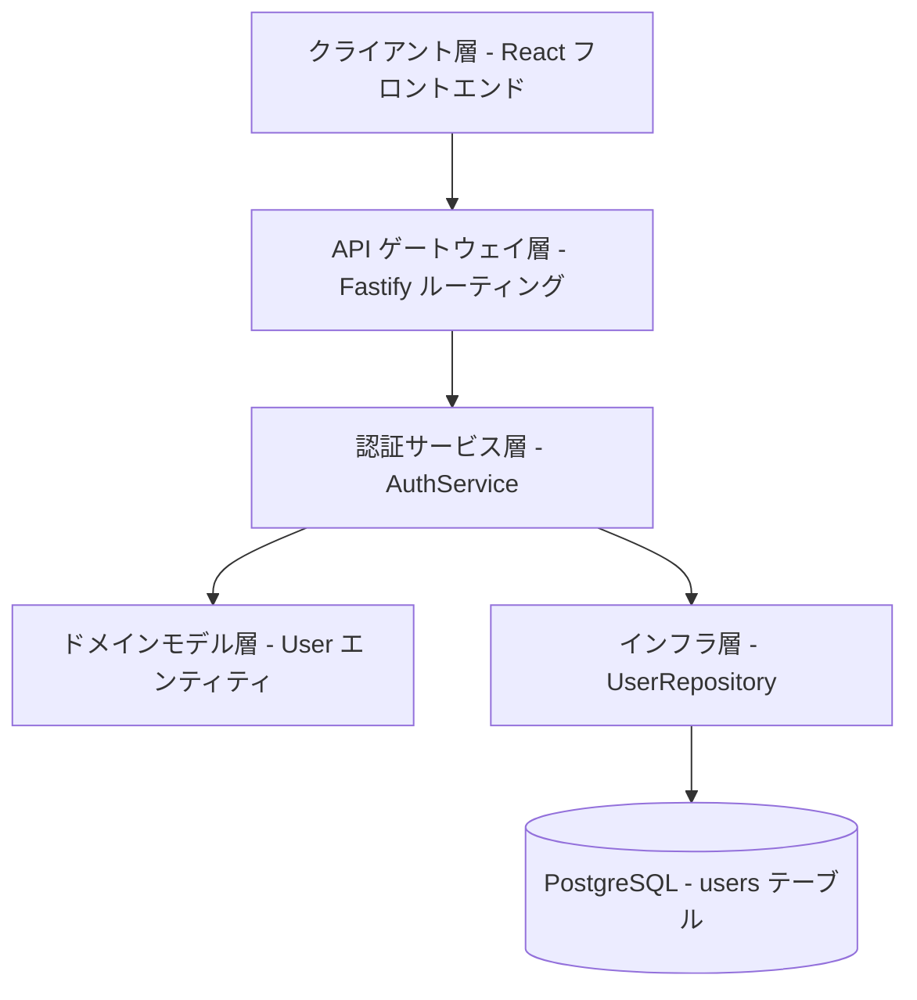
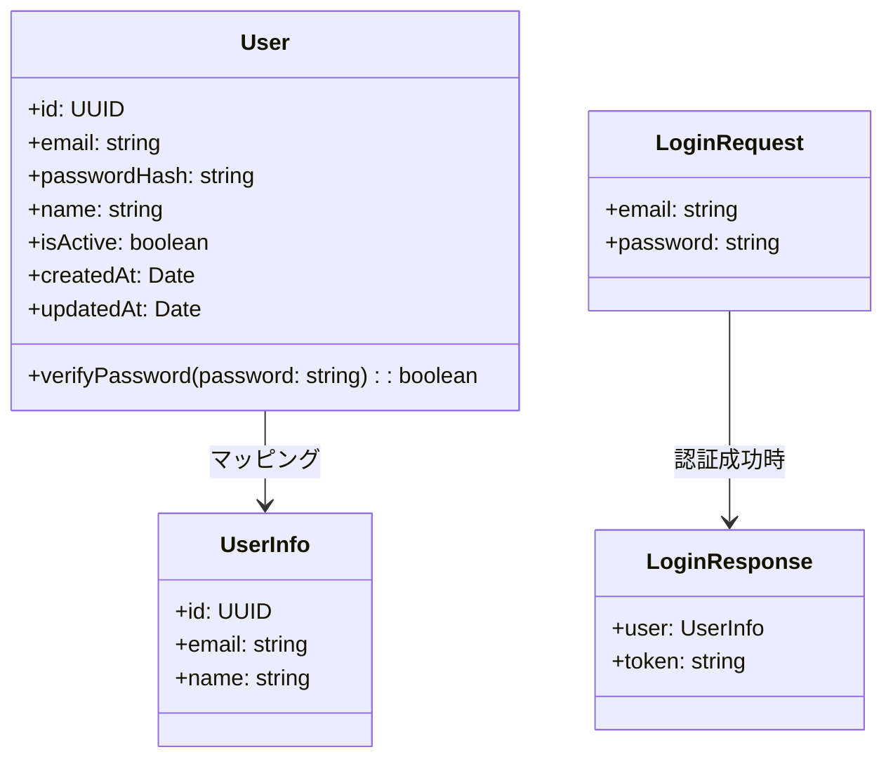
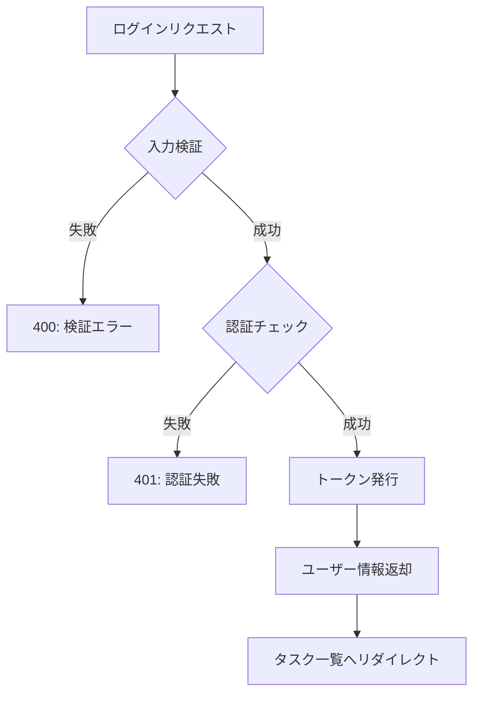

# 認証 API

**本文档中引用的文件**
- [需求规格](../../../designdoc/specs/requirements.md)
- [设计文档](../../../designdoc/specs/design.md)
- [项目概述](../../../.gientech/wiki/项目概述.md)

## 目录
1. [简介](#简介)
2. [项目架构概览](#项目架构概览)
3. [核心数据模型](#核心数据模型)
4. [API 端点](#api 端点)
5. [权限控制与角色管理](#权限控制与角色管理)
6. [错误处理与异常管理](#错误处理与异常管理)
7. [性能考虑](#性能考虑)
8. [故障排除指南](#故障排除指南)
9. [总结](#总结)

## 简介

- **系统描述**: 認証 API はユーザーのログイン・ログアウト処理を担当し、セッション管理とアクセス制御の基盤を提供します
- **核心功能**:
  - ユーザー認証（メールアドレスとパスワードによるログイン）
  - セッショントークンの発行と検証
  - ログアウト処理とセッションクリア
- **技术架构**: Fastify (Node.js + TypeScript) を使用した RESTful API、bcrypt によるパスワードハッシュ化、JWT トークンによる認証
- **ユーザー役割**: 本システムを利用するすべてのユーザー（管理者・一般ユーザーの区別は現時点ではなし）

**图表来源**
- [设计文档](../../../designdoc/specs/design.md)

## 项目架构概览



**架构说明**:
1. **クライアント層**: React 19 + TypeScript フロントエンド、ログインフォーム (react-hook-form + zod 検証)
2. **API ゲートウェイ層**: Fastify ルーティング、POST /api/auth/login, POST /api/auth/logout
3. **認証サービス層**: AuthService (login, logout, getCurrentUser)、トランザクション管理、DTO マッピング
4. **ドメインモデル層**: User エンティティ (id, email, passwordHash, name, isActive, createdAt, updatedAt)
5. **インフラ層**: UserRepository (Drizzle ORM)、データベース接続
6. **データアクセス層**: PostgreSQL (users テーブル)

**图表来源**
- [设计文档](../../../designdoc/specs/design.md)
- [项目概述](../../../.gientech/wiki/项目概述.md)

## 核心数据模型



**关键属性说明**:

| 字段 | 类型 | 约束 | 说明 |
|------|------|------|------|
| id | UUID | 主键 | ユーザー一意識別子 |
| email | VARCHAR(255) | 一意，非空 | ログインに使用するメールアドレス |
| passwordHash | VARCHAR(255) | 非空 | bcrypt でハッシュ化されたパスワード |
| name | VARCHAR(100) | 可选 | ユーザー表示名 |
| isActive | BOOLEAN | 默认 true | アカウント有効フラグ |
| createdAt | TIMESTAMP | UTC | アカウント作成日時 |
| updatedAt | TIMESTAMP | UTC | 最終更新日時 |

**章节来源**
- [设计文档](../../../designdoc/specs/design.md) (L82-L90, users テーブル定義)
- [需求规格](../../../designdoc/specs/requirements.md) (L159-L168, User データモデル)

## API 端点

### 認証エンドポイント

#### POST /api/auth/login

**リクエスト例**:
```json
{
  "email": "test@example.com",
  "password": "password123"
}
```

**成功レスポンス (200)**:
```json
{
  "user": {
    "id": "550e8400-e29b-41d4-a716-446655440000",
    "email": "test@example.com",
    "name": "テストユーザー"
  },
  "token": "eyJhbGciOiJIUzI1NiIsInR5cCI6IkpXVCJ9..."
}
```

**失敗レスポンス (401)**:
```json
{
  "error": "INVALID_CREDENTIALS",
  "message": "メールアドレスまたはパスワードが正しくありません"
}
```

**検証ルール**:
- email: 必須、有効なメールフォーマット
- password: 必須、最小 6 文字

**章节来源**
- [设计文档](../../../designdoc/specs/design.md) (L122-L146, 認証 API 定義)
- [需求规格](../../../designdoc/specs/requirements.md) (L111-L120, 登录功能需求)

#### POST /api/auth/logout

**リクエスト**: 認証トークンをヘッダーに付与
```
Authorization: Bearer <token>
```

**成功レスポンス (200)**:
```json
{
  "success": true,
  "message": "ログアウトしました"
}
```

**失敗レスポンス (401)**:
```json
{
  "error": "UNAUTHORIZED",
  "message": "認証が必要です"
}
```

**章节来源**
- [需求规格](../../../designdoc/specs/requirements.md) (L24-L33, US-002: ユーザーログアウト)

## 权限控制与角色管理

**権限マトリックス**:

| エンドポイント | 認証不要 | 認証必要 | 管理者のみ |
|---------------|---------|---------|-----------|
| POST /api/auth/login | ✓ | | |
| POST /api/auth/logout | | ✓ | |

**認証フロー**:


**章节来源**
- [设计文档](../../../designdoc/specs/design.md) (L269-L327, エラー処理・認証フロー)

## 错误处理与异常管理

**例外タイプ分類**:

| エラーコード | HTTP ステータス | 説明 |
|-------------|----------------|------|
| INVALID_CREDENTIALS | 401 | メールアドレスまたはパスワードが正しくない |
| UNAUTHORIZED | 401 | 認証トークンが無効または期限切れ |
| VALIDATION_ERROR | 400 | 入力値の検証に失敗 |
| NOT_FOUND | 404 | リソースが存在しない |
| INTERNAL_ERROR | 500 | サーバー内部エラー |

**標準エラーレスポンス形式**:
```json
{
  "error": "ERROR_CODE",
  "message": "エラーメッセージ（日本語表示用）",
  "details": {
    "field": "エラー詳細（検証失敗時のみ）"
  }
}
```

**章节来源**
- [设计文档](../../../designdoc/specs/design.md) (L269-L298, エラーコード定義)
- [项目概述](../../../.gientech/wiki/项目概述.md) (L157-L171, 故障排除ガイド)

## 性能考虑

**キャッシュ戦略**:
- 認証トークン：JWT によるステートレス認証、サーバー側キャッシュ不要
- ユーザー情報：トークンにエンコード、リクエストごとに DB アクセス不要

**パフォーマンス最適化**:
- パスワードハッシュ化：bcrypt (salt rounds: 10)、1 リクエストあたり約 100ms
- DB クエリ：users テーブルの email カラムにユニークインデックス、O(1) 検索

**並行制御**:
- 同時ログイン制限：現時点では制限なし（必要に応じて実装可能）
- トークン有効期限：標準 24 時間（環境変数で設定可能）

**章节来源**
- [设计文档](../../../designdoc/specs/design.md) (L378-L407, パフォーマンス最適化)
- [需求规格](../../../designdoc/specs/requirements.md) (L136-L140, 非機能要件)

## 故障排除ガイド

**一般的な問題と解決策**:

| 問題 | 原因 | 解決策 |
|------|------|--------|
| ログインできない | メールアドレスまたはパスワードが誤り | 入力内容を再確認 |
| トークンが期限切れ | 24 時間経過 | 再ログインが必要 |
| 検証エラー | メールフォーマット誤り、パスワード短すぎる | エラーメッセージに従って修正 |
| サーバーエラー | DB 接続失敗、内部例外 | サーバーログを確認 |

**監視指標**:
- API レスポンスタイム：< 500ms（目標）
- 認証成功率：> 99%
- エラーレート：< 1%

**ログレベル**:
- `debug`: 詳細なデバッグ情報
- `info`: 通常の処理ログ（リクエストメソッド、URL、userId）
- `warn`: 警告（認証失敗など）
- `error`: エラー（スタックトレース、エラーコード）

**章节来源**
- [设计文档](../../../designdoc/specs/design.md) (L457-L491, 監視とログ)
- [项目概述](../../../.gientech/wiki/项目概述.md) (L157-L171, 故障排除ガイド)

## 总结

**主な特徴**:
1. メールアドレスとパスワードによる標準的な認証方式
2. bcrypt による安全なパスワードハッシュ化
3. JWT トークンによるステートレス認証
4. 明確なエラーコードと日本語メッセージ
5. 入力検証（zod）によるセキュリティ向上

**技術的ハイライト**:
1. Fastify による高速な API 処理
2. TypeScript による型安全な実装
3. Drizzle ORM による型安全な DB アクセス
4. 統一されたエラーハンドリング
5. 包括的なログ記録と監視

**ビジネス価値**:
- ユーザー認証はタスク管理・勤怠管理システムの基盤機能
- 安全な認証により、ユーザーデータの機密性を確保
- 明確なエラーメッセージにより、ユーザーエクスペリエンスを向上
- 監視とログ記録により、運用中の問題検知を容易に

**章节来源**
- [需求规格](../../../designdoc/specs/requirements.md) (L1-L33, 認証機能要件)
- [设计文档](../../../designdoc/specs/design.md) (L1-L492, 全体設計)
- [项目概述](../../../.gientech/wiki/项目概述.md) (L1-L181, プロジェクト概要)
