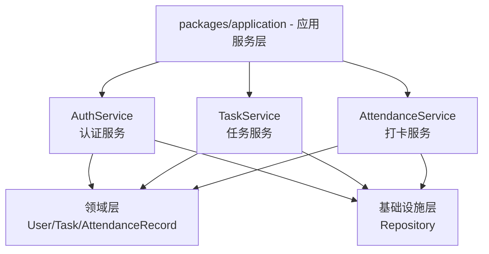
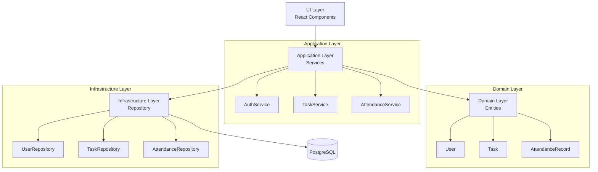
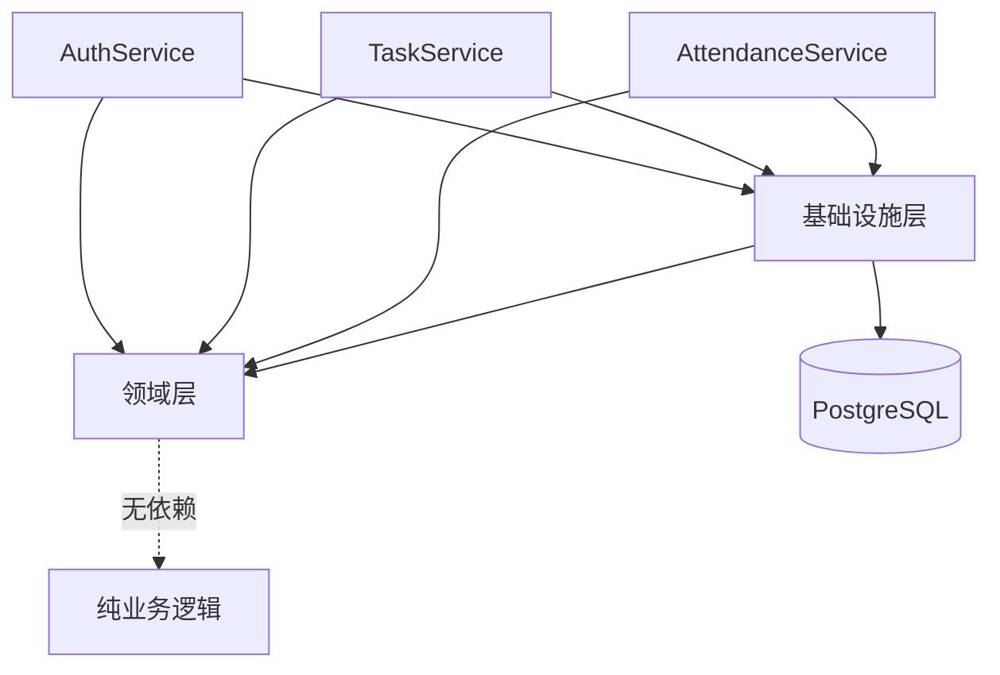

# 业务逻辑层

**本文档引用的文件**
- [项目概述](../../.gientech/wiki/项目概述.md)
- [设计文档](../../designdoc/specs/design.md)
- [任务清单](../../designdoc/specs/tasks.md)
- [README.md](../../README.md)
- [AGENTS.md](../../AGENTS.md)

## 目录
1. [简介](#简介)
2. [项目结构概述](#项目结构概述)
3. [核心应用服务](#核心应用服务)
4. [架构概览](#架构概览)
5. [依赖关系分析](#依赖关系分析)
6. [性能考虑](#性能考虑)
7. [故障排除指南](#故障排除指南)
8. [结论](#结论)

## 简介

业务逻辑层（Application Layer）是「勤怠・タスク管理」系统的核心编排层，位于 UI 层与领域层之间，承担业务流程编排、事务管理、DTO 映射等关键职责。

**核心职责**：
- **服务编排**：协调领域对象和基础设施，实现完整的业务流程
- **事务管理**：确保跨领域操作的数据一致性
- **DTO 映射**：在领域实体与 API 响应之间进行数据转换
- **业务规则应用**：执行业务验证和状态流转控制

**主要设计模式**：
- **服务层模式**：通过 AuthService、TaskService、AttendanceService 三大服务封装业务用例
- **依赖倒置**：应用服务层仅依赖领域层和基础设施层的接口，不依赖具体实现
- **事务脚本**：每个服务方法对应一个完整的业务事务

**业务价值**：
- 为前端提供统一的业务接口，隐藏领域层和基础设施层的复杂性
- 确保业务规则的一致执行，避免 UI 层直接操作领域对象
- 提供清晰的事务边界，支持数据一致性保障

来源：[设计文档](../../designdoc/specs/design.md)、[项目概述](../../.gientech/wiki/项目概述.md)

## 项目结构概述



**模块说明**：

| 服务 | 职责 | 主要方法 |
|------|------|----------|
| AuthService | 用户认证、会话管理 | login、logout、getCurrentUser |
| TaskService | 任务 CRUD、状态流转 | createTask、getTasks、updateTask、deleteTask |
| AttendanceService | 打卡记录管理、统计 | listRecords、getStatistics |

来源：[设计文档](../../designdoc/specs/design.md)、[任务清单](../../designdoc/specs/tasks.md)

## 核心应用服务

### AuthService（认证服务）

**功能描述**：
负责用户身份验证、会话管理和当前用户获取。

**主要功能列表**：
1. **login(email, password)**：验证邮箱和密码，返回 JWT Token 和用户信息
   - 输入验证：邮箱格式、密码非空
   - 密码验证：使用 bcrypt 比对哈希值
   - 成功响应：返回用户 DTO 和 JWT Token
   - 失败响应：返回 INVALID_CREDENTIALS 错误

2. **logout()**：清除用户会话
   - 使当前 Token 失效
   - 返回成功响应

3. **getCurrentUser(userId)**：获取当前登录用户信息
   - 从 UserRepository 查询用户
   - 返回用户 DTO（不包含密码哈希）

**代码示例**（根据设计文档）：
```typescript
// 登录流程伪代码
async function login(email: string, password: string) {
  // 1. 通过邮箱查找用户
  const user = await userRepository.findByEmail(email);
  if (!user) {
    throw new InvalidCredentialsError();
  }
  
  // 2. 验证密码
  const isValid = await verifyPassword(password, user.passwordHash);
  if (!isValid) {
    throw new InvalidCredentialsError();
  }
  
  // 3. 生成 JWT Token
  const token = generateJwtToken(user.id);
  
  // 4. 返回用户 DTO（脱敏）
  return {
    user: { id: user.id, email: user.email, name: user.name },
    token
  };
}
```

来源：[设计文档](../../designdoc/specs/design.md)(L124-L146)、[项目概述](../../.gientech/wiki/项目概述.md)(L69)

---

### TaskService（任务服务）

**功能描述**：
负责任务的创建、查询、更新、删除操作，以及任务状态流转控制。

**主要功能列表**：
1. **createTask(userId, title, description?, dueDate?)**：创建新任务
   - 输入验证：标题必填
   - 默认状态：todo
   - 返回创建的任务 DTO

2. **getTasks(userId, status?)**：获取用户任务列表
   - 支持按状态筛选（todo/in_progress/done）
   - 按创建时间倒序排列
   - 返回任务 DTO 数组

3. **updateTask(taskId, updates)**：更新任务信息
   - 支持更新：title、description、status、dueDate
   - 状态流转验证：todo → in_progress → done
   - 返回更新后的任务 DTO

4. **deleteTask(taskId)**：删除任务
   - 验证任务存在
   - 物理删除数据
   - 返回 204 No Content

**代码示例**（根据设计文档）：
```typescript
// 任务创建流程伪代码
async function createTask(userId: string, input: CreateTaskInput) {
  // 1. 输入验证
  if (!input.title || input.title.trim() === '') {
    throw new ValidationError('タイトルは必須です');
  }
  
  // 2. 创建领域实体
  const task = Task.create({
    userId,
    title: input.title,
    description: input.description,
    dueDate: input.dueDate,
    status: 'todo'
  });
  
  // 3. 持久化
  const savedTask = await taskRepository.save(task);
  
  // 4. 返回 DTO
  return taskToDto(savedTask);
}
```

来源：[设计文档](../../designdoc/specs/design.md)(L149-L196)、[任务清单](../../designdoc/specs/tasks.md)(L142-L173)

---

### AttendanceService（打卡服务）

**功能描述**：
负责打卡记录的创建、查询、按日统计，以及时区转换处理。

**主要功能列表**：
1. **listRecords(userId, startDate, endDate)**：获取指定日期范围内的打卡记录
   - 日期范围验证：startDate <= endDate
   - 时区处理：UTC 存储，Asia/Tokyo 展示
   - 返回记录 DTO 数组

2. **getStatistics(userId, startDate, endDate)**：获取打卡统计信息
   - 按日聚合：计算每日工作时长
   - 总计计算：汇总期间总工时
   - 返回每日统计和总工时

3. **checkIn(userId, workDate, checkInTime)**：创建打卡记录（上班）
   - 验证当日是否已有打卡记录
   - 时区转换：将本地时间转为 UTC 存储
   - 返回创建的记录

4. **checkOut(userId, workDate, checkOutTime)**：更新打卡记录（下班）
   - 验证对应上班记录存在
   - 计算工时：checkOutTime - checkInTime
   - 返回更新后的记录

**代码示例**（根据设计文档）：
```typescript
// 打卡统计流程伪代码
async function getStatistics(userId: string, startDate: string, endDate: string) {
  // 1. 查询日期范围内的记录
  const records = await attendanceRepository.findByDateRange(
    userId,
    startDate,
    endDate
  );
  
  // 2. 按日聚合
  const dailyStats = records.map(record => {
    const workHours = calculateWorkHours(
      record.checkInTime,
      record.checkOutTime
    );
    return {
      date: record.workDate,
      workHours
    };
  });
  
  // 3. 计算总工时
  const totalHours = dailyStats.reduce((sum, stat) => sum + stat.workHours, 0);
  
  // 4. 返回统计结果
  return { dailyStats, totalHours };
}

// 工时计算（小时为单位）
function calculateWorkHours(checkIn: Date, checkOut: Date): number {
  if (!checkOut) return 0;
  const diffMs = checkOut.getTime() - checkIn.getTime();
  return Math.round(diffMs / (1000 * 60 * 60) * 10) / 10; // 保留 1 位小数
}
```

来源：[设计文档](../../designdoc/specs/design.md)(L199-L226)、[项目概述](../../.gientech/wiki/项目概述.md)(L71)

---

**章节来源**
- [设计文档](../../designdoc/specs/design.md)
- [任务清单](../../designdoc/specs/tasks.md)
- [项目概述](../../.gientech/wiki/项目概述.md)

## 架构概览



**分层说明**：

1. **UI Layer (React)**：
   - Components：LoginForm、TaskList、AttendanceList 等
   - Pages：Login、Tasks、Attendance、Dashboard
   - Forms：react-hook-form + zod 验证
   - State Management：React Context / Hooks

2. **Application Layer (Services)**：
   - AuthService：认证、会话管理
   - TaskService：任务 CRUD、状态流转
   - AttendanceService：打卡记录、统计
   - 事务管理：确保跨领域操作一致性
   - DTO 映射：领域实体 ↔ API 响应

3. **Domain Layer (Entities)**：
   - User：用户实体（邮箱、密码哈希、姓名）
   - Task：任务实体（状态流转逻辑）
   - AttendanceRecord：打卡记录实体（工时计算）
   - Value Objects：Email、Password 等值对象

4. **Infrastructure Layer (Repository)**：
   - UserRepository：用户数据持久化（Drizzle ORM）
   - TaskRepository：任务数据持久化
   - AttendanceRepository：打卡记录持久化
   - 数据库连接：PostgreSQL

来源：[设计文档](../../designdoc/specs/design.md)(L5-L41)、[项目概述](../../.gientech/wiki/项目概述.md)(L78-L98)

## 依赖关系分析



**依赖特点**：

1. **应用服务层 → 领域层**：
   - 服务编排领域对象执行完整业务流程
   - 依赖领域实体的业务方法（如 Task.statusTransition）
   - 不修改领域对象的内部状态，通过领域方法操作

2. **应用服务层 → 基础设施层**：
   - 通过 Repository 接口访问数据
   - 不直接依赖 Drizzle ORM 或 SQL
   - 支持 Repository 实现的替换（如测试时使用内存实现）

3. **禁止的依赖**：
   - ❌ UI 层 → 基础设施层（直接访问 DB）
   - ❌ 领域层 → 基础设施层（外部依赖）
   - ❌ 基础设施层 → UI 层（反向依赖）

**依赖管理策略**：
- **接口隔离**：应用服务层定义 Repository 接口，基础设施层实现
- **依赖注入**：服务实例通过依赖注入容器提供，便于测试替换
- **单向依赖**：依赖方向始终指向领域层，避免循环依赖

来源：[设计文档](../../designdoc/specs/design.md)(L43-L57)

## 性能考虑

### 缓存策略

- **用户会话缓存**：JWT Token 验证结果可短期缓存（Redis，可选）
- **任务列表缓存**：按用户 ID + 状态作为缓存键，TTL 5 分钟
- **打卡统计缓存**：按用户 ID + 日期范围缓存，TTL 1 小时

### 并发控制

- **乐观锁**：使用 updated_at 字段检测并发更新冲突
- **事务隔离**：数据库事务隔离级别为 READ COMMITTED
- **打卡记录唯一性**：同一用户同一工作日期只能有一条打卡记录（数据库唯一约束）

### 数据访问优化

- **索引设计**：
  - `tasks_user_id_status_idx`：任务查询优化（user_id, status 复合索引）
  - `attendance_user_id_work_date_idx`：打卡记录查询优化（user_id, work_date 复合索引）
  
- **避免 N+1 查询**：
  - 使用 Drizzle ORM 批量查询
  - 预加载关联数据（如任务列表一次性加载，不逐条查询用户）

- **查询优化**：
  - 任务列表：按创建时间倒序，限制返回数量（分页）
  - 打卡统计：使用数据库聚合函数（SUM、COUNT）减少应用层计算

来源：[设计文档](../../designdoc/specs/design.md)(L378-L407)、[项目概述](../../.gientech/wiki/项目概述.md)(L142-L151)

## 故障排除指南

### 常见问题及解决方案

| 错误码 | 场景 | 解决方案 |
|--------|------|----------|
| INVALID_CREDENTIALS | 登录失败 | 检查邮箱格式和密码，确认用户已激活 |
| VALIDATION_ERROR | 输入验证失败 | 检查请求体字段，参考 API 文档的必填项 |
| NOT_FOUND | 资源不存在 | 确认任务 ID/用户 ID 存在，检查权限 |
| INTERNAL_ERROR | 服务器内部错误 | 查看应用日志，检查数据库连接 |

### 监控指标

**应用层监控**：
- **服务方法执行时间**：每个服务方法的平均/最大响应时间
- **事务回滚率**：事务失败回滚的比例
- **错误率**：各服务方法的错误发生频率

**日志级别**：
- `debug`：详细调试信息（开发环境）
- `info`：请求日志（method、url、userId）
- `warn`：可恢复的异常情况
- `error`：错误日志（errorCode，不记录敏感信息）

**日志示例**：
```typescript
// 请求日志
app.log.info({
  level: 'info',
  message: 'Request received',
  requestId: 'uuid',
  method: 'POST',
  url: '/api/auth/login',
  userId: 'user-uuid',
});

// 错误日志（不记录密码、token 等敏感信息）
app.log.error({
  level: 'error',
  message: 'Database error',
  requestId: 'uuid',
  errorCode: 'ECONNREFUSED',
});
```

来源：[设计文档](../../designdoc/specs/design.md)(L269-L327, L457-L491)

**章节来源**
- [设计文档](../../designdoc/specs/design.md)
- [项目概述](../../.gientech/wiki/项目概述.md)

## 结论

### 设计优势

1. **清晰的职责分离**：
   - UI 层仅负责展示和交互
   - 应用服务层负责业务编排
   - 领域层负责纯业务逻辑
   - 基础设施层负责数据持久化

2. **可测试性**：
   - 服务层可通过接口注入 Mock Repository
   - 领域层无外部依赖，可独立单元测试
   - 各层边界明确，测试范围清晰

3. **可维护性**：
   - 服务方法命名反映业务用例
   - 事务边界在服务层明确定义
   - DTO 映射集中管理，便于 API 版本升级

### 最佳实践

1. **服务编排**：
   - 每个服务方法对应一个完整的业务用例
   - 事务边界与服务方法对齐
   - 异常在服务层统一处理并转换为 API 响应

2. **领域优先**：
   - 业务规则优先在领域层实现
   - 服务层仅编排，不包含核心业务逻辑
   - 值对象封装验证逻辑（如 Email、Password）

3. **数据一致性**：
   - 跨 Repository 操作使用事务
   - 乐观锁处理并发更新
   - 数据库约束保障数据完整性

### 技术特色

1. **TypeScript 全栈**：
   - 前后端共享类型定义
   - 编译期类型检查
   - 自动补全和重构支持

2. **时区处理**：
   - UTC 存储，Asia/Tokyo 展示
   - ISO 8601 格式传输
   - 前端自动时区转换

3. **类型安全 ORM**：
   - Drizzle ORM 提供编译期 SQL 检查
   - 自动类型推导
   - 避免 SQL 注入风险

来源：[设计文档](../../designdoc/specs/design.md)、[项目概述](../../.gientech/wiki/项目概述.md)、[AGENTS.md](../../AGENTS.md)

---

**文档状态**：本文档基于设计文档和任务清单编写，反映应用服务层的预期设计。实际源码实现请参考 `packages/application/` 目录（当前项目处于设计阶段，源码尚未实现）。
