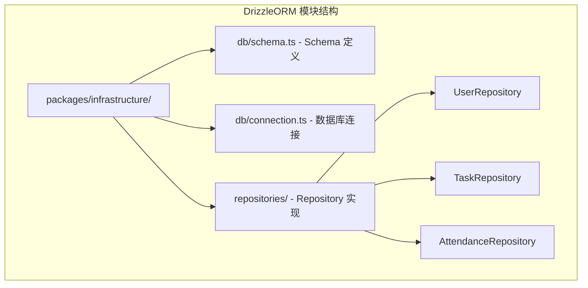
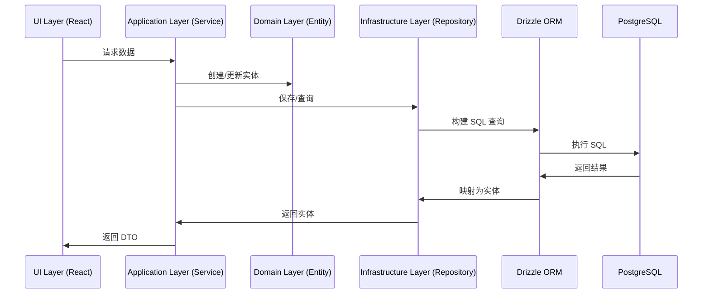
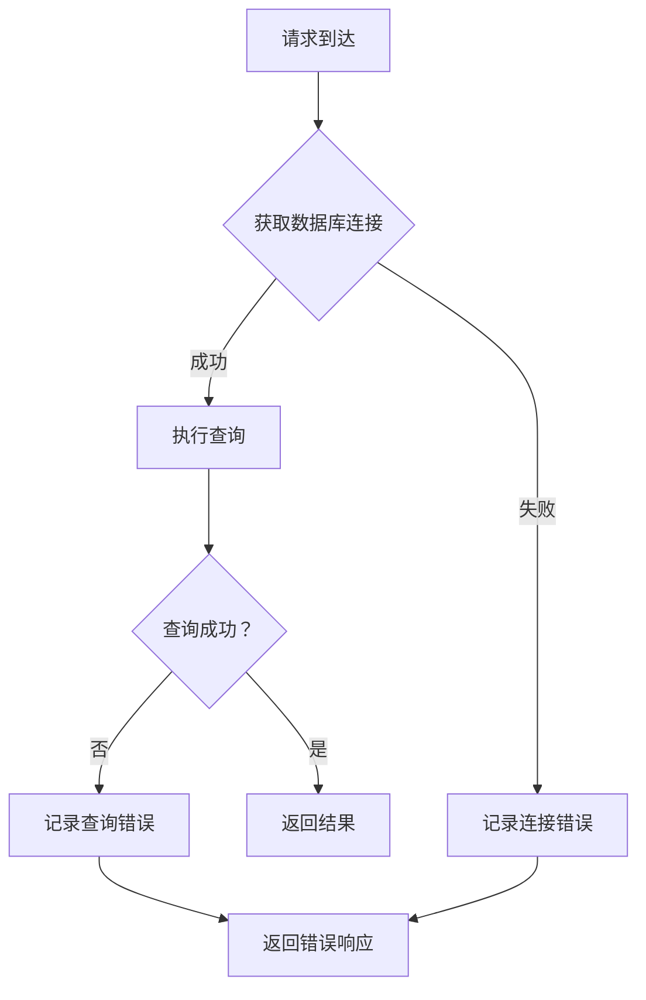
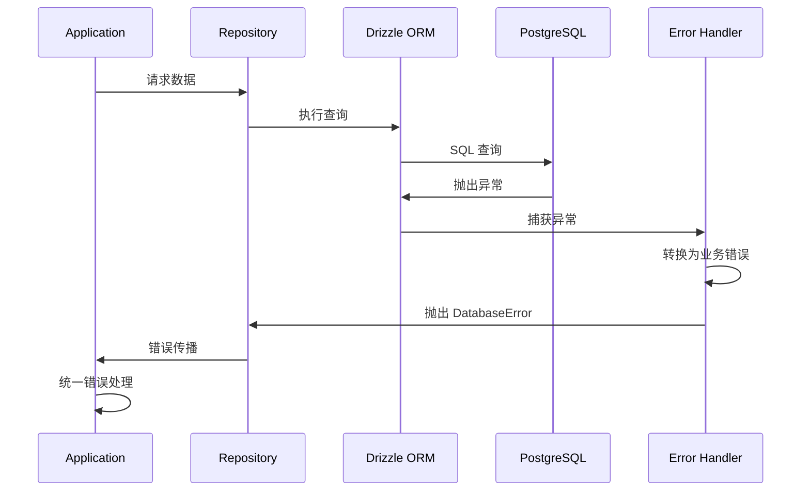

# DrizzleORM

**本文档引用的文件**
- [设计文档](../../../designdoc/specs/design.md)
- [技术栈与依赖.md](../../../.gientech/wiki/技术栈与依赖.md)
- [项目概述.md](../../../.gientech/wiki/项目概述.md)
- [apps/api/package.json](../../../apps/api/package.json)
- [README.md](../../../README.md)

## 目录
1. [简介](#简介)
2. [项目结构](#项目结构)
3. [核心组件](#核心组件)
4. [架构概览](#架构概览)
5. [详细组件分析](#详细组件分析)
6. [配置参数详解](#配置参数详解)
7. [使用示例](#使用示例)
8. [监控与异常处理](#监控与异常处理)
9. [性能考虑](#性能考虑)
10. [故障排除指南](#故障排除指南)
11. [总结](#总结)

## 简介

Drizzle ORM 是一个轻量级、类型安全的 TypeScript ORM 框架，在本项目中用于 PostgreSQL 数据库访问层。它提供了零运行时开销的 SQL 构建器，与 TypeScript 类型系统深度集成，支持代码优先（Code-First）的数据库迁移策略。

**技术选型**：
- **Drizzle ORM**: 0.29.0 — 类型安全的 SQL 构建器
- **Drizzle Kit**: 0.20.0 — 数据库迁移工具
- **pg**: 8.11.0 — PostgreSQL Node.js 驱动
- **PostgreSQL**: 15+ — 关系型数据库

来源：[技术栈与依赖.md](../../../.gientech/wiki/技术栈与依赖.md)、[apps/api/package.json](../../../apps/api/package.json)

## 项目结构

Drizzle ORM 相关代码主要分布在基础设施层：



**图表来源**
- [设计文档](../../../designdoc/specs/design.md)
- [项目概述.md](../../../.gientech/wiki/项目概述.md)

## 核心组件

### Schema 定义层

定义数据库表结构、字段类型、索引和关联关系：

```typescript
// packages/infrastructure/db/schema.ts

import { pgTable, uuid, varchar, boolean, timestamp, date, text, index } from 'drizzle-orm/pg-core';

export const users = pgTable('users', {
  id: uuid('id').primaryKey().defaultRandom(),
  email: varchar('email', { length: 255 }).notNull().unique(),
  passwordHash: varchar('password_hash', { length: 255 }).notNull(),
  name: varchar('name', { length: 100 }),
  isActive: boolean('is_active').notNull().default(true),
  createdAt: timestamp('created_at', { withTimezone: true }).notNull().defaultNow(),
  updatedAt: timestamp('updated_at', { withTimezone: true }).notNull().defaultNow(),
});

export const tasks = pgTable('tasks', {
  id: uuid('id').primaryKey().defaultRandom(),
  userId: uuid('user_id').notNull().references(() => users.id),
  title: varchar('title', { length: 255 }).notNull(),
  description: text('description'),
  status: varchar('status', { length: 50 }).notNull().default('todo'),
  dueDate: date('due_date'),
  createdAt: timestamp('created_at', { withTimezone: true }).notNull().defaultNow(),
  updatedAt: timestamp('updated_at', { withTimezone: true }).notNull().defaultNow(),
}, (table) => ({
  userIdIdx: index('tasks_user_id_idx').on(table.userId),
  statusIdx: index('tasks_status_idx').on(table.status),
  userIdStatusIdx: index('tasks_user_id_status_idx').on(table.userId, table.status),
}));

export const attendanceRecords = pgTable('attendance_records', {
  id: uuid('id').primaryKey().defaultRandom(),
  userId: uuid('user_id').notNull().references(() => users.id),
  checkInTime: timestamp('check_in_time', { withTimezone: true }).notNull(),
  checkOutTime: timestamp('check_out_time', { withTimezone: true }),
  workDate: date('work_date').notNull(),
  createdAt: timestamp('created_at', { withTimezone: true }).notNull().defaultNow(),
}, (table) => ({
  userIdIdx: index('attendance_user_id_idx').on(table.userId),
  workDateIdx: index('attendance_work_date_idx').on(table.workDate),
}));
```

### Repository 实现层

封装数据库操作，实现领域层的 Repository 接口：

```typescript
// packages/infrastructure/repositories/UserRepository.ts

import { db } from '../db/connection';
import { users } from '../db/schema';
import { eq } from 'drizzle-orm';
import { User } from '@ai-harness/domain';

export class UserRepository {
  async findById(id: string): Promise<User | null> {
    const result = await db.select().from(users).where(eq(users.id, id)).limit(1);
    return result.length > 0 ? this.mapToEntity(result[0]) : null;
  }

  async findByEmail(email: string): Promise<User | null> {
    const result = await db.select().from(users).where(eq(users.email, email)).limit(1);
    return result.length > 0 ? this.mapToEntity(result[0]) : null;
  }

  async create(user: User): Promise<User> {
    const result = await db.insert(users).values({
      email: user.email,
      passwordHash: user.passwordHash,
      name: user.name,
      isActive: user.isActive,
    }).returning();
    return this.mapToEntity(result[0]);
  }

  private mapToEntity(record: any): User {
    return new User({
      id: record.id,
      email: record.email,
      passwordHash: record.passwordHash,
      name: record.name,
      isActive: record.isActive,
      createdAt: record.createdAt,
      updatedAt: record.updatedAt,
    });
  }
}
```

**章节来源**
- [设计文档](../../../designdoc/specs/design.md)

## 架构概览

Drizzle ORM 在分层架构中的位置：



**图表来源**
- [设计文档](../../../designdoc/specs/design.md)
- [项目概述.md](../../../.gientech/wiki/项目概述.md)

## 详细组件分析

### 类型安全 Schema 定义

Drizzle ORM 使用 TypeScript 定义 schema，在编译时提供类型检查：

```typescript
// Schema 定义特点
// 1. 字段类型映射到 TypeScript 类型
// 2. 支持必填 (notNull)、唯一 (unique)、默认值 (default) 约束
// 3. 支持外键关联 (references)
// 4. 支持索引定义 (index)

// 示例：带时区的 timestamp
timestamp('created_at', { withTimezone: true })
  .notNull()
  .defaultNow()
// TypeScript 类型：Date | null
```

#### 关键特性

1. **UUID 主键**：使用 `uuid().primaryKey().defaultRandom()` 自动生成 UUID
2. **时区支持**：`timestamp` 字段支持 `withTimezone: true`，存储带时区的时间
3. **索引优化**：支持复合索引，如 `tasks_user_id_status_idx`

### 查询构建器

Drizzle ORM 提供类型安全的查询构建 API：

```typescript
import { eq, and, inArray, desc } from 'drizzle-orm';

// 单条件查询
const user = await db.select().from(users).where(eq(users.id, userId));

// 多条件查询
const tasks = await db.select()
  .from(tasks)
  .where(
    and(
      eq(tasks.userId, userId),
      eq(tasks.status, 'todo')
    )
  );

// IN 查询
const userIds = ['uuid1', 'uuid2', 'uuid3'];
const users = await db.select()
  .from(users)
  .where(inArray(users.id, userIds));

// 排序
const tasks = await db.select()
  .from(tasks)
  .where(eq(tasks.userId, userId))
  .orderBy(desc(tasks.createdAt));
```

### 事务管理

```typescript
import { db } from './db/connection';

await db.transaction(async (tx) => {
  // 事务内的所有操作要么全部成功，要么全部回滚
  const user = await tx.insert(users).values({
    email: 'test@example.com',
    passwordHash: 'hashed_password',
  }).returning();

  await tx.insert(tasks).values({
    userId: user[0].id,
    title: '初始任务',
    status: 'todo',
  });

  // 如果抛出错误，事务自动回滚
});
```

**章节来源**
- [设计文档](../../../designdoc/specs/design.md)

## 配置参数详解

### 数据库连接配置

通过环境变量配置 PostgreSQL 连接：

```typescript
// packages/infrastructure/db/connection.ts

import { drizzle } from 'drizzle-orm/node-postgres';
import { Pool } from 'pg';
import * as schema from './schema';

const connectionString = process.env.DATABASE_URL || 'postgresql://localhost:5432/ai-harness';

const pool = new Pool({
  connectionString,
  max: 20, // 连接池最大连接数
  idleTimeoutMillis: 30000, // 空闲连接超时时间
  connectionTimeoutMillis: 2000, // 连接超时时间
});

export const db = drizzle(pool, { schema });
```

### 参数说明表

| 参数 | 类型 | 默认值 | 描述 |
|------|------|--------|------|
| DATABASE_URL | string | postgresql://localhost:5432/ai-harness | 数据库连接字符串 |
| max | number | 20 | 连接池最大连接数 |
| idleTimeoutMillis | number | 30000 | 空闲连接超时时间（毫秒） |
| connectionTimeoutMillis | number | 2000 | 连接超时时间（毫秒） |

### Drizzle Kit 配置

```typescript
// drizzle.config.ts

import type { Config } from 'drizzle-kit';

export default {
  schema: './packages/infrastructure/db/schema.ts',
  out: './drizzle',
  driver: 'pg',
  dbCredentials: {
    connectionString: process.env.DATABASE_URL!,
  },
} satisfies Config;
```

**章节来源**
- [设计文档](../../../designdoc/specs/design.md)

## 使用示例

### 基础使用示例

#### 创建用户

```typescript
import { UserRepository } from './repositories/UserRepository';

const userRepository = new UserRepository();

const user = await userRepository.create({
  email: 'test@example.com',
  passwordHash: await hashPassword('password123'),
  name: 'テストユーザー',
  isActive: true,
});
```

#### 查询任务列表

```typescript
import { TaskRepository } from './repositories/TaskRepository';

const taskRepository = new TaskRepository();

// 按用户和状态查询
const tasks = await taskRepository.findByUserIdAndStatus(userId, 'todo');

// 按日期范围查询打卡记录
const records = await attendanceRepository.findByUserIdAndDateRange(
  userId,
  '2025-01-01',
  '2025-01-31'
);
```

### 高级使用示例

#### 批量操作

```typescript
// 批量创建任务
const tasksToCreate = [
  { userId, title: '任务 1', status: 'todo' },
  { userId, title: '任务 2', status: 'todo' },
  { userId, title: '任务 3', status: 'todo' },
];

await db.insert(tasks).values(tasksToCreate);
```

#### 关联查询

```typescript
// 查询用户及其所有任务
const userWithTasks = await db.select({
  user: users,
  task: tasks,
})
.from(users)
.leftJoin(tasks, eq(tasks.userId, users.id))
.where(eq(users.id, userId));
```

**章节来源**
- [设计文档](../../../designdoc/specs/design.md)

## 监控与异常处理

### 异常处理机制

```typescript
// packages/infrastructure/db/error-handler.ts

import { PostgresError } from 'drizzle-orm/node-postgres';

export class DatabaseError extends Error {
  constructor(
    message: string,
    public code: string,
    public detail?: string
  ) {
    super(message);
    this.name = 'DatabaseError';
  }
}

export function handleDatabaseError(error: any): never {
  if (error instanceof PostgresError) {
    // 数据库错误
    throw new DatabaseError(
      'データベースエラーが発生しました',
      error.code,
      error.detail
    );
  }

  // 未知错误
  throw new DatabaseError(
    '予期せぬエラーが発生しました',
    'UNKNOWN_ERROR'
  );
}
```

### 监控指标

#### 数据库连接池监控

- **活跃连接数**: 当前正在使用的连接数
- **空闲连接数**: 连接池中可用的连接数
- **等待队列长度**: 等待获取连接的请求数
- **平均查询时间**: SQL 查询的平均执行时间

#### 错误监控维度

- **连接错误**: 连接超时、连接拒绝
- **查询错误**: SQL 语法错误、约束违反
- **事务错误**: 死锁、超时回滚

### 监控流程图



**图表来源**
- [设计文档](../../../designdoc/specs/design.md)

### 异常处理流程



**章节来源**
- [设计文档](../../../designdoc/specs/design.md)

## 性能考虑

### 索引优化

```sql
-- 任务查询优化：复合索引
CREATE INDEX tasks_user_id_status_idx ON tasks(user_id, status);

-- 打卡记录查询优化：复合索引
CREATE INDEX attendance_user_id_work_date_idx ON attendance_records(user_id, work_date);
```

### 避免 N+1 查询

```typescript
// ❌ 错误示例：N+1 查询
const users = await db.select().from(users);
for (const user of users) {
  const tasks = await db.select()
    .from(tasks)
    .where(eq(tasks.userId, user.id));
}

// ✅ 正确示例：批量查询
const users = await db.select().from(users);
const userIds = users.map(u => u.id);
const tasks = await db.select()
  .from(tasks)
  .where(inArray(tasks.userId, userIds));
```

### 连接池配置优化

- **连接池大小**: 根据并发量调整 `max` 参数（默认 20）
- **超时设置**: 合理设置 `idleTimeoutMillis` 和 `connectionTimeoutMillis`
- **预检查**: 启用连接预检查，避免使用失效连接

### 查询优化技巧

- **只查询需要的字段**: 避免 `SELECT *`
- **使用 LIMIT 限制结果数**: 防止大数据量查询
- **合理使用索引**: 为高频查询字段创建索引

**章节来源**
- [设计文档](../../../designdoc/specs/design.md)

## 故障排除指南

### 常见问题及解决方案

#### 1. 数据库连接失败

**问题现象**：启动时抛出 `Connection refused` 错误

**排查步骤**：
1. 检查 PostgreSQL 服务是否启动
2. 验证 `DATABASE_URL` 环境变量配置
3. 检查数据库连接字符串格式
4. 确认防火墙允许数据库端口访问

**解决方案**：
```bash
# 检查 PostgreSQL 状态
pg_isready -h localhost -p 5432

# 验证连接字符串
echo $DATABASE_URL
```

#### 2. Schema 迁移失败

**问题现象**：运行 `npm run db:migrate` 时失败

**排查步骤**：
1. 检查 `drizzle.config.ts` 配置
2. 验证 schema 定义语法
3. 查看迁移日志输出

**解决方案**：
```bash
# 重新生成迁移文件
npx drizzle-kit generate:pg

# 查看迁移 SQL
cat drizzle/*.sql
```

#### 3. 类型错误

**问题现象**：TypeScript 编译报错，类型不匹配

**排查步骤**：
1. 检查 schema 定义与实体类字段是否一致
2. 验证 Repository 映射方法
3. 运行 `npm run typecheck` 查看详细错误

**解决方案**：
```typescript
// 确保 schema 字段类型与实体类匹配
// 使用 .notNull() 的字段在 TypeScript 中为非可选
```

### 监控和调试

#### 启用调试日志

```typescript
// apps/api/src/index.ts

import Fastify from 'fastify';

const app = Fastify({
  logger: {
    level: process.env.LOG_LEVEL || 'info', // 开发环境设为 'debug'
  },
});

// 记录所有数据库查询
app.addHook('onRequest', (request, reply, done) => {
  app.log.debug({
    method: request.method,
    url: request.url,
    userId: (request as any).user?.id,
  });
  done();
});
```

#### 监控命令

```bash
# 查看 PostgreSQL 连接数
psql -c "SELECT count(*) FROM pg_stat_activity;"

# 查看慢查询日志
psql -c "SHOW log_min_duration_statement;"

# 查看表大小
psql -c "SELECT pg_size_pretty(pg_total_relation_size('users'));"
```

**章节来源**
- [设计文档](../../../designdoc/specs/design.md)

## 总结

Drizzle ORM 在本项目中扮演基础设施层的核心角色，提供以下关键能力：

1. **类型安全**: TypeScript schema 定义，编译时类型检查，减少运行时错误
2. **零运行时开销**: 轻量级设计，SQL 构建在编译时完成，执行效率高
3. **灵活查询**: 支持原始 SQL 和构建器 API，复杂查询更灵活
4. **迁移工具**: Drizzle Kit 提供代码优先的数据库迁移方案
5. **时区支持**: 原生支持带时区的 timestamp 字段，符合项目时区处理策略

通过 Drizzle ORM，项目实现了：
- 数据库访问层的类型安全保障
- 与 PostgreSQL 的高效交互
- 清晰的模块边界和依赖关系
- 可维护、可测试的 Repository 模式实现

来源：[技术栈与依赖.md](../../../.gientech/wiki/技术栈与依赖.md)、[设计文档](../../../designdoc/specs/design.md)、[项目概述.md](../../../.gientech/wiki/项目概述.md)
