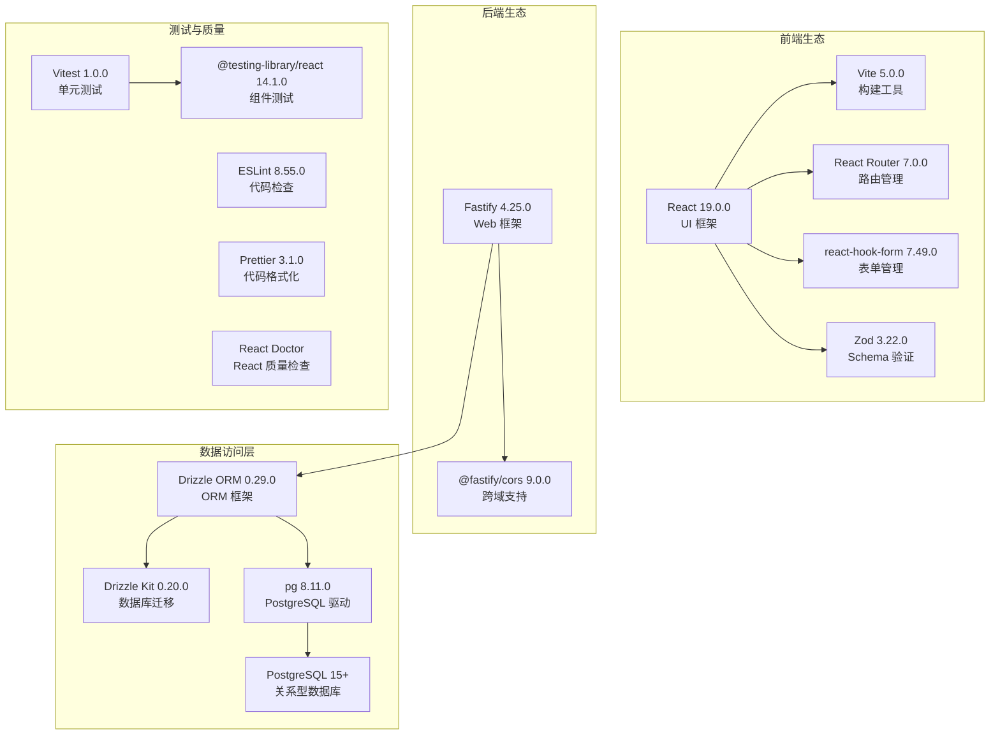
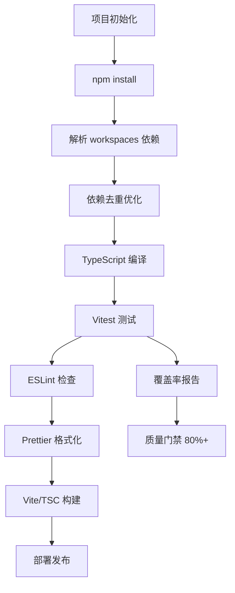
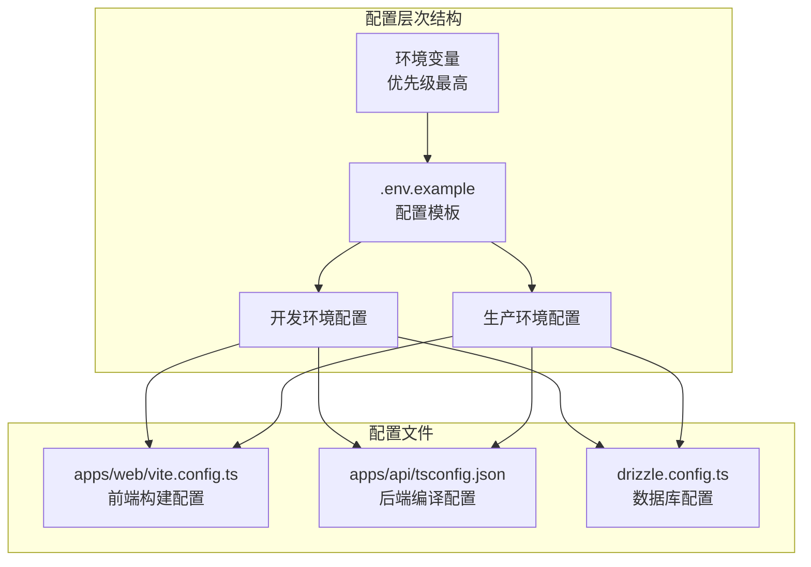
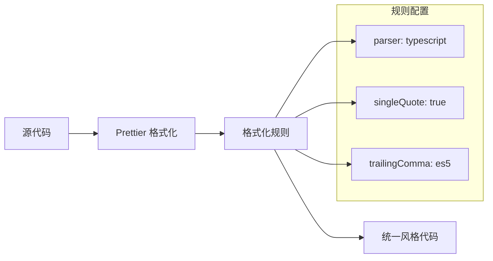
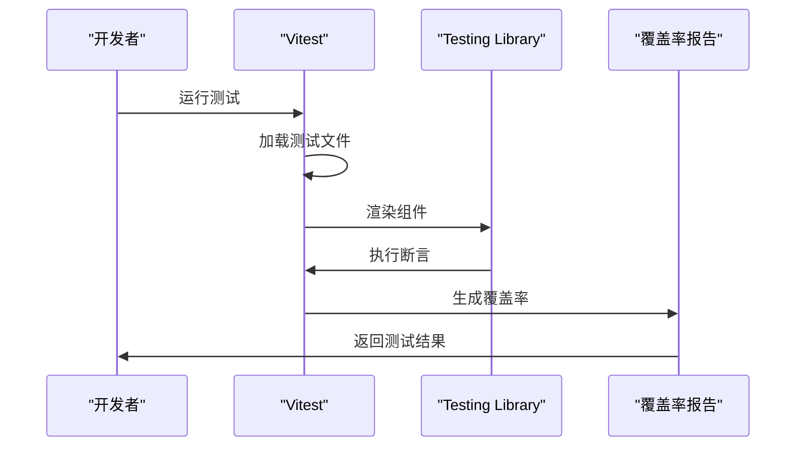
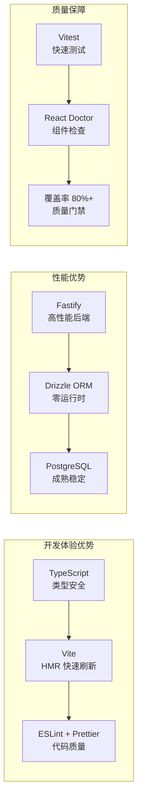
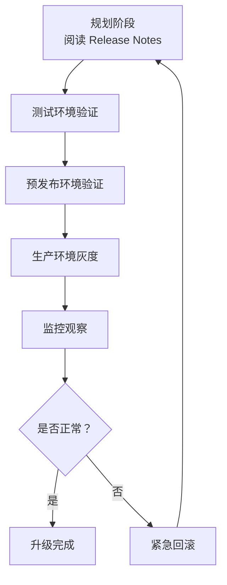

# 技术栈与依赖

**本文档引用的文件**
- [README.md](../../README.md)
- [package.json](../../package.json)
- [apps/web/package.json](../../apps/web/package.json)
- [apps/api/package.json](../../apps/api/package.json)
- [AGENTS.md](../../AGENTS.md)

## 目录
1. [项目概述](#项目概述)
2. [核心技术栈](#核心技术栈)
3. [构建与依赖管理](#构建与依赖管理)
4. [配置管理](#配置管理)
5. [代码质量工具](#代码质量工具)
6. [技术选型分析](#技术选型分析)
7. [依赖升级指导](#依赖升级指导)
8. [最佳实践建议](#最佳实践建议)

## 项目概述

本项目是一个基于 **Node.js + TypeScript** 的勤务任务管理后台系统，专门为练习 **AI Agent 在约束下可靠交付** 设计。项目采用 **Monorepo 架构**，支持前后端分离开发，具备 **TDD 驱动、类型安全、时区感知** 等技术特点。

### 核心特性
- **日文界面**：面向日本用户的勤务・任务管理功能
- **Monorepo 架构**：使用 npm workspaces 管理前后端依赖
- **类型安全**：TypeScript strict 模式全覆盖
- **TDD 实践**：Vitest 单元测试，覆盖率目标 80%+
- **时区处理**：UTC 存储，Asia/Tokyo 展示

## 核心技术栈

### Node.js 生态系统

**图表来源**
- [README.md](../../README.md)
- [apps/web/package.json](../../apps/web/package.json)
- [apps/api/package.json](../../apps/api/package.json)

### 技术选型详解

#### React 19.0.0
- **版本选择原因**: 采用最新稳定版本，享受性能优化和新特性
- **核心功能**: 组件化 UI、虚拟 DOM、Hooks API
- **应用场景**: 前端页面渲染、状态管理、表单交互

#### Fastify 4.25.0
- **认证授权**: 通过插件机制支持多种认证方式
- **安全控制**: 内置输入验证、速率限制插件支持
- **会话管理**: 支持无状态 JWT 认证

#### Drizzle ORM 0.29.0
- **优势**: 类型安全的 SQL 构建器，零运行时开销
- **使用场景**: 数据库查询、事务管理、数据迁移
- **配置特点**: 使用 TypeScript schema 定义，支持代码优先迁移

#### PostgreSQL 15+
- **数据结构**: 支持 JSONB、数组、自定义类型等丰富数据结构
- **持久化**: WAL 日志、检查点、崩溃恢复
- **集群支持**: 流复制、逻辑复制、连接池

#### Zod 3.22.0
- **Schema 验证**: 运行时类型检查，与 TypeScript 类型推导集成
- **应用场景**: 表单验证、API 请求/响应校验、环境变量验证

## 构建与依赖管理

### npm 构建系统

项目采用 **npm workspaces** 作为依赖管理工具，配合 `.nvmrc` 或 `engines` 配置确保环境一致性。

**图表来源**
- [package.json](../../package.json)
- [AGENTS.md](../../AGENTS.md)

### 依赖管理策略

#### 核心依赖版本
- **Node.js**: >= 20.0.0（LTS 版本，支持最新 ECMAScript 特性）
- **React**: ^19.0.0（最新主版本，性能优化）
- **TypeScript**: ^5.3.0（strict 模式，类型推导优化）
- **Vite**: ^5.0.0（HMR 快速刷新，生产构建优化）
- **Fastify**: ^4.25.0（高性能，低开销）
- **Drizzle ORM**: ^0.29.0（类型安全，零运行时）
- **PostgreSQL**: 15+（JSONB 支持，性能优化）
- **Vitest**: ^1.0.0（Vite 原生，快速测试）

#### 依赖升级策略
1. **渐进式升级**: 先升级非核心依赖，观察稳定性后再升级核心框架
2. **向后兼容**: 遵循 SemVer 规范，主版本升级需评估 Breaking Changes
3. **性能评估**: 升级前后运行基准测试，确保性能无回退
4. **回滚计划**: 使用 `package-lock.json` 锁定版本，支持快速回滚

## 配置管理

### 配置文件结构

项目采用 **环境变量 + 配置文件** 的多环境配置管理：

**图表来源**
- [README.md](../../README.md)
- [apps/web/tsconfig.json](../../apps/web/tsconfig.json)
- [apps/api/tsconfig.json](../../apps/api/tsconfig.json)

### 环境配置详解

#### 开发环境配置
- **数据库连接**: 通过 `.env` 文件配置 PostgreSQL 连接字符串
- **服务地址**: 前端 Vite 开发服务器默认端口 5173，后端 Fastify 默认端口 3000
- **CORS 设置**: 开发环境允许跨域请求

#### 生产环境配置
- **数据库连接**: 使用连接池配置，支持高并发
- **监控集成**: 支持日志输出、性能指标采集
- **构建优化**: Vite 生产构建启用代码分割、Tree Shaking

#### 配置加载优先级
1. 环境变量（最高优先级）
2. `.env` 文件配置
3. 配置文件默认值（最低优先级）

## 代码质量工具

### ESLint 配置

项目集成 ESLint 代码规范检查工具，确保代码风格一致性：

- **规则集**: TypeScript ESLint + React ESLint
- **检查范围**: 源代码 + 测试代码
- **集成方式**: CI/CD 强制检查，本地开发可选运行

### Prettier 格式化

**图表来源**
- [package.json](../../package.json)

### TypeScript strict 模式

- **类型安全**: 启用 strict 模式，禁止隐式 any
- **编译检查**: `tsc --noEmit` 类型检查
- **IDE 集成**: 实时类型错误提示

### React Doctor

- **检查内容**: React 组件规范、Hooks 使用规则
- **集成方式**: `npm run doctor -w apps/web`
- **应用场景**: CI/CD 质量门禁、代码审查辅助

### Vitest 单元测试

**图表来源**
- [apps/web/package.json](../../apps/web/package.json)
- [apps/api/package.json](../../apps/api/package.json)

## 技术选型分析

### 为什么选择这些技术？

#### React vs 其他框架
- **生态系统**: 最丰富的组件库和社区支持
- **性能**: React 19 编译器优化，自动批量更新
- **类型安全**: 与 TypeScript 深度集成

#### Fastify vs Express
- **性能优势**: 基于 Schema 的验证，性能比 Express 快 2-3 倍
- **类型安全**: 支持 TypeScript 类型推导
- **插件生态**: 丰富的官方和社区插件

#### Drizzle ORM vs Prisma
- **性能优势**: 零运行时开销，SQL 执行效率更高
- **类型安全**: TypeScript schema 定义，编译时类型检查
- **灵活性**: 支持原始 SQL，复杂查询更灵活

#### Vitest vs Jest
- **速度优势**: 基于 Vite，测试启动速度快 10 倍+
- **配置简单**: 复用 Vite 配置，无需额外设置
- **兼容性**: 支持 Jest 断言语法，迁移成本低

### 技术组合的优势

## 依赖升级指导

### 升级策略

#### 版本兼容性检查
1. **API 兼容性**: 阅读 Changelog，识别 Breaking Changes
2. **配置变更**: 检查是否需要更新构建配置
3. **行为变更**: 运行全量测试，确保功能正常
4. **性能影响**: 运行基准测试，确保性能无回退

#### 渐进式升级步骤

### 推荐升级路径

#### React 升级
- **当前版本**: 19.0.0
- **升级要点**:
  - 关注 React 19 新特性（Actions、useOptimistic 等）
  - 检查第三方组件库兼容性
  - 更新 @types/react 类型定义

#### TypeScript 升级
- **当前版本**: 5.3.0
- **升级要点**:
  - 关注新语法特性
  - 检查 strict 模式兼容性
  - 更新 tsconfig 配置

#### Drizzle ORM 升级
- **当前版本**: 0.29.0
- **升级要点**:
  - 检查 schema 定义语法变更
  - 更新 drizzle-kit 版本
  - 验证迁移脚本兼容性

### 升级风险评估

#### 高风险升级
- **React 主版本升级**: 可能涉及 API 变更
- **TypeScript 主版本升级**: 类型推导规则可能变化
- **数据库驱动升级**: 可能影响连接池配置

#### 中风险升级
- **ORM 框架升级**: schema 定义语法可能变更
- **构建工具升级**: 构建配置可能需要调整
- **测试框架升级**: 断言语法可能变化

#### 低风险升级
- **工具库升级**: ESLint、Prettier 等工具
- **补丁版本升级**: 修复 bug，无功能变更
- **类型定义升级**: @types/* 包升级

## 最佳实践建议

### 开发最佳实践

#### 代码组织
- **模块化设计**: 按功能划分模块，遵循单一职责原则
- **接口隔离**: 使用 TypeScript interface 定义清晰边界
- **类型安全**: 避免使用 any，使用 unknown 处理不确定类型

#### 配置管理
- **环境隔离**: 开发、测试、生产环境配置分离
- **敏感信息**: 使用环境变量，禁止硬编码密钥
- **配置验证**: 使用 Zod 验证环境变量格式

#### 测试策略
- **单元测试**: 覆盖核心业务逻辑，目标 80%+
- **集成测试**: 测试 API 端点、数据库交互
- **端到端测试**: 关键用户流程测试

### 运维最佳实践

#### 监控告警
- **应用指标**: 请求延迟、错误率、吞吐量
- **业务指标**: 用户活跃度、任务完成率
- **基础设施**: CPU、内存、磁盘、网络

#### 日志管理
- **结构化日志**: JSON 格式，便于日志分析
- **日志分级**: DEBUG/INFO/WARN/ERROR
- **日志轮转**: 按大小或时间分割，保留策略

#### 容灾备份
- **数据备份**: 每日全量备份 + 增量备份
- **异地容灾**: 跨区域数据复制
- **故障演练**: 定期 Chaos Engineering 演练

### 性能优化建议

#### 数据库优化
- **索引设计**: 为高频查询字段创建索引
- **查询优化**: 避免 N+1 查询，使用 JOIN 优化
- **连接池**: 配置合理的连接池大小

#### 缓存策略
- **热点数据**: 使用内存缓存减少数据库压力
- **缓存失效**: 设置合理的 TTL，避免脏数据
- **缓存穿透**: 使用布隆过滤器或空值缓存

#### 系统调优
- **Node.js 参数**: 调整 --max-old-space-size
- **线程池**: 配置 libuv 线程池大小
- **网络调优**: 启用 HTTP Keep-Alive

### 安全最佳实践

#### 访问控制
- **最小权限**: 数据库账号按需授权
- **定期审计**: 审查访问日志和权限配置
- **双因素认证**: 关键操作启用 2FA

#### 数据保护
- **传输加密**: 启用 HTTPS，使用 TLS 1.3
- **存储加密**: 敏感数据加密存储
- **数据脱敏**: 日志中脱敏敏感信息

#### 安全监控
- **入侵检测**: 监控异常访问模式
- **漏洞扫描**: 定期扫描依赖漏洞
- **合规检查**: 遵循 GDPR 等数据保护法规

通过遵循这些最佳实践，可以确保系统的稳定性、安全性和可维护性，为业务发展提供坚实的技术基础。
