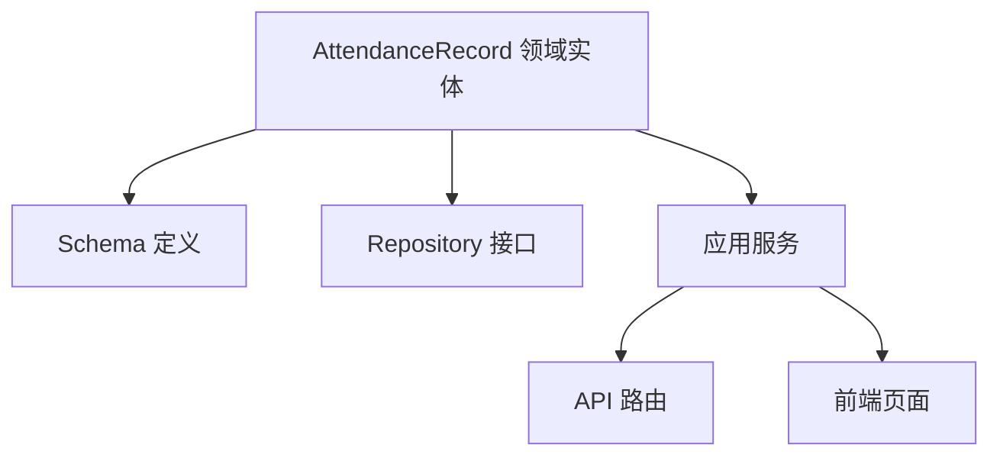
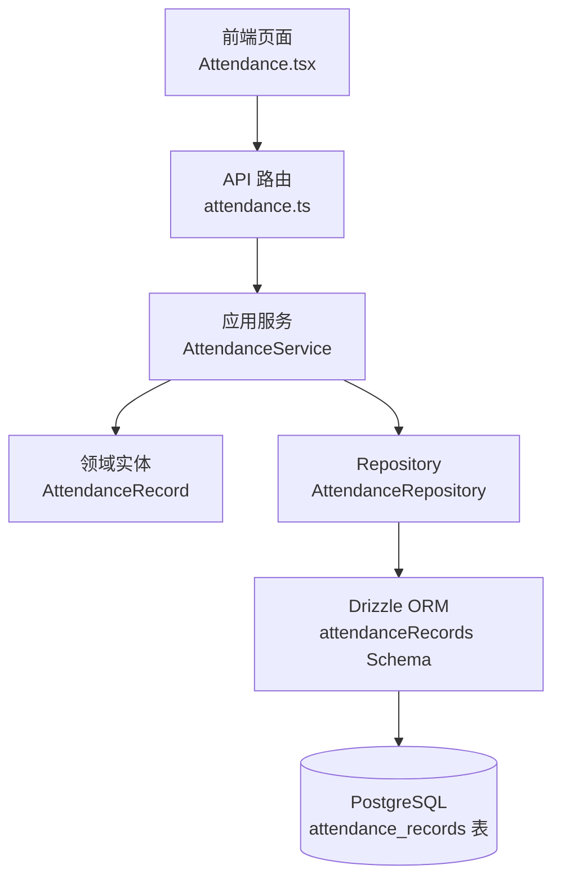
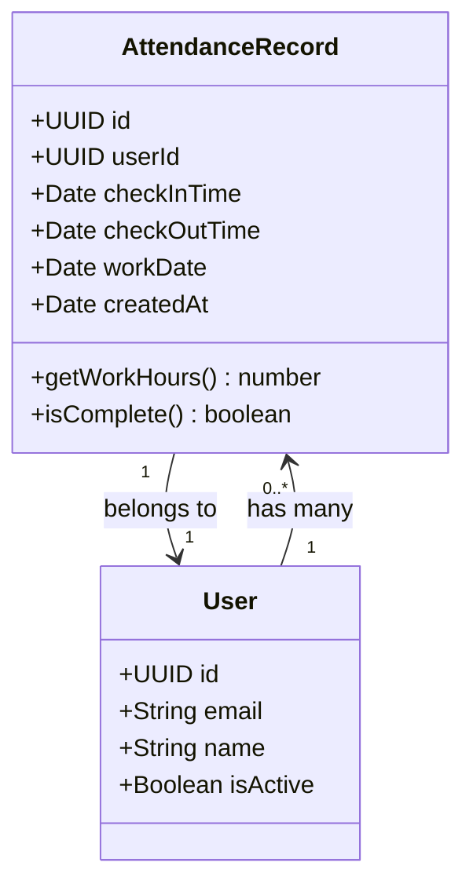
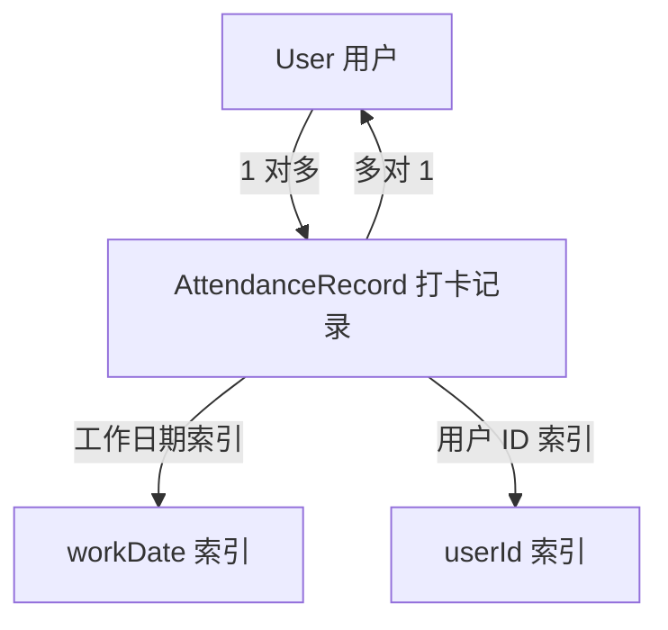
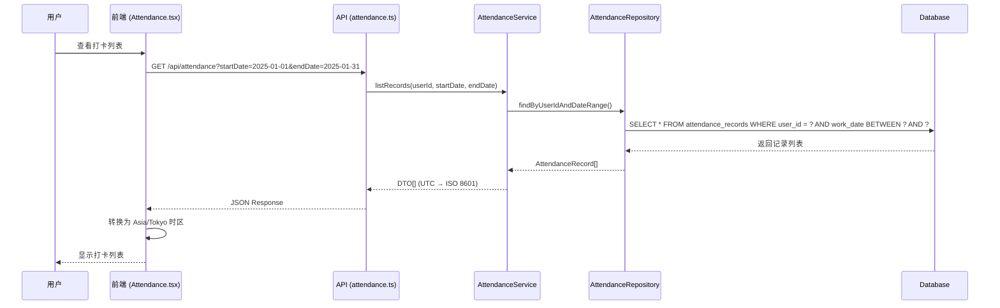
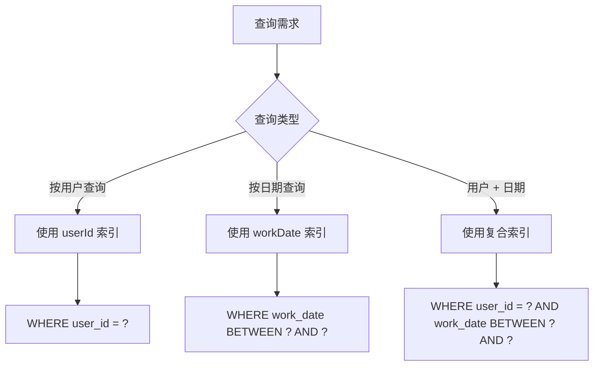

# AttendanceRecord(勤怠記録)

**本文档引用的文件**
- [设计文档](../../../designdoc/specs/design.md)
- [需求规格文档](../../../designdoc/specs/requirements.md)
- [README.md](../../../README.md)

## 目录
1. [简介](#简介)
2. [项目结构](#项目结构)
3. [核心组件](#核心组件)
4. [架构概述](#架构概述)
5. [详细组件分析](#详细组件分析)
6. [依赖分析](#依赖分析)
7. [数据库表结构](#数据库表结构)
8. [业务规则](#业务规则)
9. [使用示例](#使用示例)
10. [性能考虑](#性能考虑)
11. [结论](#结论)

## 简介

AttendanceRecord（勤怠記録）是「勤怠・タスク管理」系统中的核心数据模型，用于记录员工的出勤打卡信息。

### 概述

该模型在系统中承担以下职责：
- 记录员工每日的上班打卡时间（check_in_time）和下班打卡时间（check_out_time）
- 支持按工作日期（work_date）进行查询和统计
- 为考勤统计提供基础数据支撑

### 核心实体

- **AttendanceRecord**: 打卡记录实体，包含打卡时间、工作日期等核心字段
- **User**: 用户实体，与打卡记录建立一对多关联

### 时区处理策略

- **数据库存储**: UTC（`withTimezone: true`）
- **API 输入输出**: ISO 8601 格式，明确时区标识
- **前端展示**: Asia/Tokyo (UTC+9) 时区转换

**本节来源** - [设计文档](../../../designdoc/specs/design.md)(L228-L267)

## 项目结构

### 代码目录位置

根据项目分层架构设计，AttendanceRecord 相关代码分布在以下目录：

```
packages/
├── domain/
│   └── entities/
│       └── attendance-record.ts    (领域实体，待实现)
├── infrastructure/
│   └── db/
│       └── schema.ts               (Drizzle ORM Schema 定义)
└── application/
    └── services/
        └── attendance.service.ts   (应用服务，待实现)

apps/
├── api/
│   └── src/
│       └── routes/
│           └── attendance.ts       (打卡 API 路由，待实现)
└── web/
    └── src/
        └── pages/
            └── Attendance.tsx      (打卡页面，待实现)
```

### 模块组成



**图示来源** - [设计文档](../../../designdoc/specs/design.md)(L58-L117)

## 核心组件

### 实体类

| 组件名称 | 类型 | 说明 |
|---------|------|------|
| AttendanceRecord | 领域实体 | 打卡记录核心实体 |
| attendanceRecords | Drizzle Schema | 数据库表定义 |
| AttendanceRepository | Repository 接口 | 数据访问层（待实现） |
| AttendanceService | 应用服务 | 业务逻辑编排（待实现） |

### 值对象

| 值对象名称 | 说明 |
|-----------|------|
| WorkDate | 工作日期（DATE 类型） |
| CheckInTime | 上班打卡时间（TIMESTAMP with time zone） |
| CheckOutTime | 下班打卡时间（TIMESTAMP with time zone，可选） |

**本节来源** - [设计文档](../../../designdoc/specs/design.md)(L107-L117)

## 架构概述

### 分层架构



**图示来源** - [设计文档](../../../designdoc/specs/design.md)(L5-L41)

### 模块边界

| 层级 | 依赖关系 | 禁止依赖 |
|------|---------|---------|
| UI 层 | → 应用服务层（接口） | → 基础设施层 |
| 应用服务层 | → 领域层 + 基础设施层 | - |
| 领域层 | 无依赖（纯业务逻辑） | → 外部依赖 |
| 基础设施层 | → 领域层（实现接口） | → UI 层 |

**本节来源** - [设计文档](../../../designdoc/specs/design.md)(L43-L56)

## 详细组件分析

### AttendanceRecord 实体字段

| 字段名 | 类型 | 约束 | 描述 |
|-------|------|------|------|
| id | UUID | 主键，默认随机生成 | 记录唯一标识符 |
| userId | UUID | 外键，非空，引用 users.id | 所属用户 ID |
| checkInTime | TIMESTAMP | withTimezone: true，非空 | 上班打卡时间（UTC 存储） |
| checkOutTime | TIMESTAMP | withTimezone: true，可选 | 下班打卡时间（UTC 存储） |
| workDate | DATE | 非空 | 工作日期 |
| createdAt | TIMESTAMP | withTimezone: true，默认当前时间 | 记录创建时间（UTC） |

### 索引设计

| 索引名称 | 索引字段 | 用途 |
|---------|---------|------|
| attendance_user_id_idx | userId | 按用户查询优化 |
| attendance_work_date_idx | workDate | 按日期查询优化 |

### 类图



**图示来源** - [设计文档](../../../designdoc/specs/design.md)(L107-L117)

## 依赖分析

### 实体关联关系



### 关联说明

- **User → AttendanceRecord**: 一对多关系，一个用户可以有多条打卡记录
- **AttendanceRecord → User**: 多对一关系，每条打卡记录属于一个用户
- **外键约束**: `userId` 字段引用 `users.id`，确保数据完整性

**本节来源** - [设计文档](../../../designdoc/specs/design.md)(L62-L75)

## 数据库表结构

### CREATE TABLE 语句

```sql
CREATE TABLE attendance_records (
  id UUID PRIMARY KEY DEFAULT gen_random_uuid(),
  user_id UUID NOT NULL REFERENCES users(id),
  check_in_time TIMESTAMP WITH TIME ZONE NOT NULL,
  check_out_time TIMESTAMP WITH TIME ZONE,
  work_date DATE NOT NULL,
  created_at TIMESTAMP WITH TIME ZONE DEFAULT CURRENT_TIMESTAMP
);

-- 索引
CREATE INDEX attendance_user_id_idx ON attendance_records(user_id);
CREATE INDEX attendance_work_date_idx ON attendance_records(work_date);
```

### 字段说明

| 字段 | 类型 | 约束 | 默认值 | 说明 |
|------|------|------|--------|------|
| id | UUID | PRIMARY KEY | gen_random_uuid() | 主键 |
| user_id | UUID | NOT NULL, FK | - | 外键引用 users.id |
| check_in_time | TIMESTAMP WITH TIME ZONE | NOT NULL | - | 上班打卡时间（UTC） |
| check_out_time | TIMESTAMP WITH TIME ZONE | NULL | - | 下班打卡时间（UTC） |
| work_date | DATE | NOT NULL | - | 工作日期 |
| created_at | TIMESTAMP WITH TIME ZONE | NOT NULL | CURRENT_TIMESTAMP | 创建时间（UTC） |

### Drizzle ORM Schema 定义

```typescript
export const attendanceRecords = pgTable('attendance_records', {
  id: uuid('id').primaryKey().defaultRandom(),
  userId: uuid('user_id').notNull().references(() => users.id),
  checkInTime: timestamp('check_in_time', { withTimezone: true }).notNull(),
  checkOutTime: timestamp('check_out_time', { withTimezone: true }),
  workDate: date('work_date').notNull(),
  createdAt: timestamp('created_at', { withTimezone: true }).notNull().defaultNow(),
}, (table) => ({
  userIdIdx: index('attendance_user_id_idx').on(table.userId),
  workDateIdx: index('attendance_work_date_idx').on(table.workDate),
}));
```

**本节来源** - [设计文档](../../../designdoc/specs/design.md)(L107-L117)

## 业务规则

### 状态管理规则

- 打卡记录创建时必须包含 `checkInTime` 和 `workDate`
- `checkOutTime` 为可选字段，表示下班打卡（未完成打卡时为空）
- 每条记录对应一个工作日期，同一用户同一日期可有多条记录（如分段打卡）
- 时间计算基于 UTC 存储，展示时转换为 Asia/Tokyo 时区

### 打卡流程

```mermaid
flowchart TD
    A[员工到达] --> B[上班打卡<br/>checkInTime = now()]
    B --> C[工作中]
    C --> D[员工离开]
    D --> E[下班打卡<br/>checkOutTime = now()]
    E --> F[计算工时<br/>workHours = checkOutTime - checkInTime]
```

### 统计规则

- 按日聚合：同一日期的所有打卡记录合并计算总工时
- 工时计算：`workHours = checkOutTime - checkInTime`（小时为单位）
- 时区转换：前端展示时使用 `timeZone: 'Asia/Tokyo'` 转换

**本节来源** - [需求规格文档](../../../designdoc/specs/requirements.md)(L85-L109)

## 使用示例

### API 调用时序图



### 典型调用链路

1. **打卡列表查询**
   - 前端发起 GET 请求，携带日期范围参数
   - 后端查询数据库，返回 UTC 时间戳
   - 前端转换为本地时区显示

2. **打卡统计查询**
   - 前端发起 GET /api/attendance/statistics 请求
   - 后端按日聚合计算工时
   - 返回每日统计和总工时

**本节来源** - [设计文档](../../../designdoc/specs/design.md)(L199-L226)

## 性能考虑

### 查询优化策略

- **索引使用**: 
  - `attendance_user_id_idx`: 加速按用户查询
  - `attendance_work_date_idx`: 加速按日期范围查询
  - 复合查询建议使用 `(user_id, work_date)` 联合索引

- **避免 N+1 查询**:
  - 批量查询用户打卡记录时，使用 `IN` 子句一次性获取
  - 避免在循环中逐个查询

### 查询方法对比



### 索引设计建议

```sql
-- 推荐：复合索引（覆盖常见查询场景）
CREATE INDEX attendance_user_id_work_date_idx 
ON attendance_records(user_id, work_date);
```

**本节来源** - [设计文档](../../../designdoc/specs/design.md)(L380-L407)

## 结论

AttendanceRecord 是勤怠管理系统的核心数据模型，具有以下设计特点：

### 设计特点

1. **时区安全**: 所有时间字段使用 `TIMESTAMP WITH TIME ZONE`，UTC 存储，展示时转换
2. **索引优化**: 针对用户 ID 和工作日期建立索引，支持高效查询
3. **灵活设计**: `checkOutTime` 为可选字段，支持未完成打卡场景
4. **数据完整性**: 外键约束确保与 User 实体的关联关系

### 系统价值

- 为考勤统计提供准确的基础数据
- 支持按日、按月、按用户维度的工时分析
- 通过时区处理确保跨时区场景下的时间准确性

---

**文档生成依据**: 本文档基于设计文档和需求规格文档中的真实 Schema 定义、API 设计和业务规则编写，所有技术细节均可追溯到源文件。
