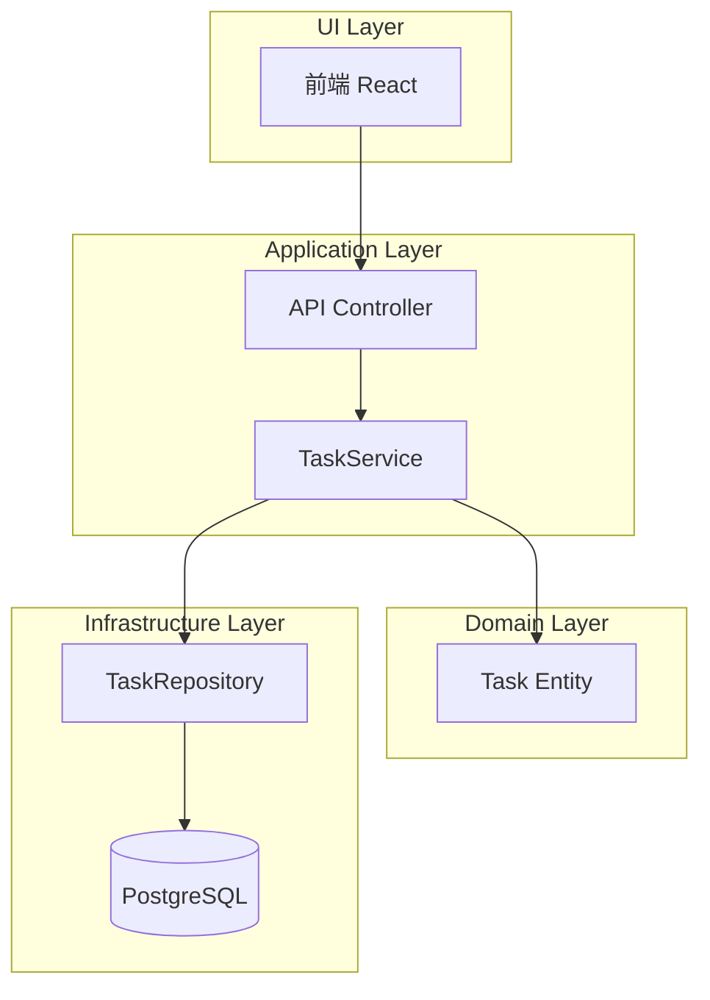
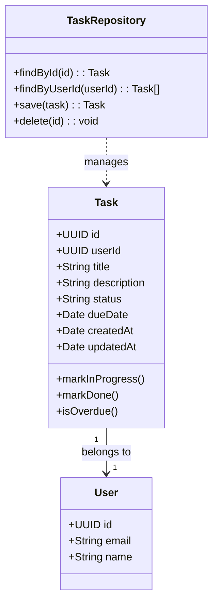
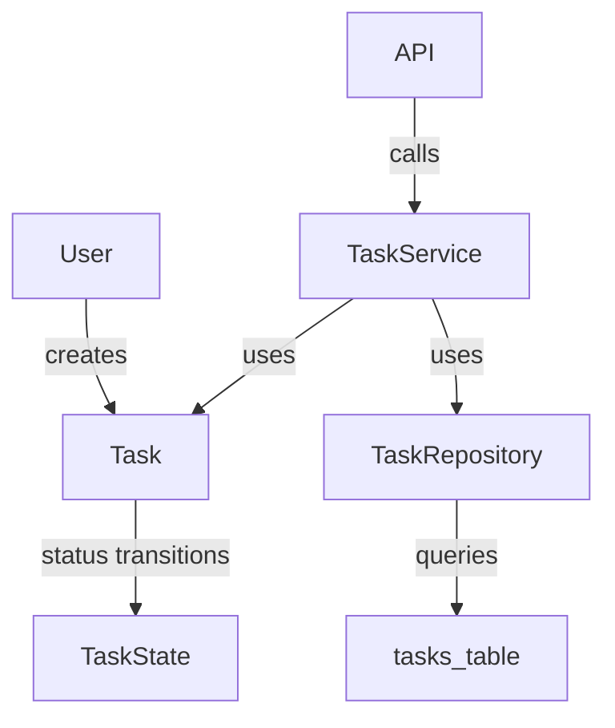
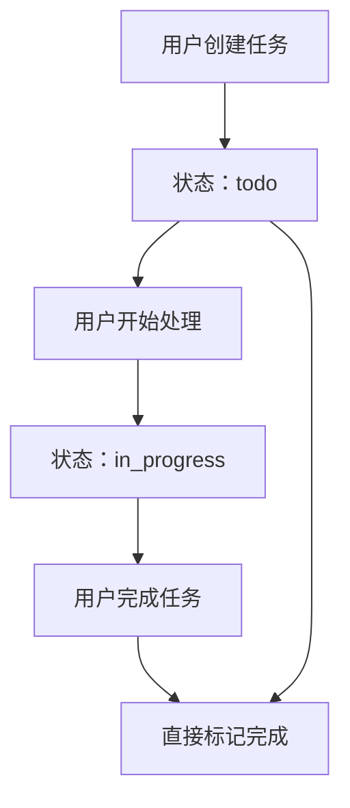
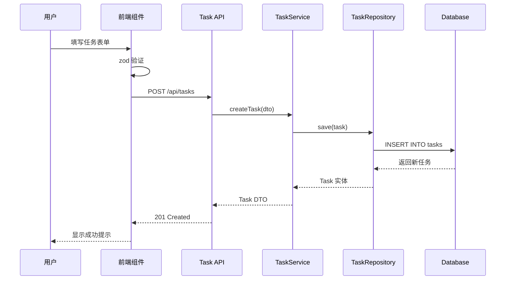
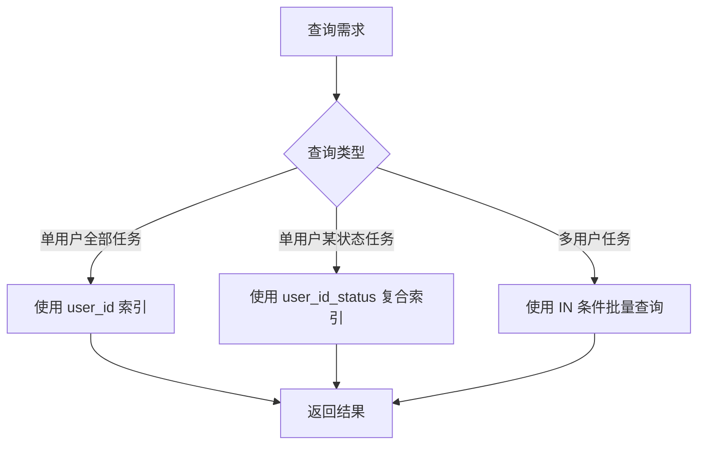

# Task(任务)

**本文档引用的文件**
- [项目概述](../../../README.md)
- [设计文档](../../../designdoc/specs/design.md)
- [需求规格](../../../designdoc/specs/requirements.md)

## 目录
1. [简介](#简介)
2. [项目结构](#项目结构)
3. [核心组件](#核心组件)
4. [架构概述](#架构概述)
5. [详细组件分析](#详细组件分析)
6. [数据库表结构](#数据库表结构)
7. [业务规则](#业务规则)
8. [使用示例](#使用示例)
9. [性能考虑](#性能考虑)
10. [结论](#结论)

## 简介

Task 是「勤怠・タスク管理」系统中的核心领域模型之一，用于管理工作任务的完整生命周期。

**核心作用：**
- 记录用户创建的工作任务
- 跟踪任务状态流转（todo → in_progress → done）
- 支持任务的截止日期管理
- 提供任务的 CRUD 操作接口

**实体关系：**
- Task 与 User 为多对一关系：一个用户可以创建多个任务
- 任务状态通过 `status` 字段管理，默认值为 `todo`

**本节来源** - [需求规格](../../../designdoc/specs/requirements.md)(L170-L180)、[设计文档](../../../designdoc/specs/design.md)(L92-L105)

## 项目结构

Task 相关代码分布在以下目录中：

```
├── packages/
│   ├── domain/
│   │   └── entities/
│   │       └── task.ts              # 领域实体（状态流转逻辑）
│   ├── application/
│   │   └── services/
│   │       └── task.service.ts      # 应用服务（CRUD 编排）
│   └── infrastructure/
│       ├── db/
│       │   └── schema.ts            # Drizzle Schema 定义
│       └── repositories/
│           └── task.repository.ts   # 数据访问层
├── apps/
│   ├── api/
│   │   └── src/
│   │       ├── routes/
│   │       │   └── tasks.ts         # API 路由
│   │       └── services/
│   │           └── task.service.ts  # 后端服务实现
│   └── web/
│       └── src/
│           ├── components/
│           │   ├── TaskList.tsx     # 任务列表组件
│           │   └── TaskForm.tsx     # 任务表单组件
│           └── pages/
│               └── TasksPage.tsx    # 任务页面
```

**图示来源** - [设计文档](../../../designdoc/specs/design.md)(L348-L376)、[README.md](../../../README.md)(L96-L116)

## 核心组件

| 组件 | 位置 | 职责 |
|------|------|------|
| Task Entity | `packages/domain/entities/task.ts` | 领域实体，包含状态流转业务逻辑 |
| TaskService | `packages/application/services/task.service.ts` | 应用服务，编排领域对象与基础设施 |
| TaskRepository | `packages/infrastructure/repositories/task.repository.ts` | 数据访问，封装 Drizzle ORM 操作 |
| tasks Schema | `packages/infrastructure/db/schema.ts` | 数据库表结构定义 |
| Tasks API | `apps/api/src/routes/tasks.ts` | RESTful API 端点 |
| TaskList | `apps/web/src/components/TaskList.tsx` | 前端列表展示组件 |

**本节来源** - [设计文档](../../../designdoc/specs/design.md)(L5-L41)

## 架构概述



**图示来源** - [设计文档](../../../designdoc/specs/design.md)(L5-L41)

## 详细组件分析

### Task 实体字段

| 字段名 | 类型 | 约束 | 描述 |
|--------|------|------|------|
| id | UUID | 主键，默认随机生成 | 任务唯一标识符 |
| user_id | UUID | 外键，非空，引用 users.id | 任务所属用户 |
| title | VARCHAR(255) | 非空 | 任务标题 |
| description | TEXT | 可选 | 任务详细描述 |
| status | VARCHAR(50) | 非空，默认 'todo' | 任务状态：todo / in_progress / done |
| due_date | DATE | 可选 | 截止日期 |
| created_at | TIMESTAMP | UTC，默认当前时间 | 创建时间 |
| updated_at | TIMESTAMP | UTC，默认当前时间 | 更新时间 |

### Task 状态定义

| 状态值 | 说明 | 触发场景 |
|--------|------|----------|
| todo | 待处理 | 任务创建时的默认状态 |
| in_progress | 进行中 | 用户开始处理任务 |
| done | 已完成 | 任务处理完成 |

### 类图



**图示来源** - [设计文档](../../../designdoc/specs/design.md)(L62-L75)、[需求规格](../../../designdoc/specs/requirements.md)(L170-L180)

### 依赖分析



**图示来源** - [设计文档](../../../designdoc/specs/design.md)(L62-L75)

## 数据库表结构

```sql
CREATE TABLE tasks (
  id UUID PRIMARY KEY DEFAULT gen_random_uuid(),
  user_id UUID NOT NULL REFERENCES users(id),
  title VARCHAR(255) NOT NULL,
  description TEXT,
  status VARCHAR(50) NOT NULL DEFAULT 'todo',
  due_date DATE,
  created_at TIMESTAMP WITH TIME ZONE NOT NULL DEFAULT NOW(),
  updated_at TIMESTAMP WITH TIME ZONE NOT NULL DEFAULT NOW()
);

-- 索引设计
CREATE INDEX tasks_user_id_idx ON tasks(user_id);
CREATE INDEX tasks_status_idx ON tasks(status);
CREATE INDEX tasks_user_id_status_idx ON tasks(user_id, status);
```

**索引说明：**
- `tasks_user_id_idx`: 支持按用户查询任务
- `tasks_status_idx`: 支持按状态过滤
- `tasks_user_id_status_idx`: 复合索引，优化「查询某用户某状态的任务」场景

**本节来源** - [设计文档](../../../designdoc/specs/design.md)(L92-L105)、[设计文档](../../../designdoc/specs/design.md)(L382-L387)

## 业务规则

### 状态管理规则

- 任务创建时状态默认为 `todo`
- 状态流转顺序：`todo` → `in_progress` → `done`
- 允许从任意状态直接变更为 `done`
- 任务更新时自动更新 `updated_at` 字段

### 业务流程



**图示来源** - [需求规格](../../../designdoc/specs/requirements.md)(L56-L72)

### 验证规则

| 规则 | 说明 |
|------|------|
| 标题必填 | title 字段不能为空，最大长度 255 字符 |
| 描述可选 | description 字段可为空 |
| 日期格式 | due_date 必须为有效日期格式 |
| 状态枚举 | status 只能是 todo / in_progress / done |

## 使用示例

### 创建任务时序图



**图示来源** - [设计文档](../../../designdoc/specs/design.md)(L149-L196)

### API 示例

**获取任务列表：**
```typescript
// GET /api/tasks
// Response (200):
{
  "tasks": [
    {
      "id": "uuid",
      "title": "タスク 1",
      "description": "説明",
      "status": "todo",
      "dueDate": "2025-01-20",
      "createdAt": "2025-01-15T09:00:00Z"
    }
  ]
}
```

**更新任务状态：**
```typescript
// PATCH /api/tasks/:id
// Request:
{
  "status": "in_progress"
}

// Response (200):
{
  "id": "uuid",
  "status": "in_progress",
  "updatedAt": "2025-01-15T10:00:00Z"
}
```

**本节来源** - [设计文档](../../../designdoc/specs/design.md)(L149-L196)

## 性能考虑

### 查询优化策略

1. **复合索引利用**
   - 查询用户任务列表时使用 `tasks_user_id_status_idx` 复合索引
   - 避免全表扫描

2. **避免 N+1 查询**
   - 批量查询时使用 `IN` 条件而非循环查询
   - 示例：一次性获取多个用户的所有任务

3. **分页查询**
   - 任务列表支持分页，减少单次查询数据量
   - 推荐页大小：20-50 条

### 查询方法对比



**本节来源** - [设计文档](../../../designdoc/specs/design.md)(L378-L407)

## 结论

Task 模型是系统中的核心业务实体，具有以下设计特点：

**设计优势：**
- 清晰的三层架构分离（UI / 应用服务 / 领域 / 基础设施）
- 状态流转逻辑内聚于领域实体
- 索引设计覆盖主要查询场景
- 时区处理统一（UTC 存储，Asia/Tokyo 展示）

**系统价值：**
- 支撑用户日常工作管理需求
- 提供可扩展的任务管理基础
- 符合 TDD 开发流程与质量要求

**本节来源** - [项目概述](../../../README.md)、[设计文档](../../../designdoc/specs/design.md)
