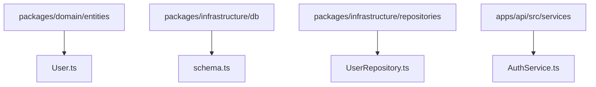
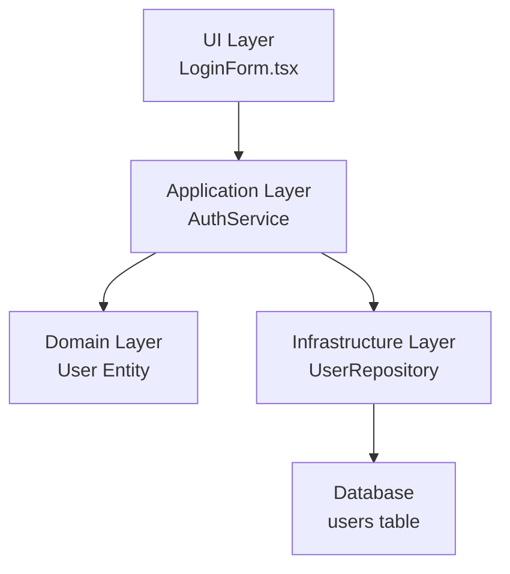
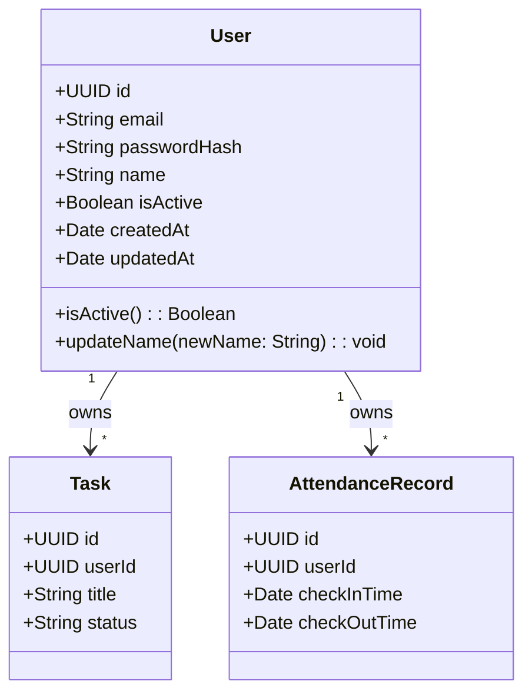
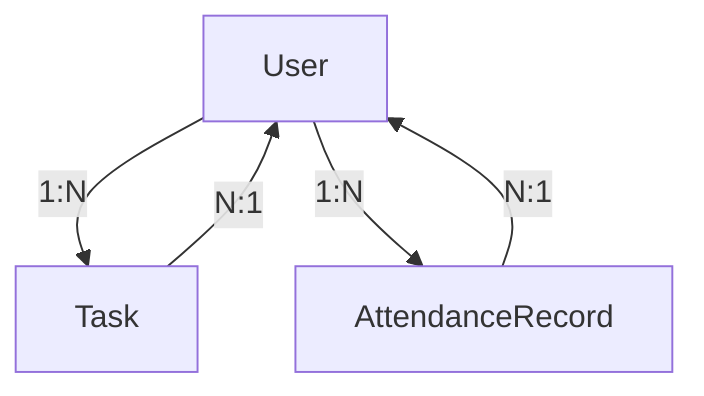
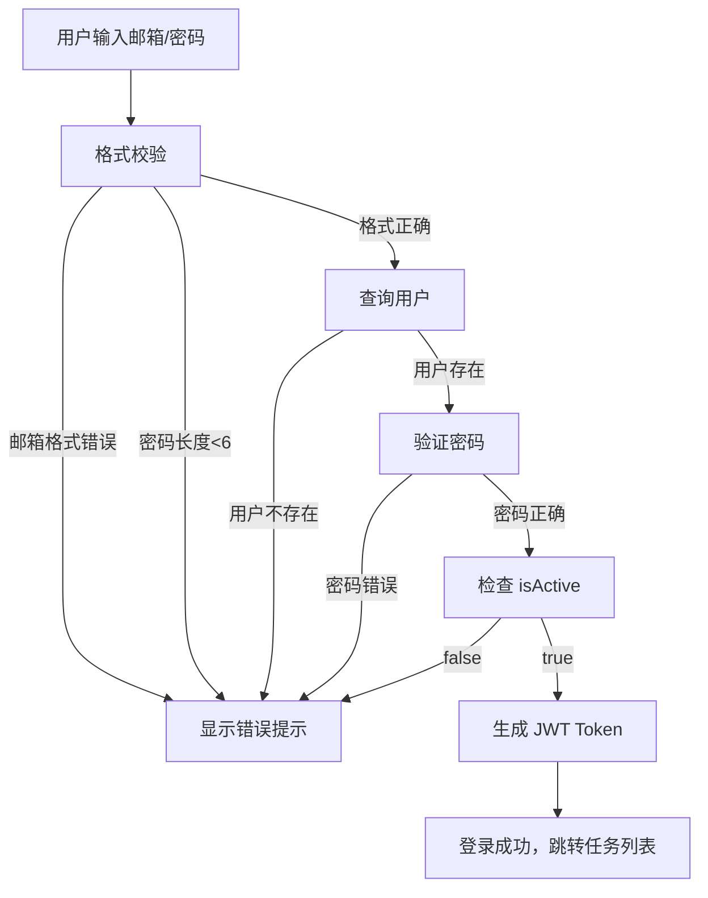
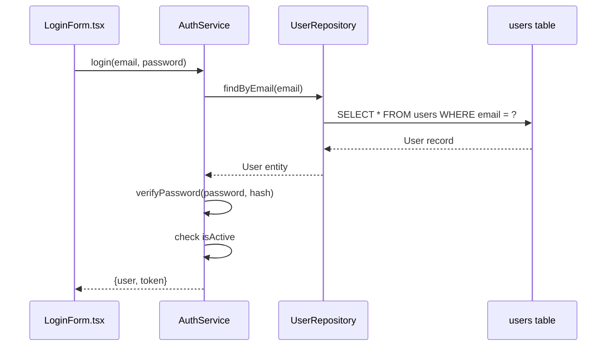

# User(ユーザー)

**本文档引用的文件**
- [README.md](../../../README.md)
- [design.md](../../../designdoc/specs/design.md)
- [requirements.md](../../../designdoc/specs/requirements.md)

## 目录
1. [简介](#简介)
2. [项目结构](#项目结构)
3. [核心组件](#核心组件)
4. [架构概述](#架构概述)
5. [详细组件分析](#详细组件分析)
6. [数据库表结构](#数据库表结构)
7. [业务规则](#业务规则)
8. [使用示例](#使用示例)
9. [性能考虑](#性能考虑)
10. [结论](#结论)

## 简介

User（ユーザー）实体是「勤怠・タスク管理」系统中的核心领域模型，用于表示系统用户。

**主要作用：**
- 作为任务（Task）和打卡记录（AttendanceRecord）的所有者
- 管理用户认证信息（邮箱、密码哈希）
- 控制用户账户状态（激活/非激活）

**核心实体关系：**
- User 与 Task：一对多关系（一个用户可以有多个任务）
- User 与 AttendanceRecord：一对多关系（一个用户可以有多条打卡记录）

**本节来源** - [requirements.md](../../../designdoc/specs/requirements.md)(L159-L168)、[design.md](../../../designdoc/specs/design.md)(L82-L90)

## 项目结构

User 模型相关代码分布在以下目录：



**图示来源** - [design.md](../../../designdoc/specs/design.md)(L5-L41)、[README.md](../../../README.md)(L96-L116)

**目录说明：**
- `packages/domain/entities/User.ts` - 领域实体（业务逻辑）
- `packages/infrastructure/db/schema.ts` - 数据库 Schema 定义
- `packages/infrastructure/repositories/UserRepository.ts` - 数据访问层
- `apps/api/src/services/AuthService.ts` - 认证服务

## 核心组件

User 模型涉及以下核心组件：

| 组件名 | 类型 | 职责 |
|--------|------|------|
| User | 领域实体 | 用户业务逻辑（状态判断、信息变更） |
| users | Drizzle Schema | 数据库表定义 |
| UserRepository | Repository 接口 | 用户数据持久化 |
| AuthService | 应用服务 | 登录、登出、获取当前用户 |

**章节来源** - [design.md](../../../designdoc/specs/design.md)(L17-L23)、[requirements.md](../../../designdoc/specs/requirements.md)(L159-L168)

## 架构概述

User 模型在分层架构中的位置：



**图示来源** - [design.md](../../../designdoc/specs/design.md)(L5-L41)

**分层说明：**
- **UI 层**：登录表单等组件通过 AuthService 访问用户信息
- **应用服务层**：AuthService 编排认证逻辑、事务管理
- **领域层**：User 实体包含纯业务逻辑（无外部依赖）
- **基础设施层**：UserRepository 使用 Drizzle ORM 访问 PostgreSQL

## 详细组件分析

### User 实体字段

| 字段名 | 类型 | 约束 | 描述 |
|--------|------|------|------|
| id | UUID | 主键 | 用户唯一标识符 |
| email | VARCHAR(255) | 唯一，非空 | 用户邮箱（登录用） |
| passwordHash | VARCHAR(255) | 非空 | 密码哈希（bcrypt 加密） |
| name | VARCHAR(100) | 可选 | 用户显示名称 |
| isActive | BOOLEAN | 默认 true | 账户激活状态 |
| createdAt | TIMESTAMP | UTC | 创建时间 |
| updatedAt | TIMESTAMP | UTC | 更新时间 |

### User 类图



**图示来源** - [design.md](../../../designdoc/specs/design.md)(L62-L75)、[requirements.md](../../../designdoc/specs/requirements.md)(L159-L168)

### 依赖分析

User 实体与其他实体的关系：



**图示来源** - [design.md](../../../designdoc/specs/design.md)(L62-L75)

**关系说明：**
- **User → Task**：一对多关系，一个用户可以创建多个任务
- **User → AttendanceRecord**：一对多关系，一个用户可以有多条打卡记录
- 外键约束：`tasks.user_id` 和 `attendance_records.user_id` 均引用 `users.id`

## 数据库表结构

users 表的完整 Schema 定义：

```sql
CREATE TABLE users (
  id UUID PRIMARY KEY DEFAULT gen_random_uuid(),
  email VARCHAR(255) NOT NULL UNIQUE,
  password_hash VARCHAR(255) NOT NULL,
  name VARCHAR(100),
  is_active BOOLEAN NOT NULL DEFAULT true,
  created_at TIMESTAMP WITH TIME ZONE NOT NULL DEFAULT NOW(),
  updated_at TIMESTAMP WITH TIME ZONE NOT NULL DEFAULT NOW()
);

-- 索引定义
CREATE UNIQUE INDEX users_email_key ON users(email);
```

**Drizzle ORM 定义：**
```typescript
export const users = pgTable('users', {
  id: uuid('id').primaryKey().defaultRandom(),
  email: varchar('email', { length: 255 }).notNull().unique(),
  passwordHash: varchar('password_hash', { length: 255 }).notNull(),
  name: varchar('name', { length: 100 }),
  isActive: boolean('is_active').notNull().default(true),
  createdAt: timestamp('created_at', { withTimezone: true }).notNull().defaultNow(),
  updatedAt: timestamp('updated_at', { withTimezone: true }).notNull().defaultNow(),
});
```

**本节来源** - [design.md](../../../designdoc/specs/design.md)(L82-L90)

## 业务规则

### 状态管理规则

- **账户激活**：`isActive = true` 时用户可以登录系统
- **账户停用**：`isActive = false` 时用户无法登录，但历史数据保留
- **邮箱唯一性**：同一邮箱不能注册多个账户
- **密码安全**：密码使用 bcrypt 加密存储（salt rounds: 10）

### 认证业务流程



**图示来源** - [design.md](../../../designdoc/specs/design.md)(L122-L147)、[requirements.md](../../../designdoc/specs/requirements.md)(L11-L33)

### 验证规则

| 字段 | 规则 | 错误消息（日文） |
|------|------|------------------|
| email | 必填，邮箱格式 | `メールアドレスの形式が無効です` |
| password | 必填，长度≥6 | `パスワードは 6 文字以上で入力してください` |
| name | 可选，最大 100 字符 | - |

## 使用示例

### 典型调用链路



**图示来源** - [design.md](../../../designdoc/specs/design.md)(L122-L147)

### API 请求示例

**登录请求：**
```typescript
// POST /api/auth/login
Request:
{
  "email": "test@example.com",
  "password": "password123"
}

Response (200):
{
  "user": {
    "id": "uuid",
    "email": "test@example.com",
    "name": "テストユーザー"
  },
  "token": "jwt_token"
}
```

**本节来源** - [design.md](../../../designdoc/specs/design.md)(L122-L147)

## 性能考虑

### 查询优化策略

- **邮箱查询**：`users.email` 列有唯一索引，登录查询高效
- **避免 N+1**：批量查询用户关联数据时使用 `IN` 子句

**示例：**
```typescript
// ✅ 正确示例 - 批量查询
const userIds = records.map(r => r.userId);
const users = await db.select()
  .from(users)
  .where(inArray(users.id, userIds));
```

### 索引设计

| 索引名 | 列 | 类型 | 用途 |
|--------|-----|------|------|
| users_pkey | id | PRIMARY KEY | 主键索引 |
| users_email_key | email | UNIQUE | 邮箱唯一性校验、登录查询 |

**本节来源** - [design.md](../../../designdoc/specs/design.md)(L380-L407)

## 结论

User 实体作为「勤怠・タスク管理」系统的核心领域模型，具有以下设计特点：

1. **职责单一**：仅包含用户相关的业务逻辑，不依赖外部服务
2. **关系清晰**：通过外键约束与 Task、AttendanceRecord 建立明确关联
3. **安全考虑**：密码 bcrypt 加密、邮箱唯一性约束、账户状态控制
4. **性能优化**：关键列索引、避免 N+1 查询

User 模型的设计遵循领域驱动设计（DDD）原则，确保业务逻辑集中在领域层，便于测试和维护。

---

**文档版本**: 1.0  
**最后更新**: 2025-01-17  
**参考文档**: [requirements.md](../../../designdoc/specs/requirements.md), [design.md](../../../designdoc/specs/design.md)
