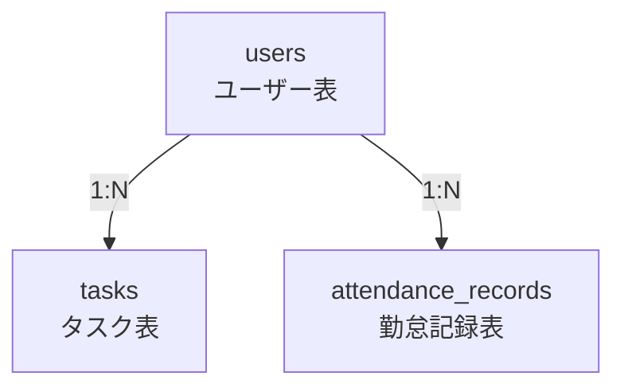
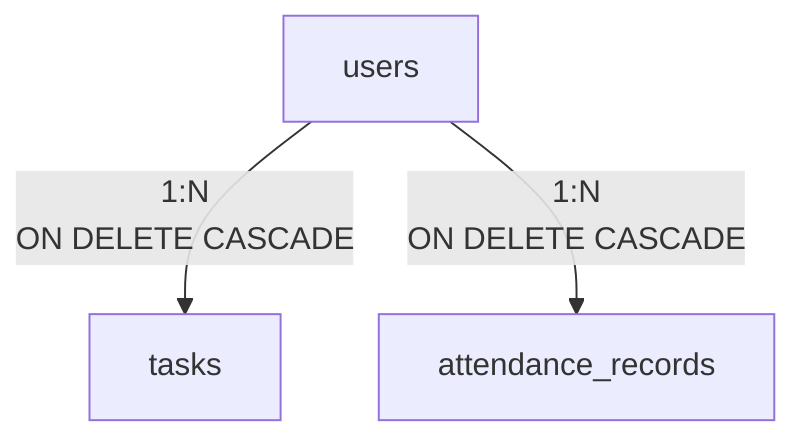

# 数据库 Schema 与迁移 (データベーススキーマ)

**本文档引用的文件**
- [design.md](../../../designdoc/specs/design.md)
- [requirements.md](../../../designdoc/specs/requirements.md)
- [User.md](./User.md)
- [Task.md](./Task.md)
- [AttendanceRecord.md](./AttendanceRecord.md)

## 目录
1. [简介](#简介)
2. [数据库表概览](#数据库表概览)
3. [Schema 定义](#schema-定义)
4. [详细表结构](#详细表结构)
5. [索引设计](#索引设计)
6. [外键关系](#外键关系)
7. [时区处理](#时区处理)
8. [迁移策略](#迁移策略)
9. [性能考虑](#性能考虑)
10. [结论](#结论)

## 简介

本文档详细说明「勤怠・タスク管理」系统的数据库 Schema 设计，包括：

- **表结构定义**：users、tasks、attendance_records 三个核心表的完整字段定义
- **索引设计**：查询优化所需的索引策略
- **外键关系**：表间关联的约束定义
- **Drizzle ORM Schema**：类型安全的 TypeScript 定义
- **时区处理**：UTC 存储与 Asia/Tokyo 展示的实现策略

**设计原则：**
- 使用 PostgreSQL 15+ 关系型数据库
- 所有主键使用 UUID 类型（`gen_random_uuid()`）
- 时间戳统一使用 `TIMESTAMP WITH TIME ZONE` 存储 UTC
- 通过 Drizzle ORM 实现类型安全的查询

**本节来源** - [design.md](../../../designdoc/specs/design.md)(L58-L118)、[requirements.md](../../../designdoc/specs/requirements.md)(L157-L191)

## 数据库表概览

系统包含三个核心表：

| 表名 | 描述 | 主要用途 |
|------|------|----------|
| `users` | 用户表 | 存储系统用户信息（认证、资料） |
| `tasks` | 任务表 | 存储任务信息（CRUD、状态流转） |
| `attendance_records` | 打卡记录表 | 存储打卡时间、工作日期 |

### ER 图



**图示来源** - [design.md](../../../designdoc/specs/design.md)(L62-L75)

**外键关系：**
- `tasks.user_id` → `users.id`（任务归属用户）
- `attendance_records.user_id` → `users.id`（打卡记录归属用户）

## Schema 定义

### Drizzle ORM Schema

```typescript
// packages/infrastructure/db/schema.ts

import { pgTable, uuid, varchar, text, boolean, timestamp, date, index } from 'drizzle-orm/pg-core';

// ユーザー表
export const users = pgTable('users', {
  id: uuid('id').primaryKey().defaultRandom(),
  email: varchar('email', { length: 255 }).notNull().unique(),
  passwordHash: varchar('password_hash', { length: 255 }).notNull(),
  name: varchar('name', { length: 100 }),
  isActive: boolean('is_active').notNull().default(true),
  createdAt: timestamp('created_at', { withTimezone: true }).notNull().defaultNow(),
  updatedAt: timestamp('updated_at', { withTimezone: true }).notNull().defaultNow(),
});

// タスク表
export const tasks = pgTable('tasks', {
  id: uuid('id').primaryKey().defaultRandom(),
  userId: uuid('user_id').notNull().references(() => users.id),
  title: varchar('title', { length: 255 }).notNull(),
  description: text('description'),
  status: varchar('status', { length: 50 }).notNull().default('todo'),
  dueDate: date('due_date'),
  createdAt: timestamp('created_at', { withTimezone: true }).notNull().defaultNow(),
  updatedAt: timestamp('updated_at', { withTimezone: true }).notNull().defaultNow(),
}, (table) => ({
  userIdIdx: index('tasks_user_id_idx').on(table.userId),
  statusIdx: index('tasks_status_idx').on(table.status),
  userIdStatusIdx: index('tasks_user_id_status_idx').on(table.userId, table.status),
}));

// 勤怠記録表
export const attendanceRecords = pgTable('attendance_records', {
  id: uuid('id').primaryKey().defaultRandom(),
  userId: uuid('user_id').notNull().references(() => users.id),
  checkInTime: timestamp('check_in_time', { withTimezone: true }).notNull(),
  checkOutTime: timestamp('check_out_time', { withTimezone: true }),
  workDate: date('work_date').notNull(),
  createdAt: timestamp('created_at', { withTimezone: true }).notNull().defaultNow(),
}, (table) => ({
  userIdIdx: index('attendance_user_id_idx').on(table.userId),
  workDateIdx: index('attendance_work_date_idx').on(table.workDate),
}));
```

**本节来源** - [design.md](../../../designdoc/specs/design.md)(L77-L118)

## 详细表结构

### users (ユーザー表)

| 字段 | 类型 | 约束 | 描述 |
|------|------|------|------|
| id | UUID | PRIMARY KEY, DEFAULT gen_random_uuid() | 用户唯一标识符 |
| email | VARCHAR(255) | NOT NULL, UNIQUE | 用户邮箱（登录用） |
| password_hash | VARCHAR(255) | NOT NULL | 密码哈希（bcrypt） |
| name | VARCHAR(100) | NULL | 用户显示名称 |
| is_active | BOOLEAN | NOT NULL, DEFAULT true | 账户激活状态 |
| created_at | TIMESTAMP WITH TIME ZONE | NOT NULL, DEFAULT NOW() | 创建时间（UTC） |
| updated_at | TIMESTAMP WITH TIME ZONE | NOT NULL, DEFAULT NOW() | 更新时间（UTC） |

**SQL 定义：**
```sql
CREATE TABLE users (
  id UUID PRIMARY KEY DEFAULT gen_random_uuid(),
  email VARCHAR(255) NOT NULL UNIQUE,
  password_hash VARCHAR(255) NOT NULL,
  name VARCHAR(100),
  is_active BOOLEAN NOT NULL DEFAULT true,
  created_at TIMESTAMP WITH TIME ZONE NOT NULL DEFAULT NOW(),
  updated_at TIMESTAMP WITH TIME ZONE NOT NULL DEFAULT NOW()
);
```

**本节来源** - [design.md](../../../designdoc/specs/design.md)(L82-L90)、[requirements.md](../../../designdoc/specs/requirements.md)(L159-L168)

### tasks (タスク表)

| 字段 | 类型 | 约束 | 描述 |
|------|------|------|------|
| id | UUID | PRIMARY KEY, DEFAULT gen_random_uuid() | 任务唯一标识符 |
| user_id | UUID | NOT NULL, FOREIGN KEY → users.id | 归属用户 ID |
| title | VARCHAR(255) | NOT NULL | 任务标题 |
| description | TEXT | NULL | 任务描述 |
| status | VARCHAR(50) | NOT NULL, DEFAULT 'todo' | 状态（todo/in_progress/done） |
| due_date | DATE | NULL | 截止日期 |
| created_at | TIMESTAMP WITH TIME ZONE | NOT NULL, DEFAULT NOW() | 创建时间（UTC） |
| updated_at | TIMESTAMP WITH TIME ZONE | NOT NULL, DEFAULT NOW() | 更新时间（UTC） |

**SQL 定义：**
```sql
CREATE TABLE tasks (
  id UUID PRIMARY KEY DEFAULT gen_random_uuid(),
  user_id UUID NOT NULL REFERENCES users(id),
  title VARCHAR(255) NOT NULL,
  description TEXT,
  status VARCHAR(50) NOT NULL DEFAULT 'todo',
  due_date DATE,
  created_at TIMESTAMP WITH TIME ZONE NOT NULL DEFAULT NOW(),
  updated_at TIMESTAMP WITH TIME ZONE NOT NULL DEFAULT NOW()
);
```

**本节来源** - [design.md](../../../designdoc/specs/design.md)(L92-L105)、[requirements.md](../../../designdoc/specs/requirements.md)(L170-L180)

### attendance_records (勤怠記録表)

| 字段 | 类型 | 约束 | 描述 |
|------|------|------|------|
| id | UUID | PRIMARY KEY, DEFAULT gen_random_uuid() | 记录唯一标识符 |
| user_id | UUID | NOT NULL, FOREIGN KEY → users.id | 归属用户 ID |
| check_in_time | TIMESTAMP WITH TIME ZONE | NOT NULL | 打卡时间（UTC） |
| check_out_time | TIMESTAMP WITH TIME ZONE | NULL | 签退时间（UTC） |
| work_date | DATE | NOT NULL | 工作日期 |
| created_at | TIMESTAMP WITH TIME ZONE | NOT NULL, DEFAULT NOW() | 创建时间（UTC） |

**SQL 定义：**
```sql
CREATE TABLE attendance_records (
  id UUID PRIMARY KEY DEFAULT gen_random_uuid(),
  user_id UUID NOT NULL REFERENCES users(id),
  check_in_time TIMESTAMP WITH TIME ZONE NOT NULL,
  check_out_time TIMESTAMP WITH TIME ZONE,
  work_date DATE NOT NULL,
  created_at TIMESTAMP WITH TIME ZONE NOT NULL DEFAULT NOW()
);
```

**本节来源** - [design.md](../../../designdoc/specs/design.md)(L107-L117)、[requirements.md](../../../designdoc/specs/requirements.md)(L182-L190)

## 索引设计

### 索引列表

| 表名 | 索引名 | 列 | 类型 | 用途 |
|------|--------|-----|------|------|
| users | users_pkey | id | PRIMARY KEY | 主键索引 |
| users | users_email_key | email | UNIQUE | 邮箱唯一性校验、登录查询 |
| tasks | tasks_pkey | id | PRIMARY KEY | 主键索引 |
| tasks | tasks_user_id_idx | user_id | INDEX | 按用户查询任务 |
| tasks | tasks_status_idx | status | INDEX | 按状态筛选任务 |
| tasks | tasks_user_id_status_idx | user_id, status | COMPOSITE INDEX | 用户 + 状态组合查询 |
| attendance_records | attendance_pkey | id | PRIMARY KEY | 主键索引 |
| attendance_records | attendance_user_id_idx | user_id | INDEX | 按用户查询打卡记录 |
| attendance_records | attendance_work_date_idx | work_date | INDEX | 按日期查询打卡记录 |

### 索引创建 SQL

```sql
-- users 表索引
CREATE UNIQUE INDEX users_email_key ON users(email);

-- tasks 表索引
CREATE INDEX tasks_user_id_idx ON tasks(user_id);
CREATE INDEX tasks_status_idx ON tasks(status);
CREATE INDEX tasks_user_id_status_idx ON tasks(user_id, status);

-- attendance_records 表索引
CREATE INDEX attendance_user_id_idx ON attendance_records(user_id);
CREATE INDEX attendance_work_date_idx ON attendance_records(work_date);
```

**索引设计说明：**
- **复合索引 `tasks_user_id_status_idx`**：支持常见查询场景「查询某用户的所有待办任务」
- **日期索引 `attendance_work_date_idx`**：支持打卡记录的日期范围查询、统计功能

**本节来源** - [design.md](../../../designdoc/specs/design.md)(L380-L388)

## 外键关系

### 外键约束

```sql
-- tasks.user_id → users.id
ALTER TABLE tasks 
  ADD CONSTRAINT tasks_user_id_fkey 
  FOREIGN KEY (user_id) REFERENCES users(id) ON DELETE CASCADE;

-- attendance_records.user_id → users.id
ALTER TABLE attendance_records 
  ADD CONSTRAINT attendance_records_user_id_fkey 
  FOREIGN KEY (user_id) REFERENCES users(id) ON DELETE CASCADE;
```

### 级联删除策略

| 关系 | 删除行为 | 说明 |
|------|----------|------|
| users → tasks | CASCADE | 用户删除时，关联任务一并删除 |
| users → attendance_records | CASCADE | 用户删除时，关联打卡记录一并删除 |

### ER 关系图



**图示来源** - [design.md](../../../designdoc/specs/design.md)(L62-L75)

## 时区处理

### 核心原则

1. **数据库存储**：UTC（使用 `TIMESTAMP WITH TIME ZONE`）
2. **API 输入输出**：ISO 8601 格式，带时区标识
3. **前端展示**：Asia/Tokyo (UTC+9)

### 实现方案

**后端存储（UTC）：**
```typescript
const record = {
  checkInTime: new Date('2025-01-15T09:00:00+09:00'), // 自动转为 UTC 存储
};
// 数据库存储：2025-01-15T00:00:00.000Z
```

**后端返回（ISO 8601）：**
```typescript
return {
  checkInTime: record.checkInTime.toISOString(), // "2025-01-15T00:00:00.000Z"
};
```

**前端展示（Asia/Tokyo）：**
```typescript
const displayTime = new Date(apiResponse.checkInTime).toLocaleString('ja-JP', {
  timeZone: 'Asia/Tokyo',
  hour12: false,
});
// 出力：2025/1/15 9:00
```

### Zod Schema 时区处理

```typescript
const attendanceSchema = z.object({
  checkInTime: z.string()
    .datetime({ message: '日時の形式が無効です' })
    .transform((val) => new Date(val)),
  workDate: z.string()
    .regex(/^\d{4}-\d{2}-\d{2}$/, { message: '日付の形式が無効です' }),
});
```

**本节来源** - [design.md](../../../designdoc/specs/design.md)(L228-L267)

## 迁移策略

### Drizzle Kit 迁移命令

```bash
# 生成迁移文件
npx drizzle-kit generate

# 执行迁移
npx drizzle-kit migrate

# 查看迁移状态
npx drizzle-kit status
```

### 迁移文件结构

```
drizzle/
├── meta/
│   ├── _journal.json
│   └── 0000_snapshot.json
└── 0000_initial.sql
```

### 初始迁移 SQL 示例

```sql
-- 0000_initial.sql

-- 创建 users 表
CREATE TABLE IF NOT EXISTS users (
  id UUID PRIMARY KEY DEFAULT gen_random_uuid(),
  email VARCHAR(255) NOT NULL UNIQUE,
  password_hash VARCHAR(255) NOT NULL,
  name VARCHAR(100),
  is_active BOOLEAN NOT NULL DEFAULT true,
  created_at TIMESTAMP WITH TIME ZONE NOT NULL DEFAULT NOW(),
  updated_at TIMESTAMP WITH TIME ZONE NOT NULL DEFAULT NOW()
);

-- 创建 tasks 表
CREATE TABLE IF NOT EXISTS tasks (
  id UUID PRIMARY KEY DEFAULT gen_random_uuid(),
  user_id UUID NOT NULL REFERENCES users(id),
  title VARCHAR(255) NOT NULL,
  description TEXT,
  status VARCHAR(50) NOT NULL DEFAULT 'todo',
  due_date DATE,
  created_at TIMESTAMP WITH TIME ZONE NOT NULL DEFAULT NOW(),
  updated_at TIMESTAMP WITH TIME ZONE NOT NULL DEFAULT NOW()
);

-- 创建 attendance_records 表
CREATE TABLE IF NOT EXISTS attendance_records (
  id UUID PRIMARY KEY DEFAULT gen_random_uuid(),
  user_id UUID NOT NULL REFERENCES users(id),
  check_in_time TIMESTAMP WITH TIME ZONE NOT NULL,
  check_out_time TIMESTAMP WITH TIME ZONE,
  work_date DATE NOT NULL,
  created_at TIMESTAMP WITH TIME ZONE NOT NULL DEFAULT NOW()
);

-- 创建索引
CREATE UNIQUE INDEX users_email_key ON users(email);
CREATE INDEX tasks_user_id_idx ON tasks(user_id);
CREATE INDEX tasks_status_idx ON tasks(status);
CREATE INDEX tasks_user_id_status_idx ON tasks(user_id, status);
CREATE INDEX attendance_user_id_idx ON attendance_records(user_id);
CREATE INDEX attendance_work_date_idx ON attendance_records(work_date);
```

**本节来源** - [design.md](../../../designdoc/specs/design.md)(L77-L118)

## 性能考虑

### 查询优化策略

1. **复合索引利用**：
   - 查询「某用户的待办任务」时使用 `tasks_user_id_status_idx`
   ```sql
   SELECT * FROM tasks 
   WHERE user_id = 'xxx' AND status = 'todo';
   ```

2. **避免 N+1 查询**：
   ```typescript
   // ❌ 错误示例
   const users = await db.select().from(users);
   for (const user of users) {
     const tasks = await db.select()
       .from(tasks)
       .where(eq(tasks.userId, user.id));
   }

   // ✅ 正确示例
   const users = await db.select().from(users);
   const userIds = users.map(u => u.id);
   const tasks = await db.select()
     .from(tasks)
     .where(inArray(tasks.userId, userIds));
   ```

3. **日期范围查询优化**：
   ```sql
   -- 利用 attendance_work_date_idx
   SELECT * FROM attendance_records
   WHERE user_id = 'xxx' 
     AND work_date BETWEEN '2025-01-01' AND '2025-01-31';
   ```

### 性能目标

| 指标 | 目标值 |
|------|--------|
| 页面加载时间 | < 2 秒 |
| API 响应时间 | < 500ms |
| 登录查询（邮箱） | < 50ms（唯一索引） |
| 任务列表查询 | < 100ms（复合索引） |
| 打卡统计查询 | < 200ms（日期索引） |

**本节来源** - [design.md](../../../designdoc/specs/design.md)(L378-L407)、[requirements.md](../../../designdoc/specs/requirements.md)(L136-L141)

## 结论

本数据库 Schema 设计具有以下特点：

1. **类型安全**：使用 Drizzle ORM 实现 TypeScript 类型安全的查询
2. **时区规范**：统一 UTC 存储，Asia/Tokyo 展示，避免时区混乱
3. **索引优化**：针对常见查询场景设计复合索引，提升查询性能
4. **外键约束**：明确表间关系，使用 CASCADE 删除保持数据一致性
5. **扩展性**：UUID 主键支持分布式 ID 生成，便于未来扩展

通过遵循上述设计，系统能够实现高效、安全、可维护的数据持久化。

---

**文档版本**: 1.0  
**最后更新**: 2025-01-17  
**参考文档**: [design.md](../../../designdoc/specs/design.md), [requirements.md](../../../designdoc/specs/requirements.md)
