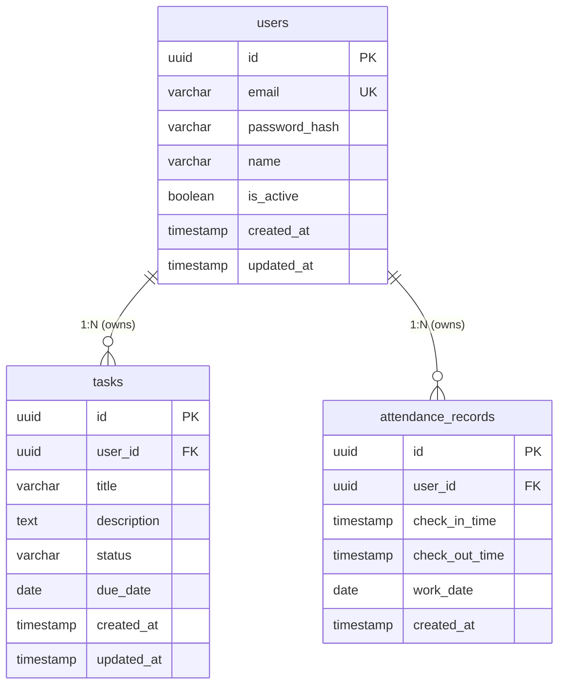

# 数据模型

**本文档引用的文件**
- [项目概述](../../.gientech/wiki/项目概述.md)
- [需求规格](../../designdoc/specs/requirements.md)
- [设计文档](../../designdoc/specs/design.md)
- [User](../../.gientech/wiki/数据模型/User.md)
- [Task](../../.gientech/wiki/数据模型/Task.md)
- [AttendanceRecord](../../.gientech/wiki/数据模型/AttendanceRecord.md)

## 目录
1. [引言](#引言)
2. [核心领域实体](#核心领域实体)
   - [User(ユーザー)](#user-ユーザー)
   - [Task(タスク)](#task-タスク)
   - [AttendanceRecord(勤怠記録)](#attendancerecord-勤怠記録)
3. [实体关系](#实体关系)
4. [数据库 Schema 概览](#数据库-schema 概览)
5. [数据验证与业务规则](#数据验证与业务规则)
6. [数据访问模式与性能考虑](#数据访问模式与性能考虑)
7. [结论](#结论)

## 引言

### 文档目的与范围

本文档概述「勤怠・タスク管理」系统的核心数据模型，涵盖三个主要领域实体及其关系、数据库表结构、验证规则与访问模式。

### 系统概述

本系统是一个日文界面的迷你后台系统，用于练习 AI Agent 在约束下的可靠交付能力。数据模型设计遵循领域驱动设计（DDD）原则，采用清晰的分层架构。

**技术栈：**
- 数据库：PostgreSQL 15+
- ORM：Drizzle ORM（类型安全的 SQL 构建器）
- 时区策略：UTC 存储，Asia/Tokyo 展示

来源：[项目概述](../../.gientech/wiki/项目概述.md)、[需求规格](../../designdoc/specs/requirements.md)

### 主要实体简介

| 实体名 | 说明 | 核心用途 |
|--------|------|----------|
| User | 用户实体 | 系统用户管理、认证 |
| Task | 任务实体 | 工作任务管理、状态跟踪 |
| AttendanceRecord | 打卡记录实体 | 出勤打卡记录、工时统计 |

### 文档结构说明

- **核心领域实体**：详细描述三个实体的字段定义、约束与业务逻辑
- **实体关系**：展示实体间的关联关系与外键约束
- **数据库 Schema 概览**：提供完整的表结构定义与索引设计
- **数据验证与业务规则**：说明字段级验证规则与跨实体业务规则
- **数据访问模式与性能考虑**：介绍查询优化策略与最佳实践

## 核心领域实体

### User(ユーザー)

User 实体是系统的核心领域模型，用于表示系统用户，作为任务和打卡记录的所有者。

**字段定义与约束**

| 字段名 | 类型 | 约束 | 说明 |
|--------|------|------|------|
| **id** | UUID | 主键，默认随机生成 | 用户唯一标识符 |
| **email** | VARCHAR(255) | 唯一，非空 | 用户邮箱（登录用） |
| **password_hash** | VARCHAR(255) | 非空 | 密码哈希（bcrypt 加密） |
| **name** | VARCHAR(100) | 可选 | 用户显示名称 |
| **is_active** | BOOLEAN | 非空，默认 true | 账户激活状态 |
| **created_at** | TIMESTAMP | UTC，默认当前时间 | 创建时间 |
| **updated_at** | TIMESTAMP | UTC，默认当前时间 | 更新时间 |

**索引：**
- 主键索引：`PRIMARY KEY (id)`
- 唯一索引：`UNIQUE INDEX users_email_key ON users(email)`

**数据访问：**
- Repository：`UserRepository`（Drizzle ORM 实现）
- Service：`AuthService`（登录、登出、获取当前用户）
- 主要操作：`findByEmail(email)`、`save(user)`、`updateStatus(id, isActive)`

来源：[User](../../.gientech/wiki/数据模型/User.md)、[设计文档](../../designdoc/specs/design.md)(L82-L90)

### Task(タスク)

Task 实体用于管理工作任务的完整生命周期，支持任务的创建、查询、更新、删除及状态流转。

**字段定义与约束**

| 字段名 | 类型 | 约束 | 说明 |
|--------|------|------|------|
| **id** | UUID | 主键，默认随机生成 | 任务唯一标识符 |
| **user_id** | UUID | 外键，非空，引用 users.id | 任务所属用户 |
| **title** | VARCHAR(255) | 非空 | 任务标题 |
| **description** | TEXT | 可选 | 任务详细描述 |
| **status** | VARCHAR(50) | 非空，默认 'todo' | 任务状态：todo / in_progress / done |
| **due_date** | DATE | 可选 | 截止日期 |
| **created_at** | TIMESTAMP | UTC，默认当前时间 | 创建时间 |
| **updated_at** | TIMESTAMP | UTC，默认当前时间 | 更新时间 |

**索引：**
- 主键索引：`PRIMARY KEY (id)`
- 普通索引：`INDEX tasks_user_id_idx ON tasks(user_id)`
- 普通索引：`INDEX tasks_status_idx ON tasks(status)`
- 复合索引：`INDEX tasks_user_id_status_idx ON tasks(user_id, status)`

**数据访问：**
- Repository：`TaskRepository`（Drizzle ORM 实现）
- Service：`TaskService`（CRUD 操作编排）
- 主要操作：`findByUserId(userId)`、`save(task)`、`delete(id)`、`updateStatus(id, status)`

来源：[Task](../../.gientech/wiki/数据模型/Task.md)、[设计文档](../../designdoc/specs/design.md)(L92-L105)

### AttendanceRecord(勤怠記録)

AttendanceRecord 实体用于记录员工的出勤打卡信息，为考勤统计提供基础数据。

**字段定义与约束**

| 字段名 | 类型 | 约束 | 说明 |
|--------|------|------|------|
| **id** | UUID | 主键，默认随机生成 | 记录唯一标识符 |
| **user_id** | UUID | 外键，非空，引用 users.id | 所属用户 ID |
| **check_in_time** | TIMESTAMP | withTimezone: true，非空 | 上班打卡时间（UTC 存储） |
| **check_out_time** | TIMESTAMP | withTimezone: true，可选 | 下班打卡时间（UTC 存储） |
| **work_date** | DATE | 非空 | 工作日期 |
| **created_at** | TIMESTAMP | withTimezone: true，默认当前时间 | 记录创建时间（UTC） |

**索引：**
- 主键索引：`PRIMARY KEY (id)`
- 普通索引：`INDEX attendance_user_id_idx ON attendance_records(user_id)`
- 普通索引：`INDEX attendance_work_date_idx ON attendance_records(work_date)`
- 推荐复合索引：`INDEX attendance_user_id_work_date_idx ON attendance_records(user_id, work_date)`

**数据访问：**
- Repository：`AttendanceRepository`（Drizzle ORM 实现）
- Service：`AttendanceService`（列表查询、统计计算）
- 主要操作：`findByUserIdAndDateRange(userId, startDate, endDate)`、`save(record)`

来源：[AttendanceRecord](../../.gientech/wiki/数据模型/AttendanceRecord.md)、[设计文档](../../designdoc/specs/design.md)(L107-L117)

## 实体关系

### 关系概述

三个核心实体之间存在以下关联关系：

- **User → Task**：一对多关系（一个用户可以创建多个任务）
- **User → AttendanceRecord**：一对多关系（一个用户可以有多条打卡记录）
- **Task → User**：多对一关系（每个任务属于一个用户）
- **AttendanceRecord → User**：多对一关系（每条打卡记录属于一个用户）

### ER 图



### 外键约束说明

| 外键字段 | 引用表 | 引用列 | 约束类型 |
|----------|--------|--------|----------|
| `tasks.user_id` | `users` | `id` | `NOT NULL`, `REFERENCES users(id)` |
| `attendance_records.user_id` | `users` | `id` | `NOT NULL`, `REFERENCES users(id)` |

来源：[设计文档](../../designdoc/specs/design.md)(L62-L75)

## 数据库 Schema 概览

### 表结构统计

| 表名 | 字段数 | 索引数 | 说明 |
|------|--------|--------|------|
| `users` | 7 | 2 | 用户表 |
| `tasks` | 8 | 4 | 任务表 |
| `attendance_records` | 6 | 3 | 打卡记录表 |

### 完整 Schema 定义（Drizzle ORM）

```typescript
// packages/infrastructure/db/schema.ts

export const users = pgTable('users', {
  id: uuid('id').primaryKey().defaultRandom(),
  email: varchar('email', { length: 255 }).notNull().unique(),
  passwordHash: varchar('password_hash', { length: 255 }).notNull(),
  name: varchar('name', { length: 100 }),
  isActive: boolean('is_active').notNull().default(true),
  createdAt: timestamp('created_at', { withTimezone: true }).notNull().defaultNow(),
  updatedAt: timestamp('updated_at', { withTimezone: true }).notNull().defaultNow(),
});

export const tasks = pgTable('tasks', {
  id: uuid('id').primaryKey().defaultRandom(),
  userId: uuid('user_id').notNull().references(() => users.id),
  title: varchar('title', { length: 255 }).notNull(),
  description: text('description'),
  status: varchar('status', { length: 50 }).notNull().default('todo'),
  dueDate: date('due_date'),
  createdAt: timestamp('created_at', { withTimezone: true }).notNull().defaultNow(),
  updatedAt: timestamp('updated_at', { withTimezone: true }).notNull().defaultNow(),
}, (table) => ({
  userIdIdx: index('tasks_user_id_idx').on(table.userId),
  statusIdx: index('tasks_status_idx').on(table.status),
  userIdStatusIdx: index('tasks_user_id_status_idx').on(table.userId, table.status),
}));

export const attendanceRecords = pgTable('attendance_records', {
  id: uuid('id').primaryKey().defaultRandom(),
  userId: uuid('user_id').notNull().references(() => users.id),
  checkInTime: timestamp('check_in_time', { withTimezone: true }).notNull(),
  checkOutTime: timestamp('check_out_time', { withTimezone: true }),
  workDate: date('work_date').notNull(),
  createdAt: timestamp('created_at', { withTimezone: true }).notNull().defaultNow(),
}, (table) => ({
  userIdIdx: index('attendance_user_id_idx').on(table.userId),
  workDateIdx: index('attendance_work_date_idx').on(table.workDate),
}));
```

来源：[设计文档](../../designdoc/specs/design.md)(L77-L118)

### Schema 版本管理说明

本项目使用 Drizzle ORM 进行数据库迁移管理：

- **迁移方式**：Drizzle Kit 生成 SQL 迁移脚本
- **版本控制**：迁移文件纳入 Git 版本管理
- **执行命令**：`npm run db:migrate`

### 数据库迁移文件

迁移脚本位于 `packages/infrastructure/db/migrations/` 目录（具体文件根据实际生成为准）。

## 数据验证与业务规则

### 字段级验证规则

#### User 实体

| 字段 | 规则 | 错误消息（日文） |
|------|------|------------------|
| email | 必填，邮箱格式 | `メールアドレスの形式が無効です` |
| password | 必填，长度≥6 | `パスワードは 6 文字以上で入力してください` |
| name | 可选，最大 100 字符 | - |

#### Task 实体

| 字段 | 规则 | 错误消息（日文） |
|------|------|------------------|
| title | 必填，最大 255 字符 | `タイトルは必須です` |
| description | 可选 | - |
| status | 枚举值：todo / in_progress / done | `ステータスの値が無効です` |
| due_date | 可选，有效日期格式 | `日付の形式が無効です` |

#### AttendanceRecord 实体

| 字段 | 规则 | 错误消息（日文） |
|------|------|------------------|
| check_in_time | 必填，有效时间戳 | `日時の形式が無効です` |
| work_date | 必填，有效日期格式 | `日付の形式が無効です` |
| check_out_time | 可选，有效时间戳 | `日時の形式が無効です` |

来源：[需求规格](../../designdoc/specs/requirements.md)(L113-L134)

### 实体级业务规则

#### User

- **邮箱唯一性**：同一邮箱不能注册多个账户
- **账户状态**：`is_active = false` 时用户无法登录，但历史数据保留
- **密码安全**：密码使用 bcrypt 加密存储（salt rounds: 10）

#### Task

- **状态流转**：`todo` → `in_progress` → `done`（允许从任意状态直接变更为 `done`）
- **默认状态**：任务创建时状态默认为 `todo`
- **自动更新**：任务更新时自动更新 `updated_at` 字段

#### AttendanceRecord

- **打卡完整性**：创建时必须包含 `check_in_time` 和 `work_date`
- **下班打卡**：`check_out_time` 为可选，表示下班打卡（未完成打卡时为空）
- **日期关联**：同一用户同一日期可有多条记录（如分段打卡）

### 跨实体业务规则

#### 级联操作规则

- **用户删除**：删除用户时，其关联的任务和打卡记录需要特殊处理（逻辑删除或物理删除）
- **数据保留**：即使用户停用（`is_active = false`），历史任务和打卡记录仍需保留

#### 引用完整性约束

- 任务和打卡记录必须关联到有效的用户
- 外键约束确保无法创建孤立的任务或打卡记录

来源：[需求规格](../../designdoc/specs/requirements.md)(L157-L191)

## 数据访问模式与性能考虑

### 查询优化

#### 常用查询模式

| 查询场景 | 推荐索引 | SQL 示例 |
|----------|----------|----------|
| 用户登录 | `users_email_key` | `SELECT * FROM users WHERE email = ?` |
| 查询用户任务列表 | `tasks_user_id_status_idx` | `SELECT * FROM tasks WHERE user_id = ? AND status = ?` |
| 查询用户打卡记录 | `attendance_user_id_work_date_idx` | `SELECT * FROM attendance_records WHERE user_id = ? AND work_date BETWEEN ? AND ?` |

#### 索引使用建议

- **单字段查询**：使用对应的单列索引
- **复合条件查询**：优先使用复合索引（如 `tasks_user_id_status_idx`）
- **范围查询**：日期范围查询使用 `work_date_idx`

#### 分页策略

- 任务列表推荐页大小：20-50 条
- 打卡记录按日期范围查询时建议分页
- 使用 `LIMIT` / `OFFSET` 或游标分页

来源：[设计文档](../../designdoc/specs/design.md)(L380-L407)

### 缓存策略

#### 可缓存数据类型

- **用户信息**：登录成功后的用户基本信息（不含密码哈希）
- **任务列表**：短期内频繁访问的任务列表（需注意状态变更）

#### 缓存失效策略

- 用户信息变更（如停用账户）时立即失效
- 任务状态更新时失效对应列表缓存
- 打卡记录创建/更新时失效统计缓存

### 并发控制

#### 乐观锁 / 悲观锁使用场景

- **乐观锁**：适用于任务更新等低频冲突场景（通过 `updated_at` 字段检测）
- **悲观锁**：适用于打卡记录创建等高频冲突场景（使用 `SELECT ... FOR UPDATE`）

#### 事务隔离级别

- 默认使用 PostgreSQL 的 `READ COMMITTED` 隔离级别
- 涉及多表操作时使用事务确保数据一致性
- 统计查询可使用 `REPEATABLE READ` 避免脏读

### 避免 N+1 查询

```typescript
// ❌ 错误示例 - N+1 查询
const records = await db.select().from(attendanceRecords);
for (const record of records) {
  const user = await db.select()
    .from(users)
    .where(eq(users.id, record.userId));
}

// ✅ 正确示例 - 批量查询
const records = await db.select().from(attendanceRecords);
const userIds = records.map(r => r.userId);
const users = await db.select()
  .from(users)
  .where(inArray(users.id, userIds));
```

来源：[设计文档](../../designdoc/specs/design.md)(L390-L407)

## 结论

### 数据模型核心特点

1. **分层清晰**：严格遵循 UI → Application → Domain → Infrastructure 的依赖规则
2. **时区安全**：所有时间字段使用 `TIMESTAMP WITH TIME ZONE`，UTC 存储，Asia/Tokyo 展示
3. **索引优化**：针对主要查询场景设计复合索引，避免全表扫描
4. **数据完整性**：外键约束确保实体间关联关系的完整性

### 扩展性考虑

- **领域实体扩展**：新增字段时需在领域层、应用层、基础设施层同步修改
- **索引扩展**：根据实际查询模式动态调整索引策略
- **分库分表**：未来数据量增长时可考虑按用户 ID 分片

### 维护建议

- **Schema 变更**：使用 Drizzle Kit 生成迁移脚本，纳入版本管理
- **性能监控**：定期分析慢查询日志，优化索引设计
- **数据备份**：建立定期备份机制，确保数据安全

### 相关文档链接

- [User 详细文档](../../.gientech/wiki/数据模型/User.md)
- [Task 详细文档](../../.gientech/wiki/数据模型/Task.md)
- [AttendanceRecord 详细文档](../../.gientech/wiki/数据模型/AttendanceRecord.md)
- [需求规格](../../designdoc/specs/requirements.md)
- [设计文档](../../designdoc/specs/design.md)

---

**文档版本**: 1.0  
**最后更新**: 2025-01-17
