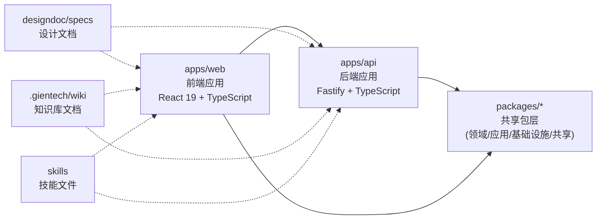

# 架构总览

## 系统概览

本项目是一个「勤怠・タスク管理」迷你后台系统，用于练习 **AI Agent 在约束下可靠交付**。项目采用前后端分离架构，通过 monorepo 方式组织代码，使用 npm workspaces 管理多包依赖。

**项目定位**：
- 日文界面的勤务任务管理后台系统
- 服务于 AI Agent 工程化实践，强调在明确约束下可靠交付
- 采用 TDD 开发流程，单元测试覆盖率目标 80%+

**当前模块结构**：
- `apps/` - 应用层：包含前端 Web 应用和后端 API 服务
- `packages/` - 共享包层：预留领域层、应用服务层、基础设施层和共享代码（当前为空）
- `designdoc/` - 设计文档：需求规格、设计文档、任务清单
- `.gientech/` - 生成式文档：wiki 知识库和规范说明
- `skills/` - 技能文件：首席工程师、架构师、TDD 等域内技能指南

## 顶层架构图


说明：
- 实线箭头表示运行时依赖关系：前端调用后端 API，前后端均可使用共享包
- 虚线箭头表示设计时参考关系：应用开发需遵循设计文档、wiki 规范和技能指南
- `packages/` 当前为空，为后续分层架构预留扩展空间

## 顶层模块

### apps/web - 前端应用

**位置**：[`apps/web/`](../../apps/web/)

**职责**：
- 提供日文界面的用户交互层
- 实现表单验证、路由管理、状态管理
- 通过 HTTP 与后端 API 通信

**技术栈**：
- React 19 + TypeScript + Vite + React Router
- UI 组件：shadcn/ui
- 表单：react-hook-form + zod

**质量要求**：
- 必须通过 React Doctor 检查
- TypeScript strict 模式
- 所有表单必填校验

### apps/api - 后端应用

**位置**：[`apps/api/`](../../apps/api/)

**职责**：
- 提供 RESTful API 接口
- 处理业务逻辑编排
- 管理数据库访问和外部服务集成

**技术栈**：
- Node.js + TypeScript + Fastify
- 数据库：PostgreSQL + Drizzle ORM

**质量要求**：
- 所有业务逻辑必须有单元测试
- SQL 可审查、可优化，禁止 N+1 查询
- 时区处理：UTC 存储，Asia/Tokyo 展示

### packages - 共享包层

**位置**：[`packages/`](../../packages/)

**职责**：
- 当前为空，为分层架构预留扩展空间
- 规划中的模块：
  - `domain/` - 领域层：纯业务逻辑，无外部依赖
  - `application/` - 应用服务层：编排领域对象和基础设施
  - `infrastructure/` - 基础设施层：封装 Drizzle/PostgreSQL
  - `shared/` - 共享代码：类型定义、工具函数

### designdoc/specs - 设计文档

**位置**：[`designdoc/specs/`](../../designdoc/specs/)

**包含文档**：
- [`requirements.md`](../../designdoc/specs/requirements.md) - 需求规格
- [`design.md`](../../designdoc/specs/design.md) - 设计文档
- [`tasks.md`](../../designdoc/specs/tasks.md) - 任务清单

**职责**：
- 定义系统需求、设计原则和任务分解
- 作为开发流程的输入材料
- 与 wiki 文档互为补充

### .gientech/wiki - 知识库文档

**位置**：[`.gientech/wiki/`](../../.gientech/wiki/)

**已生成文档**：
- [`项目概述.md`](../../.gientech/wiki/项目概述.md) - 全局背景、术语与整体结构
- [`快速开始.md`](../../.gientech/wiki/快速开始.md) - 环境要求与运行步骤
- [`技术栈与依赖.md`](../../.gientech/wiki/技术栈与依赖.md) - 技术选型与依赖关系
- [`测试策略.md`](../../.gientech/wiki/测试策略.md) - 测试方法与覆盖率要求
- [`编码指引.md`](../../.gientech/wiki/编码指引.md) - 编码规范与最佳实践
- [`部署与运维.md`](../../.gientech/wiki/部署与运维.md) - 部署流程与运维指南
- [`架构总览.md`](../../.gientech/wiki/架构总览.md) - 本文档

**职责**：
- 生成式知识库，服务于顶层阅读者
- 强调整体结构、模块边界、协作方式
- 与 designdoc 形成互补

### skills - 技能文件

**位置**：[`skills/`](../../skills/)

**包含文件**：
- [`principal-engineer.md`](../../skills/principal-engineer.md) - 首席工程师技能
- [`architect.md`](../../skills/architect.md) - 架构师技能
- [`tdd.md`](../../skills/tdd.md) - TDD 实践技能
- [`react-doctor.md`](../../skills/react-doctor.md) - React 质量检查技能
- [`database.md`](../../skills/database.md) - 数据库设计技能

**职责**：
- 提供域内专业知识和最佳实践
- 指导 AI Agent 在特定领域的决策

### .cursor/rules - 编码规则

**位置**：[`.cursor/rules/`](../../.cursor/rules/)

**包含规则**：
- [`tdd.mdc`](../../.cursor/rules/tdd.mdc) - TDD 强制规则
- [`naming.mdc`](../../.cursor/rules/naming.mdc) - 命名规范

**职责**：
- 定义 IDE 辅助编码的约束规则
- 确保代码风格和质量一致性

## 关键边界

### 模块边界规则

1. **UI 层**（`apps/web/`）
   - 只依赖应用服务接口，不直接访问数据层
   - 必须通过 React Doctor 检查

2. **应用服务层**（规划中 `packages/application/`）
   - 编排领域对象和基础设施
   - 处理事务边界
   - 不依赖 UI 框架

3. **领域层**（规划中 `packages/domain/`）
   - 纯业务逻辑，无外部依赖
   - 可独立测试

4. **数据访问层**（规划中 `packages/infrastructure/`）
   - 实现 Repository 接口
   - 封装 Drizzle/PostgreSQL
   - SQL 必须可审查、可优化

### 运行时边界

- **前端**：浏览器环境，通过 HTTP 与后端通信
- **后端**：Node.js 运行时，监听指定端口，提供 API 服务
- **数据库**：PostgreSQL，UTC 时区存储

### 设计时边界

- **需求输入**：`designdoc/specs/requirements.md`
- **设计约束**：`designdoc/specs/design.md` + `AGENTS.md`
- **任务分解**：`designdoc/specs/tasks.md`
- **质量规范**：`skills/` + `.cursor/rules/` + `.gientech/wiki/`

## 主要链路

### 开发流程链路

```
需求理解 → 设计阅读 → 任务执行 → TDD 实现 → 验证
   ↓           ↓           ↓           ↓         ↓
requirements  design     tasks      测试 + 代码  test + lint
```

1. **需求理解**：阅读 [`AGENTS.md`](../../AGENTS.md) 和需求文档
2. **设计**：阅读设计文档，理解模块边界
3. **任务**：按 [`tasks.md`](../../designdoc/specs/tasks.md) 执行
4. **TDD**：先写测试 → 实现功能 → 重构优化
5. **验证**：运行测试和质量检查

### 数据流链路（规划）

```
用户输入 → 前端表单验证 → API 请求 → 后端验证 → 领域逻辑 → 数据持久化
   ↑                                                              ↓
   └────────────────────── 响应返回 ──────────────────────────────┘
```

### 质量保障链路

```
代码编写 → TypeScript 类型检查 → ESLint → Prettier → React Doctor → 单元测试
```

- **类型检查**：[`npm run typecheck`](../../package.json)
- **代码风格**：[`npm run lint`](../../package.json) + [`npm run format`](../../package.json)
- **React 质量**：[`npm run doctor`](../../package.json)
- **测试验证**：[`npm run test`](../../package.json)

## 建议阅读顺序

### 新成员入门

1. **[项目概述.md](../../.gientech/wiki/项目概述.md)** - 了解项目定位和核心特性
2. **[快速开始.md](../../.gientech/wiki/快速开始.md)** - 环境配置和运行步骤
3. **[技术栈与依赖.md](../../.gientech/wiki/技术栈与依赖.md)** - 技术选型详情
4. **[架构总览.md](../../.gientech/wiki/架构总览.md)** - 本文档，理解整体结构
5. **[编码指引.md](../../.gientech/wiki/编码指引.md)** - 编码规范和最佳实践
6. **[测试策略.md](../../.gientech/wiki/测试策略.md)** - 测试方法和覆盖率要求
7. **[部署与运维.md](../../.gientech/wiki/部署与运维.md)** - 部署流程和运维指南

### 开发者深入

1. **[AGENTS.md](../../AGENTS.md)** - 开发规范总览
2. **[需求规格](../../designdoc/specs/requirements.md)** - 详细需求
3. **[设计文档](../../designdoc/specs/design.md)** - 架构设计
4. **[任务清单](../../designdoc/specs/tasks.md)** - 当前任务分解
5. **技能文件** - 按需阅读：
   - [`architect.md`](../../skills/architect.md) - 架构设计
   - [`tdd.md`](../../skills/tdd.md) - TDD 实践
   - [`database.md`](../../skills/database.md) - 数据库设计
   - [`react-doctor.md`](../../skills/react-doctor.md) - React 质量

### 架构师视角

1. **[架构总览.md](../../.gientech/wiki/架构总览.md)** - 本文档
2. **[设计文档](../../designdoc/specs/design.md)** - 详细设计
3. **[`architect.md`](../../skills/architect.md)** - 架构师技能指南
4. **[`principal-engineer.md`](../../skills/principal-engineer.md)** - 首席工程师技能

---

## 本文档引用的文件

### 项目根目录
- [README.md](../../README.md)
- [AGENTS.md](../../AGENTS.md)
- [package.json](../../package.json)

### 设计文档
- [designdoc/specs/requirements.md](../../designdoc/specs/requirements.md)
- [designdoc/specs/design.md](../../designdoc/specs/design.md)
- [designdoc/specs/tasks.md](../../designdoc/specs/tasks.md)

### Wiki 文档
- [.gientech/wiki/项目概述.md](../../.gientech/wiki/项目概述.md)
- [.gientech/wiki/快速开始.md](../../.gientech/wiki/快速开始.md)
- [.gientech/wiki/技术栈与依赖.md](../../.gientech/wiki/技术栈与依赖.md)
- [.gientech/wiki/测试策略.md](../../.gientech/wiki/测试策略.md)
- [.gientech/wiki/编码指引.md](../../.gientech/wiki/编码指引.md)
- [.gientech/wiki/部署与运维.md](../../.gientech/wiki/部署与运维.md)

### 技能文件
- [skills/principal-engineer.md](../../skills/principal-engineer.md)
- [skills/architect.md](../../skills/architect.md)
- [skills/tdd.md](../../skills/tdd.md)
- [skills/react-doctor.md](../../skills/react-doctor.md)
- [skills/database.md](../../skills/database.md)

### 规则文件
- [.cursor/rules/tdd.mdc](../../.cursor/rules/tdd.mdc)
- [.cursor/rules/naming.mdc](../../.cursor/rules/naming.mdc)
