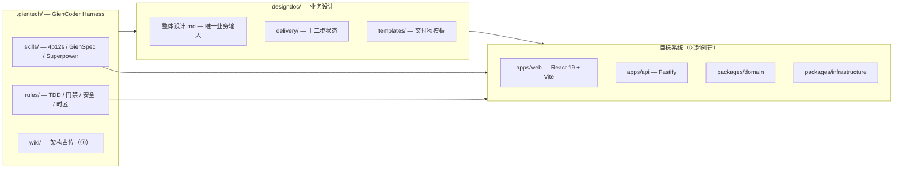

# 架构总览

**本文档引用的文件**
- [整体设计.md](../../designdoc/整体设计.md)
- [项目概述.md](./项目概述.md)
- [.gientech/README.md](../../.gientech/README.md)

## 系统概览

本仓库为 **GienCoder 4p12s Harness** 的 `replay/4p12s-from-design` 分支。

**当前状态**（① 完成后）：
- 业务输入：[`designdoc/整体设计.md`](../../designdoc/整体设计.md)
- 交付追踪：[`designdoc/delivery/delivery-state.md`](../../designdoc/delivery/delivery-state.md)
- Harness： [`.gientech/skills/`](../../.gientech/skills/)、[`.gientech/rules/`](../../.gientech/rules/)
- **无** `apps/`、`packages/`（⑧ 起创建）

## 顶层架构图

## 模块边界

1. UI → 仅调 API（不直连 DB）
2. API / Application → Domain + Infrastructure
3. Domain → 无外部依赖
4. Infrastructure → Repository，封装 Drizzle

来源：[整体设计.md §2.2](../../designdoc/整体设计.md)

## 真相源优先级

代码 > designdoc > AGENTS / rules / skills > Wiki
