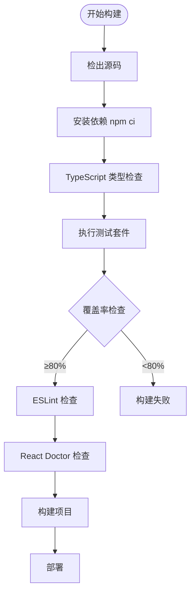
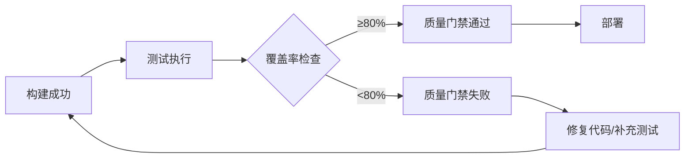

# 测试策略文档

**本文档中引用的文件**
- [README.md](../../README.md)
- [package.json](../../package.json)
- [apps/web/package.json](../../apps/web/package.json)
- [apps/api/package.json](../../apps/api/package.json)
- [AGENTS.md](../../AGENTS.md)
- [设计文档](../../designdoc/specs/design.md)
- [skills/tdd.md](../../skills/tdd.md)

## 目录
1. [项目概述](#项目概述)
2. [测试架构概览](#测试架构概览)
3. [测试框架与工具](#测试框架与工具)
4. [测试代码组织结构](#测试代码组织结构)
5. [测试类型与策略](#测试类型与策略)
6. [测试最佳实践](#测试最佳实践)
7. [持续集成与测试流程](#持续集成与测试流程)
8. [测试覆盖率与质量保证](#测试覆盖率与质量保证)
9. [故障排除指南](#故障排除指南)
10. [总结](#总结)

## 项目概述

本项目是一个 **勤怠・タスク管理** 后台系统，采用 **React 19 + TypeScript + Vite + Fastify + PostgreSQL** 技术栈构建，具有完整的测试策略体系。项目使用 **Vitest** 作为统一测试框架，配合 **Testing Library** 进行组件测试，采用 **TDD（测试驱动开发）** 实践，确保系统的稳定性和可靠性。

项目核心特性：
- 用户认证功能（登录/登出）
- 任务管理（创建、查看、更新、删除）
- 打卡记录管理与时区转换（UTC 存储，Asia/Tokyo 展示）

测试策略目标：
- 单元测试覆盖率 ≥ 80%
- TypeScript strict 模式全覆盖
- 所有表单必填校验
- React Doctor 检查通过

来源：[README.md](../../README.md)、[AGENTS.md](../../AGENTS.md)

## 测试架构概览

```mermaid
graph TB
subgraph "测试环境"
TestEnv[测试环境配置]
TestDB[(测试数据库)]
TestRedis[(测试 Redis)]
TestConfig[测试配置文件]
end
subgraph "测试框架"
Vitest[[Vitest 1.0.0]]
TestingLib[Testing Library]
JSDOM[jsdom 23.0.0]
VitePlugin[@vitejs/plugin-react]
end
subgraph "测试类型"
UnitTest[单元测试]
ComponentTest[组件测试]
IntegrationTest[集成测试]
APITest[API 测试]
end
subgraph "测试工具"
Zod[Zod 验证]
Mock[Vi.fn() Mock]
Coverage[覆盖率报告]
end
TestEnv --> Vitest
TestDB --> IntegrationTest
TestConfig --> Vitest
Vitest --> UnitTest
TestingLib --> ComponentTest
VitePlugin --> ComponentTest
JSDOM --> ComponentTest
Zod --> UnitTest
Mock --> UnitTest
Vitest --> Coverage
```

**图表来源**
- [README.md](../../README.md)
- [apps/web/package.json](../../apps/web/package.json)
- [apps/api/package.json](../../apps/api/package.json)
- [设计文档](../../designdoc/specs/design.md)

## 测试框架与工具

### 核心测试框架

项目使用以下核心测试框架：

1. **Vitest 1.0.0**: 主要的单元测试框架，基于 Vite，提供极速的测试启动和执行速度
2. **Testing Library (@testing-library/react 14.1.0)**: React 组件测试工具，鼓励以用户视角编写测试
3. **jsdom 23.0.0**: 用于模拟浏览器环境，支持前端组件测试
4. **@vitejs/plugin-react 4.2.0**: Vite React 插件，支持 JSX/TSX 测试文件

### 特殊测试工具

#### Vitest 特性

Vitest 作为现代测试框架，提供以下核心功能：

```typescript
// 基本测试结构
import { describe, it, expect, beforeEach, vi } from 'vitest';

describe('测试套件', () => {
  beforeEach(() => {
    // 每个测试前的准备工作
  });

  it('测试用例描述', () => {
    expect(实际值).toBe(期望值);
  });

  it('异步测试', async () => {
    const result = await 异步函数 ();
    expect(result).toBeDefined();
  });

  it('Mock 函数测试', () => {
    const mockFn = vi.fn().mockReturnValue('mocked');
    expect(mockFn()).toBe('mocked');
  });
});
```

**Mock 与 Spy 功能**

```typescript
// Mock 外部依赖
vi.mock('../infrastructure/database', () => ({
  db: {
    insert: vi.fn().mockResolvedValue({ id: '123' }),
    select: vi.fn().mockResolvedValue([]),
  },
}));

// Spy 方法调用
const spy = vi.spyOn(object, 'methodName');
// 执行操作
expect(spy).toHaveBeenCalledWith(expect.any(String));
spy.mockRestore();
```

**章节来源**
- [apps/web/package.json](../../apps/web/package.json)
- [apps/api/package.json](../../apps/api/package.json)
- [skills/tdd.md](../../skills/tdd.md)

## 测试代码组织结构

### 目录结构

根据项目分层架构，测试文件组织如下：

```
apps/
├── web/
│   └── src/
│       ├── components/
│       │   ├── LoginForm.tsx
│       │   └── LoginForm.test.tsx
│       ├── pages/
│       │   ├── TasksPage.tsx
│       │   └── TasksPage.test.tsx
│       └── hooks/
│           ├── useAuth.ts
│           └── useAuth.test.ts
└── api/
    └── src/
        ├── routes/
        │   ├── tasks.ts
        │   └── tasks.test.ts
        └── services/
            ├── task.service.ts
            └── task.service.test.ts

packages/
├── domain/
│   └── entities/
│       ├── task.ts
│       └── task.test.ts
├── application/
│   └── services/
│       ├── auth.service.ts
│       └── auth.service.test.ts
└── infrastructure/
    └── repositories/
        ├── task.repository.ts
        └── task.repository.test.ts
```

### 测试文件命名规范

- **测试文件后缀**: `.test.ts` 或 `.test.tsx`
- **测试文件位置**: 与被测试文件同目录
- **测试套件命名**: `describe('ClassName', () => {})`
- **测试用例命名**: `it('场景描述_条件_预期结果', () => {})`

### 测试基类设计

前端组件测试基础模式：

```typescript
import { render, screen, fireEvent } from '@testing-library/react';
import { describe, it, expect, vi } from 'vitest';

describe('ComponentName', () => {
  it('渲染正常', () => {
    render(<ComponentName />);
    expect(screen.getByText(/文本/i)).toBeInTheDocument();
  });

  it('用户交互测试', async () => {
    const mockSubmit = vi.fn();
    render(<ComponentName onSubmit={mockSubmit} />);
    
    fireEvent.click(screen.getByRole('button'));
    
    await vi.waitFor(() => {
      expect(mockSubmit).toHaveBeenCalled();
    });
  });
});
```

**图表来源**
- [设计文档](../../designdoc/specs/design.md)
- [skills/tdd.md](../../skills/tdd.md)

## 测试类型与策略

### 单元测试

单元测试专注于测试单个组件或方法的行为，使用 Vitest 的 Mock 功能进行依赖隔离。

#### 测试特点：
- 使用 `vi.fn()` 进行依赖模拟
- 测试独立性高
- 快速执行（毫秒级）
- 覆盖核心业务逻辑
- **本项目占比：70%**

#### 示例：领域层单元测试

```typescript
// packages/domain/user.test.ts
import { describe, it, expect } from 'vitest';
import { User } from './user';

describe('User', () => {
  it('创建用户时邮箱格式必须有效', () => {
    expect(() => User.create({ email: 'invalid', password: 'pass123' }))
      .toThrow('邮箱格式无效');
  });

  it('创建用户时密码长度至少 6 位', () => {
    expect(() => User.create({ email: 'test@example.com', password: '12345' }))
      .toThrow('密码长度至少 6 位');
  });

  it('成功创建用户', () => {
    const user = User.create({ email: 'test@example.com', password: 'pass123' });
    expect(user.email).toBe('test@example.com');
    expect(user.id).toBeDefined();
  });
});
```

### 组件测试

前端 React 组件测试，使用 Testing Library 以用户视角验证组件行为。

#### 测试特点：
- 使用 `@testing-library/react` 渲染组件
- 模拟用户交互（点击、输入等）
- 验证 DOM 更新和状态变化
- 使用 jsdom 模拟浏览器环境

#### 示例：LoginForm 组件测试

```typescript
// apps/web/components/LoginForm.test.tsx
import { describe, it, expect, vi } from 'vitest';
import { render, screen, fireEvent, waitFor } from '@testing-library/react';
import { LoginForm } from './LoginForm';

describe('LoginForm', () => {
  it('显示必填校验错误', async () => {
    render(<LoginForm onSubmit={() => {}} />);
    
    const submitButton = screen.getByRole('button', { name: /登录/i });
    fireEvent.click(submitButton);
    
    expect(await screen.findByText(/邮箱为必填项/i)).toBeInTheDocument();
    expect(await screen.findByText(/密码为必填项/i)).toBeInTheDocument();
  });

  it('邮箱格式校验错误', async () => {
    render(<LoginForm onSubmit={() => {}} />);
    
    fireEvent.change(screen.getByLabelText(/邮箱/i), {
      target: { value: 'invalid' },
    });
    fireEvent.change(screen.getByLabelText(/密码/i), {
      target: { value: 'pass123' },
    });
    
    fireEvent.click(screen.getByRole('button', { name: /登录/i }));
    
    expect(await screen.findByText(/邮箱格式无效/i)).toBeInTheDocument();
  });

  it('提交成功调用 onSubmit', async () => {
    const mockSubmit = vi.fn();
    render(<LoginForm onSubmit={mockSubmit} />);
    
    fireEvent.change(screen.getByLabelText(/邮箱/i), {
      target: { value: 'test@example.com' },
    });
    fireEvent.change(screen.getByLabelText(/密码/i), {
      target: { value: 'pass123' },
    });
    
    fireEvent.click(screen.getByRole('button', { name: /登录/i }));
    
    await waitFor(() => {
      expect(mockSubmit).toHaveBeenCalledWith({
        email: 'test@example.com',
        password: 'pass123',
      });
    });
  });
});
```

### API 测试

后端 API 路由测试，使用 Fastify 的 `inject` 方法进行 HTTP 请求模拟。

#### 测试特点：
- 端到端测试 API 端点
- 包含认证和授权验证
- 模拟真实用户场景
- 使用 Zod 验证请求/响应格式

#### 示例：任务 API 测试

```typescript
// apps/api/routes/tasks.test.ts
import { describe, it, expect, beforeEach } from 'vitest';
import { buildServer } from '../test-utils';

describe('POST /api/tasks', () => {
  let server: Awaited<ReturnType<typeof buildServer>>;

  beforeEach(async () => {
    server = await buildServer();
  });

  it('创建任务成功', async () => {
    const res = await server.inject({
      method: 'POST',
      url: '/api/tasks',
      payload: { title: '测试任务', dueDate: '2025-01-15' },
    });
    expect(res.statusCode).toBe(201);
    const body = res.json();
    expect(body.title).toBe('测试任务');
  });

  it('标题为必填项', async () => {
    const res = await server.inject({
      method: 'POST',
      url: '/api/tasks',
      payload: {},
    });
    expect(res.statusCode).toBe(400);
  });
});
```

### 集成测试

集成测试验证多个组件之间的交互，使用真实数据库连接。

#### 测试特点：
- 使用真实数据库连接（测试数据库）
- 包含外部服务调用
- 测试完整业务流程
- 使用 Drizzle ORM 进行数据操作

#### 示例：任务服务集成测试

```typescript
// packages/application/services/task.service.test.ts
import { describe, it, expect, beforeEach } from 'vitest';
import { TaskService } from './task.service';
import { TaskRepository } from '../../infrastructure/repositories/task.repository';

describe('TaskService', () => {
  let taskService: TaskService;
  let taskRepository: TaskRepository;

  beforeEach(() => {
    taskRepository = new TaskRepository();
    taskService = new TaskService(taskRepository);
  });

  it('创建任务并查询', async () => {
    const task = await taskService.create({
      title: '测试任务',
      description: '测试描述',
      dueDate: '2025-01-15',
    });

    const found = await taskService.findById(task.id);
    expect(found.title).toBe('测试任务');
  });
});
```

**章节来源**
- [skills/tdd.md](../../skills/tdd.md)
- [设计文档](../../designdoc/specs/design.md)

## 测试最佳实践

### 1. 测试命名规范

- 使用描述性的测试方法名称
- 遵循"should[动作]_when[条件]"或中文"场景描述_条件_预期结果"格式
- 明确表达测试意图

```typescript
// ❌ 不好的命名
it('test1', () => {});
it('应该工作', () => {});

// ✅ 好的命名
it('邮箱格式无效时抛出错误', () => {});
it('用户创建成功返回用户对象', () => {});
it('提交表单时必填项为空显示错误提示', () => {});
```

### 2. AAA 模式

```typescript
it('计算订单总价', () => {
  // Arrange - 准备数据
  const order = new Order();
  order.addItem({ price: 100, quantity: 2 });
  order.addItem({ price: 50, quantity: 3 });

  // Act - 执行操作
  const total = order.calculateTotal();

  // Assert - 断言结果
  expect(total).toBe(350);
});
```

### 3. 测试隔离

```typescript
// ❌ 测试间有依赖
let user: User;
beforeEach(() => {
  user = User.create({...}); // 前一个测试影响后一个
});

// ✅ 每个测试独立
it('测试场景 A', () => {
  const user = User.create({...});
  // ...
});

it('测试场景 B', () => {
  const user = User.create({...});
  // ...
});
```

### 4. Mock 策略

- 合理使用 Mock 减少外部依赖
- 模拟真实行为而非简单返回
- 验证交互而非仅仅验证结果

```typescript
// Mock 数据库
vi.mock('../infrastructure/database', () => ({
  db: {
    insert: vi.fn().mockResolvedValue({ id: '123' }),
    select: vi.fn().mockResolvedValue([]),
  },
}));

// Mock API 调用
global.fetch = vi.fn().mockResolvedValue({
  json: () => Promise.resolve({ data: [] }),
});
```

### 5. 断言最佳实践

```typescript
// 使用 Vitest 匹配器提高可读性
expect(result).toBe(expectedValue);
expect(array).toContain(item);
expect(object).toHaveProperty('key');

// 组合断言验证多个条件
expect(user.email).toBe('test@example.com');
expect(user.isActive).toBe(true);

// 异步断言
await vi.waitFor(() => {
  expect(mockFn).toHaveBeenCalled();
});
```

### 6. 边界条件测试

```typescript
describe('密码校验', () => {
  it('密码长度为 5 时报错', () => {
    expect(() => User.create({ email: 'test@example.com', password: '12345' }))
      .toThrow();
  });

  it('密码长度为 6 时通过', () => {
    expect(() => User.create({ email: 'test@example.com', password: '123456' }))
      .not.toThrow();
  });

  it('密码长度为 100 时通过', () => {
    expect(() => User.create({ email: 'test@example.com', password: 'a'.repeat(100) }))
      .not.toThrow();
  });
});
```

## 持续集成与测试流程

### CI/CD 管道配置



**图表来源**
- [AGENTS.md](../../AGENTS.md)
- [package.json](../../package.json)

### 测试执行配置

项目使用 npm scripts 进行测试管理，配置如下：

```json
{
  "scripts": {
    "test": "npm run test -w apps/web && npm run test -w apps/api",
    "test:watch": "npm run test:watch -w apps/web & npm run test:watch -w apps/api",
    "typecheck": "npm run typecheck -w apps/web && npm run typecheck -w apps/api",
    "lint": "npm run lint -w apps/web && npm run lint -w apps/api",
    "doctor": "npm run doctor -w apps/web"
  }
}
```

### 测试报告发布

CI 系统自动发布以下测试报告：
- Vitest 测试执行报告
- 代码覆盖率报告（HTML/Text）
- ESLint 代码质量报告
- React Doctor 组件检查报告
- TypeScript 类型检查报告

### GitHub Actions 示例

```yaml
name: CI
on: [push, pull_request]
jobs:
  test:
    runs-on: ubuntu-latest
    steps:
      - uses: actions/checkout@v4
      - uses: actions/setup-node@v4
        with:
          node-version: 20
      - run: npm ci
      - run: npm run typecheck
      - run: npm run test -- --coverage
      - run: npm run doctor
      - run: npm run lint
```

**章节来源**
- [package.json](../../package.json)
- [AGENTS.md](../../AGENTS.md)

## 测试覆盖率与质量保证

### 覆盖率要求

项目使用 Vitest 内置覆盖率功能进行代码覆盖率分析，确保：
- 语句覆盖率 ≥ 80%
- 分支覆盖率 ≥ 80%
- 函数覆盖率 ≥ 80%
- 行覆盖率 ≥ 80%
- 关键业务逻辑全覆盖
- 集成测试覆盖主要流程

### 生成覆盖率报告

```bash
# 生成覆盖率报告
npm run test -- --coverage

# 查看 HTML 报告
open coverage/index.html
```

### 质量门禁



### 代码质量工具

- **ESLint**: TypeScript/React 代码风格检查
- **Prettier**: 代码格式化统一
- **TypeScript strict**: 严格类型检查
- **React Doctor**: React 组件规范检查
- **Vitest**: 测试执行与覆盖率统计

**章节来源**
- [AGENTS.md](../../AGENTS.md)
- [README.md](../../README.md)

## 故障排除指南

### 常见测试问题

#### 1. 测试数据库连接失败
**症状**: 集成测试执行时数据库连接超时  
**解决方案**:
- 检查测试环境数据库配置
- 确保测试数据库服务正常运行
- 验证网络连接和防火墙设置
- 使用 Mock 替代真实数据库连接

#### 2. Mock 行为不正确
**症状**: 测试中 Mock 对象返回意外结果  
**解决方案**:
- 检查 `vi.fn()` 配置是否正确
- 验证参数匹配器是否准确
- 确保 Mock 对象生命周期管理
- 使用 `vi.clearAllMocks()` 清理 Mock 状态

#### 3. 组件测试渲染错误
**症状**: Testing Library 无法找到元素  
**解决方案**:
- 使用 `screen.debug()` 查看 DOM 结构
- 确认异步操作使用 `waitFor` 或 `findBy`
- 检查组件是否正确处理加载状态
- 验证 jsdom 环境配置

#### 4. 测试执行超时
**症状**: 异步测试超时失败  
**解决方案**:
- 增加 `vi.setConfig({ testTimeout: 10000 })`
- 检查异步操作是否正确 await
- 使用 `vi.useFakeTimers()` 控制时间

### 调试技巧

1. **运行单个测试文件**:
```bash
npm run test -- path/to/test.test.ts
```

2. **运行匹配名称的测试**:
```bash
npm run test -- -t "邮箱格式"
```

3. **监视模式**:
```bash
npm run test:watch
```

4. **使用 console.log 调试**:
```typescript
it('调试测试', () => {
  console.log('调试信息:', value);
  expect(value).toBe(expected);
});
```

5. **检查测试隔离**:
```typescript
beforeEach(() => {
  vi.clearAllMocks();
});

afterEach(() => {
  vi.restoreAllMocks();
});
```

### 性能优化

- **并行执行**: Vitest 默认并行执行测试文件
- **测试缓存**: 使用 `--cache` 选项加速重复测试
- **排除 node_modules**: 确保测试不包含依赖包
- **使用监视模式**: 开发时使用 `test:watch` 快速反馈

## 总结

本项目建立了完善的测试策略体系，涵盖了从单元测试到集成测试的全方位测试覆盖。通过合理的测试架构设计、现代化的测试工具选择和严格的 CI/CD 流程，确保了系统的高质量交付。

### 关键优势

1. **全面的测试覆盖**: 涵盖所有核心业务模块（用户认证、任务管理、打卡记录）
2. **极速的测试执行**: 使用 Vitest + Vite，测试启动速度快，支持 HMR
3. **类型安全保障**: TypeScript strict 模式，编译时类型检查
4. **自动化 CI/CD 流程**: 实现测试的自动化执行和报告发布
5. **严格的质量保证**: 多层次的质量检查（ESLint、Prettier、React Doctor、覆盖率 80%+）
6. **TDD 实践**: 先写测试后实现，确保代码质量

### 技术栈总结

| 类别 | 工具 | 版本 |
|------|------|------|
| 测试框架 | Vitest | 1.0.0 |
| 组件测试 | Testing Library | 14.1.0 |
| 模拟环境 | jsdom | 23.0.0 |
| 代码质量 | ESLint | 8.55.0 |
| 代码格式化 | Prettier | 3.1.0 |
| 类型检查 | TypeScript | 5.3.0 |
| React 检查 | React Doctor | latest |

### 未来改进方向

1. **增加 E2E 测试**: 使用 Playwright 或 Cypress 扩展用户场景的完整测试覆盖
2. **性能测试集成**: 添加压力测试和性能基准测试
3. **测试自动化**: 进一步提升测试自动化的程度
4. **监控和告警**: 建立测试执行监控和异常告警机制
5. **视觉回归测试**: 引入 Percy 或 Chromatic 进行 UI 视觉对比

通过持续优化测试策略和工具，项目将继续保持高质量的软件交付能力，为业务发展提供可靠的技术保障。

**章节来源**
- [README.md](../../README.md)
- [AGENTS.md](../../AGENTS.md)
- [skills/tdd.md](../../skills/tdd.md)
