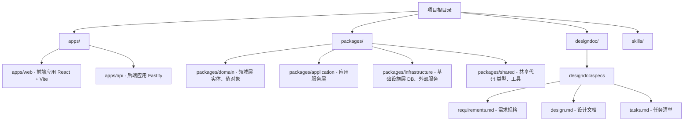
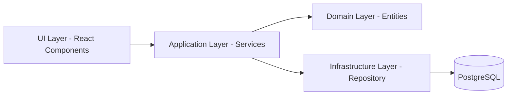

# 项目概述

**本文档引用的文件**
- [README.md](../../README.md)
- [package.json](../../package.json)
- [AGENTS.md](../../AGENTS.md)
- [需求规格](../../designdoc/specs/requirements.md)
- [设计文档](../../designdoc/specs/design.md)
- [任务清单](../../designdoc/specs/tasks.md)

## 目录
1. [简介](#简介)
2. [项目结构](#项目结构)
3. [核心组件](#核心组件)
4. [架构概述](#架构概述)
5. [详细组件分析](#详细组件分析)
6. [依赖分析](#依赖分析)
7. [性能考虑](#性能考虑)
8. [故障排除指南](#故障排除指南)
9. [结论](#结论)

## 简介

- **项目名称**: AI Harness - 勤怠・タスク管理
- **项目定位**: 一个日文界面的「勤怠・タスク管理」迷你后台系统，用于练习 AI Agent 在约束下的可靠交付能力
- **核心特性**:
  1. 用户认证功能（登录/登出）— 来源：[需求规格](../../designdoc/specs/requirements.md)
  2. 任务管理（创建、查看、更新、删除）— 来源：[需求规格](../../designdoc/specs/requirements.md)
  3. 打卡记录管理与时区转换（UTC 存储，Asia/Tokyo 展示）— 来源：[需求规格](../../designdoc/specs/requirements.md)
- **技术栈**:
  - 前端：React 19 + TypeScript + Vite + React Router + shadcn/ui
  - 表单：react-hook-form + zod
  - 后端：Node.js + TypeScript + Fastify
  - 数据库：PostgreSQL + Drizzle ORM
  - 测试：Vitest + Testing Library
  - 质量：ESLint + Prettier + React Doctor + TypeScript strict
  
  来源：[README.md](../../README.md)、[package.json](../../package.json)

## 项目结构

### 本节来源
- [README.md](../../README.md)
- [package.json](../../package.json)

## 核心组件

- **用户认证模块** — 负责用户登录、登出、身份验证。来源：[需求规格](../../designdoc/specs/requirements.md)、[设计文档](../../designdoc/specs/design.md)
- **任务管理模块** — 负责任务的 CRUD 操作、状态流转（todo/in_progress/done）。来源：[需求规格](../../designdoc/specs/requirements.md)、[设计文档](../../designdoc/specs/design.md)
- **打卡记录模块** — 负责打卡记录的创建、查询、按日统计，处理时区转换。来源：[需求规格](../../designdoc/specs/requirements.md)、[设计文档](../../designdoc/specs/design.md)

### 本节来源
- 控制器文件：[apps/api/](../../apps/api/)
- 服务文件：[packages/application/](../../packages/application/)
- 模型文件：[packages/domain/](../../packages/domain/)

## 架构概述

**分层说明**:

1. **UI Layer (React)**: Components、Pages、Forms（react-hook-form + zod 验证）、State Management
2. **Application Layer (Services)**: AuthService、TaskService、AttendanceService、事务管理、DTO 映射
3. **Domain Layer (Entities)**: User、Task、AttendanceRecord 实体与值对象，纯业务逻辑
4. **Infrastructure Layer (Repository)**: UserRepository、TaskRepository、AttendanceRepository（Drizzle ORM）、数据库连接

来源：[设计文档](../../designdoc/specs/design.md)

### 本节来源
- [设计文档](../../designdoc/specs/design.md)

## 详细组件分析

### 用户管理
- **职责**: 认证、用户资料管理、权限校验
- **领域模型**: User（id、email、passwordHash、name、isActive、createdAt、updatedAt）
- **API 端点**: POST /api/auth/login、POST /api/auth/logout

来源：[需求规格](../../designdoc/specs/requirements.md)、[设计文档](../../designdoc/specs/design.md)

### 任务管理
- **职责**: 任务的创建、查询、更新、删除，状态流转
- **领域模型**: Task（id、userId、title、description、status、dueDate、createdAt、updatedAt）
- **API 端点**: GET/POST/PATCH/DELETE /api/tasks

来源：[需求规格](../../designdoc/specs/requirements.md)、[设计文档](../../designdoc/specs/design.md)

### 打卡记录
- **职责**: 打卡记录的创建、查询、按日统计，时区处理
- **领域模型**: AttendanceRecord（id、userId、checkInTime、checkOutTime、workDate、createdAt）
- **API 端点**: GET /api/attendance、GET /api/attendance/statistics

来源：[需求规格](../../designdoc/specs/requirements.md)、[设计文档](../../designdoc/specs/design.md)

### 本节来源
- 领域模型文件：[packages/domain/](../../packages/domain/)
- 服务实现类：[packages/application/](../../packages/application/)

## 依赖分析

- **数据库**: PostgreSQL 15+（连接配置通过环境变量）— 来源：[README.md](../../README.md)
- **ORM**: Drizzle ORM（类型安全的 SQL 构建器）— 来源：[README.md](../../README.md)、[设计文档](../../designdoc/specs/design.md)
- **前端框架**: React 19 + TypeScript + Vite + React Router — 来源：[README.md](../../README.md)
- **UI 组件**: shadcn/ui — 来源：[README.md](../../README.md)
- **表单验证**: react-hook-form + zod — 来源：[README.md](../../README.md)
- **后端框架**: Fastify（Node.js + TypeScript）— 来源：[README.md](../../README.md)
- **测试框架**: Vitest + Testing Library — 来源：[README.md](../../README.md)
- **代码质量**: ESLint + Prettier + React Doctor + TypeScript strict — 来源：[README.md](../../README.md)

### 本节来源
- [README.md](../../README.md)
- [package.json](../../package.json)

## 性能考虑

- **数据库索引**: 
  - `tasks_user_id_status_idx` — 任务查询优化
  - `attendance_user_id_work_date_idx` — 打卡记录查询优化
- **避免 N+1 查询**: 使用 Drizzle ORM 批量查询
- **页面加载时间**: < 2 秒
- **API 响应时间**: < 500ms

来源：[设计文档](../../designdoc/specs/design.md)、[需求规格](../../designdoc/specs/requirements.md)

### 本节来源
- [设计文档](../../designdoc/specs/design.md)
- [需求规格](../../designdoc/specs/requirements.md)

## 故障排除指南

- **日志级别**: debug、info、warn、error
- **日志内容**: 请求日志（method、url、userId）、错误日志（errorCode，不记录敏感信息）
- **常见错误**:
  - `INVALID_CREDENTIALS` — 邮箱或密码错误
  - `VALIDATION_ERROR` — 输入验证失败
  - `NOT_FOUND` — 资源不存在
  - `INTERNAL_ERROR` — 服务器内部错误

来源：[设计文档](../../designdoc/specs/design.md)

### 本节来源
- [设计文档](../../designdoc/specs/design.md)
- [README.md](../../README.md)

## 结论

- **架构特点**: 采用清晰的分层架构（UI → Application → Domain → Infrastructure），模块边界明确，依赖规则严格
- **技术选型**: 基于 TypeScript 全栈开发，使用现代化工具链（React 19、Fastify、Drizzle ORM），强调类型安全与开发体验
- **质量保障**: TDD 实践、单元测试覆盖率 80%+、多重质量检查（ESLint、Prettier、React Doctor、TypeScript strict）
- **业务价值**: 实现一个完整的日文界面勤务任务管理系统，涵盖用户认证、任务管理、打卡记录三大核心功能，同时作为 AI Agent 可靠交付的练习项目

来源：[README.md](../../README.md)、[AGENTS.md](../../AGENTS.md)、[需求规格](../../designdoc/specs/requirements.md)、[设计文档](../../designdoc/specs/design.md)
