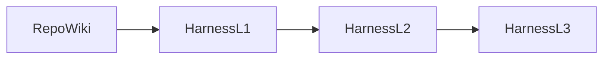

# Harness 实践案例：GienHarness 勤怠・タスク管理

> **文档类型**：实践案例 / 对外分享素材
> **最近更新**：2026-07-21
> **案例主线**：**GienCoder 开发助手**（RepoWiki → Harness L1 → 4p12s Skills）
> **真相源**：`delivery-state.md`、`specs/`、`verification/`、`TASK-xxx.md`

## 元信息

| 项 | 内容 |
|----|------|
| 案例名称 | GienHarness 勤怠・タスク管理 |
| 案例类型 | Harness 实践案例 |
| 当前阶段 | RepoWiki ✅ / Harness L1 ✅ / Harness L2-L3 📋 |
| 产品类型 | 日文后台系统（勤怠 + タスク管理） |
| 技术栈 | React 19 + TypeScript + Fastify + PostgreSQL + Drizzle |
| 交付方法 | 4p12s 主链路 + GienSpec 最小集 + Superpower 最小集 |

## 01 使用场景

本案例适用于这样一类研发场景：团队希望用 AI 辅助交付真实产品，但又不接受“只会写几段代码、不能稳定落盘、不能接测试门禁”的半成品结果。`GienHarness` 选用一个规模适中、边界明确的「勤怠・タスク管理」迷你后台系统，专门用来演示如何把口头需求、Wiki、规格、任务、测试和 API 逐步纳入 **GienCoder 4p12s** 的工程闭环。

对照 [`学习资料.md`](../../学习资料.md)，这个案例要解决的不是“AI 能不能写代码”，而是另外三个更实际的问题：一是需求容易口头化，AI 容易自由发挥；二是长流程里约束会遗忘，前后修改容易互相打架；三是即使代码能跑，也未必能对接仓库、测试和交付记录。这个案例的意义，就是用一条完整但可控的链路，证明 **RepoWiki + Harness + 4p12s Skills** 可以把这些问题显式化、文件化，并持续更新。

## 02 使用方法（GienCoder 开发助手）

### 2.1 使用入口

本案例中的“使用方法”，特指 **GienCoder 开发助手** 的使用，而不是 IDE 本身的操作。实际入口如下：

1. 打开 **GienCoder 开发助手**
2. 选择项目「**驾驭工程 Harness Engineering**」
3. 依次经过 `RepoWiki`、`Harness L1`、后续 `Harness L2/L3`
4. 在输入框中通过 `/` 调用对应 Skill

可参考当前分享截图中的阶段条：



### 2.2 环境与目录约定

根据 Harness L1 提示，本案例的关键约定是：

- `WIKI_DIR=.gientech/wiki/`
- 该路径是相对仓库根目录的 **HARD-GATE 校验目录**
- 执行 Skill 时要显式使用这个 Wiki 路径，而不是默认根目录

这意味着：案例不是“随便开一个对话开始写”，而是先让 GienCoder 明确知道 **Wiki 在哪里、真相源在哪里、之后所有交付物落到哪里**。

### 2.3 基本使用步骤

1. **RepoWiki 阶段**  
   先整理、生成、审查 `.gientech/wiki/`，把仓库导航、架构、API、数据模型、技能映射讲清楚。
2. **Harness L1 阶段**  
   通过如 `/harness-init-l1` 这样的初始化命令，对齐 Harness 护栏、状态表、规则和技能入口。
3. **4p12s 按步骤推进**  
   在输入框通过 `/` 调用具体 Skill，例如：
   - `/4p12s-delivery-orchestrator`
   - `/4p12s-requirements`
   - `/4p12s-prd`
   - `/4p12s-user-stories`
   - `/4p12s-implementation-execution`
4. **始终以文件为准，不以对话为准**  
   进度以 [`delivery-state.md`](./delivery-state.md)、[`tasks.md`](../specs/tasks.md)、各个 `TASK-xxx.md` 为准。

### 2.4 GienCoder 中 Skills 的实际映射

| 4p12s 步骤 | 在 GienCoder 中调用 | 仓库产出 |
|-----------|---------------------|----------|
| ① | `4p12s-delivery-orchestrator` | `delivery-state.md` |
| ② | `4p12s-requirements` | `requirements-register.md` |
| ③ | `4p12s-prd` | `prd.md` |
| ④ | `4p12s-user-stories` | `user-stories.md` |
| ⑤ | `4p12s-technical-design` | `design.md` |
| ⑥ | `4p12s-verification-plan` | `verification-plan.md` |
| ⑦ | `4p12s-implementation-tasks` | `tasks.md` + `TASK-xxx.md` |
| ⑧ | `4p12s-implementation-execution` | 代码 + 测试证据 |
| ⑨～⑫ | 集成 / E2E / Git / 部署相关 Skills | 验证与交付记录 |

### 2.5 使用时的真实注意点

- GienCoder 界面中模型接口可能偶发报错或重试，这不是理论问题，而是本案例中真实遇到过的操作风险。
- 因此每次推进都必须落到文件，否则会出现“对话断了、进度也断了”的问题。
- 本案例强调的不是一次性生成所有内容，而是 **按阶段、小步、可验证地推进**。

## 03 操作过程（GienCoder 时间线）

### 3.1 RepoWiki 阶段

第一阶段不是直接写功能，而是围绕 `.gientech/wiki/` 做 RepoWiki 审查和重构。实践过程中完成了：

- 24 篇基础 Wiki 的全量核对
- 3 篇补充页新增
- Wiki 状态统一改为 `✅ / 🟡 / 📋 / 🔮`
- 审查过程沉淀到 [`wiki-audit-status.md`](./wiki-audit-status.md)

这一阶段的意义，是先让 GienCoder 有一个 **可信、可导航、与仓库一致** 的知识入口，而不是拿着一堆过期说明直接开工。

### 3.2 Harness L1 阶段

在 Harness L1 中，重点不是功能开发，而是对齐工程护栏：

- 明确 `WIKI_DIR=.gientech/wiki/`
- 对齐 `AGENTS.md`
- 建立/刷新 [`delivery-state.md`](./delivery-state.md)
- 对齐 `skills/`、`.cursor/rules/`、`designdoc/`

对应结果是 [`harness-alignment-status.md`](./harness-alignment-status.md) 已闭环到 Phase 4，说明 4p12s、GienSpec、Superpower 的最小集已经在仓库内可用。

### 3.3 4p12s ②～⑥：规格先行

在 GienCoder 中按 4p12s 步骤继续推进：

1. ② 业务需求确认
2. ③ 生成 PRD
3. ④ 用户故事
4. ⑤ 技术设计
5. ⑥ 验证计划

这一段最关键的案例成果，是把“打刻范围”提前裁定为：

- **只读**
- 数据来自 seed
- **本期不做** `POST /api/attendance`

这类范围裁定如果放到后期编码才处理，通常会带来大返工；而在 Harness 链路里，它被提前固定进了 `requirements`、`PRD`、`user-stories`、`design`、`verification-plan`。

### 3.4 4p12s ⑦⑧：TASK 驱动开发

在 GienCoder 中，开发不是直接“写一整套系统”，而是先用 ⑦ 把任务拆成 `TASK-xxx.md`，再用 ⑧ 执行。当前已经完成的链路如下：

```text
B102 Task 状态机
→ B201/B202 Schema + Supabase migrate
→ B206 seed
→ B101 User 实体
→ B203～B205 Repository
→ C201 登录 API
→ C202 登出 API
→ C301～C304 Task API
```

这条链说明：GienCoder 在案例里承担的是“按阶段、按任务推进”的角色，而不是一次性输出一堆不可追踪的代码。

### 3.5 当前阶段与后续

当前产品交付已推进到：

- 规格链（②～⑦）已完成
- ⑧ 执行开发进行中
- 已完成认证 API 与任务 CRUD API
- 下一步是 **C401/C402 打刻只读 API** 或前端对接

`Harness L2 / L3` 在本案例中还没有作为主线展开，因此会在案例内容里明确标注为 **后续阶段**，而不会伪装成已完成。

### 3.6 真实难点

为了让案例更可信，需要诚实记录操作中的难点：

1. **模型调用不稳定**  
   从截图可见，GienCoder 在 Harness L1 中出现过“大模型接口报错、5 秒后重试”的情况。  
   对策：缩小单次 Skill 范围，确保每轮都落盘到 `designdoc/`。

2. **长链路易失真**  
   如果没有 `delivery-state.md` 和 `TASK-xxx.md`，后续会很难知道当前到底推进到哪一步。  
   对策：每步结束必须回写状态和证据。

3. **“已完成”容易主观化**  
   只写代码不跑测试，很容易出现假完成。  
   对策：案例所有“达成结果”都绑定命令证据。

## 04 达成结果（可验证）

### 4.1 规格与流程成果

- [`requirements-register.md`](../specs/requirements-register.md)
- [`prd.md`](../specs/prd.md)
- [`user-stories.md`](../specs/user-stories.md)
- [`design.md`](../specs/design.md)
- [`verification-plan.md`](../verification/verification-plan.md)
- [`tasks.md`](../specs/tasks.md)
- 多个 `TASK-xxx.md` 证据文件

这说明 GienCoder 并没有停留在“生成几段代码”，而是完成了完整的规格与任务链落盘。

### 4.2 Wiki 与 Harness 对齐成果

- `.gientech/wiki/` 已完成全量审查
- [`wiki-audit-status.md`](./wiki-audit-status.md) 可追溯每个 Step
- [`harness-alignment-status.md`](./harness-alignment-status.md) 显示 Harness 方法论最小集已闭环

### 4.3 代码与接口成果

| 层 | 已完成内容 | 证据 |
|----|------------|------|
| domain | User / Task 实体、任务状态机 | `npm run test -w @ai-harness/domain` |
| infrastructure | Schema、迁移、Repository、seed | `npm run test -w @ai-harness/infrastructure` / `npm run db:seed` |
| API | 登录、登出、任务 CRUD、打刻只读、JWT 鉴权 | `npm run test -w apps/api` |
| web | 登录页、任务页、打刻页、路由守卫 | `npm run test -w apps/web` |

### 4.4 当前测试证据

截至当前案例快照，可直接验证的命令包括：

```bash
npm run test -w @ai-harness/domain
npm run test -w @ai-harness/infrastructure
npm run test -w apps/api
npm run test:e2e -w apps/web
npm run test
npm run typecheck
npm run db:migrate
npm run db:seed
```

当前已知结果：

- domain：13 passed
- infrastructure：5 passed
- api：23 passed
- web：3 passed
- Playwright E2E：3 passed（smoke 2 + 截图采集 1）
- 全仓测试：44 passed

### 4.5 演示数据

用于本案例演示的测试账号为：

- 邮箱：`test@example.com`
- 密码：`password123`

仅用于测试环境和案例演示，不应作为生产环境默认账户。

### 4.6 明确未完成边界

为避免“案例包装过度”，当前仍未完成的内容应明确写出：

- ⑪ Git 提交推送记录 ✅（commit `d289087`、`3f489fd`）
- ⑫ 测试环境部署证据 ✅（见 `deploy-log.md`；本地 Artifact 等价部署 + DEPLOY_SMOKE E2E）
- E2E 主路径截图 ✅（见附录 B `designdoc/delivery/assets/e2e/`）

## 05 效率提升与价值收益

### 5.1 需求不失真

本案例里，“打刻只读 + seed 数据 + 本期不做打卡提交”在 ②～⑥ 阶段就完成了裁定。这样到了 ⑧ 编码阶段，开发边界非常清晰，避免出现“先做了 POST 打刻，后面又推翻”的返工。

### 5.2 质量门禁前置

任务状态机不是等前端联调时才发现问题，而是在：

- domain 单测
- Repository 层
- API 层状态流转测试
- 打刻只读 API 的 Tokyo 时区与日次统计测试

多层被提前验证。这比“只看页面是否能点通”更能体现 Harness 的控风险价值。

### 5.3 可续跑、可追溯

这个仓库已经多次跨会话推进，但只要读取：

- [`delivery-state.md`](./delivery-state.md)
- [`tasks.md`](../specs/tasks.md)
- 各个 `TASK-xxx.md`

就能知道当前状态、下一步和已有证据。对团队而言，这意味着推进不依赖单个会话上下文，也不依赖“谁还记得上次聊到哪”。

### 5.4 对接真实工具链

本案例没有停在“AI 生成代码”的层面，而是已经接上了：

- Supabase PostgreSQL
- Drizzle 迁移
- seed 数据
- 仓库测试命令
- 类型检查

这正对应了 `学习资料.md` 提到的关键点：AI 产出必须进入真实研发工具链，才有规模化价值。

### 5.5 对分享场景的价值

作为对外分享素材，这个案例的优势在于：

1. 有完整阶段链，而不是只有零散片段
2. 有真实截图与真实问题，而不是纯理论流程图
3. 有可运行仓库与测试证据，便于复用
4. 能同时解释“怎么用 GienCoder”和“为什么这样用更稳”

## 附录 A：里程碑快照

### 2026-07-21 | RepoWiki Step 0–8

- **GienCoder 操作**：先完成 RepoWiki 审查与重写，逐批推进 Step 0–8
- **交付物**：`.gientech/wiki/` 24 篇基础页 + 3 篇新增页
- **证据**：[`wiki-audit-status.md`](./wiki-audit-status.md)
- **案例要点**：先把知识入口校准，再进入 Harness 和产品开发

### 2026-07-21 | Harness L1 / 方法论对齐

- **GienCoder 操作**：使用 Harness L1 初始化链路，对齐 `WIKI_DIR`、skills、规则与状态表
- **交付物**：[`delivery-state.md`](./delivery-state.md)、[`harness-alignment-status.md`](./harness-alignment-status.md)
- **证据**：Harness Phase 0–4 已闭环
- **案例要点**：把“怎么推进”本身也工程化

### 2026-07-21 | 4p12s ②～⑥ 规格闭环

- **GienCoder 操作**：依次调用 requirements / prd / user-stories / technical-design / verification-plan
- **交付物**：`requirements-register.md`、`prd.md`、`user-stories.md`、`design.md`、`verification-plan.md`
- **证据**：[`delivery-state.md`](./delivery-state.md) 中 ②～⑥ 为 `done`
- **案例要点**：在编码前先定边界与验证方法

### 2026-07-21 | 4p12s ⑧ TASK-B102

- **GienCoder 操作**：`/4p12s-implementation-execution` + TDD 执行 Task 状态机
- **交付物**：`packages/domain/src/entities/task.ts`、`TASK-B102.md`
- **证据**：`npm run test -w @ai-harness/domain`
- **案例要点**：领域规则先在 domain 落地，再往 API 外扩

### 2026-07-21 | 4p12s ⑧ B201/B202/B206

- **GienCoder 操作**：按 TASK 推进 Drizzle schema、Supabase migrate 与 seed
- **交付物**：`packages/infrastructure/src/db/schema.ts`、`seed.ts`
- **证据**：`npm run db:migrate`、`npm run db:seed`
- **案例要点**：数据层进入真实数据库，而非停留在 Mock

### 2026-07-21 | 4p12s ⑧ B203～B205 Repository

- **GienCoder 操作**：围绕 Repository TASK 推进 CRUD 与统计实现
- **交付物**：`user.repository.ts`、`task.repository.ts`、`attendance.repository.ts`
- **证据**：`npm run test -w @ai-harness/infrastructure` → 5 passed
- **案例要点**：Repository 集成测试连真实 Supabase，提升可信度

### 2026-07-21 | 4p12s ⑧ C201/C202

- **GienCoder 操作**：实现登录/登出 API 与 JWT 校验链
- **交付物**：`apps/api/src/routes/auth.ts`、`apps/api/src/services/auth.service.ts`
- **证据**：`npm run test -w apps/api`
- **案例要点**：认证先闭环，再为后续受保护路由提供基础能力

### 2026-07-21 | 4p12s ⑧ C301～C304

- **GienCoder 操作**：实现 Task CRUD API 与 JWT 鉴权中间件
- **交付物**：`apps/api/src/routes/tasks.ts`、`apps/api/src/plugins/authenticate.ts`
- **证据**：`npm run test -w apps/api` → 19 passed
- **案例要点**：规格中的状态机与 API 错误码映射保持一致

### 2026-07-21 | 4p12s ⑧ C401/C402

- **GienCoder 操作**：围绕 seed 数据与 Tokyo 时区要求，实现打刻一覧与日次集計只读 API
- **交付物**：`apps/api/src/routes/attendance.ts`、`apps/api/src/services/attendance.service.ts`
- **证据**：`npm run test -w apps/api` → 23 passed；`npm run test` → 全仓 42 passed
- **案例要点**：设计中的 UTC 存储 / Tokyo 展示规则在 API 层被明确落地

### 2026-07-21 | 4p12s ⑧ Phase D 最小前端链路

- **GienCoder 操作**：在既有 API 基础上补登录、任务、打刻页面与基础路由守卫
- **交付物**：`apps/web/src/App.tsx`、`pages/LoginPage.tsx`、`pages/TasksPage.tsx`、`pages/AttendancePage.tsx`
- **证据**：`npm run test -w apps/web` → 3 passed；`npm run test` → 全仓 44 passed
- **案例要点**：GienCoder 案例不只停在后端接口，还能继续推进到可演示的前端最小闭环

### 2026-07-21 | 4p12s ⑨ 集成测试结果文档

- **GienCoder 操作**：基于 verification-plan 汇总真 DB、真 API、前端最小联动的集成验证结果
- **交付物**：`designdoc/verification/verification-result.md`
- **证据**：`npm run test -w apps/api`、`npm run test -w @ai-harness/infrastructure`、`npm run test -w apps/web`
- **案例要点**：明确区分“后端/数据层集成已通过”与“浏览器全链路留到⑩”，避免把单测或 stub 结果包装成完整集成通过

### 2026-07-21 | 4p12s ⑩ E2E 主路径

- **GienCoder 操作**：补齐 Playwright 真实全链路配置，使用专用端口拉起 Web 与 API，执行未登录重定向、登录、任务创建/状态流转、打刻一覧、登出主路径
- **交付物**：`apps/web/e2e/smoke.spec.ts`、`apps/web/playwright.config.ts`、`apps/web/playwright-report/`
- **证据**：`npm run test:e2e -w apps/web` → 2 passed
- **案例要点**：不是把“页面能打开”当 E2E，而是把真浏览器、真 API、真 DB 串起来，形成可交付门禁证据

### 2026-07-21 | 闭环后补全 · 构建修复 + E2E 截图

- **GienCoder 操作**：修复 workspace 生产 build；统一登录后默认进ダッシュボード；采集 E2E 主路径截图写入案例附录
- **交付物**：`packages/domain|infrastructure` dist 构建；`apps/web/e2e/capture-screenshots.spec.ts`；`designdoc/delivery/assets/e2e/*.png`
- **证据**：`npm run build` ✅；`npm run test` → 44 passed；`npm run test:e2e` → 3 passed
- **案例要点**：闭环后的 commit 仍须带测试证据；E2E 截图落盘到仓库相对路径，便于分享文档直接引用

## 附录 B：截图索引

| 截图 | 文件 | 用途 |
|------|------|------|
| GienCoder 分享入口示意 | `C:/Users/P0001219/.cursor/projects/e-IdeaProjects-GienHarness/assets/c__Users_P0001219_AppData_Roaming_Cursor_User_workspaceStorage_c0abae760270d0864030bb31ceb4140b_images_image-a063ce0d-a77c-4b71-85f4-c0f5b6909f7e.png` | 说明案例分享内容模板（使用场景 / 使用方法 / 操作过程 / 达成结果 / 价值收益） |
| Harness L1 操作截图 | `C:/Users/P0001219/.cursor/projects/e-IdeaProjects-GienHarness/assets/c__Users_P0001219_AppData_Roaming_Cursor_User_workspaceStorage_c0abae760270d0864030bb31ceb4140b_images_image-f6b3897d-e2c2-469d-b7b6-e865d7a787a9.png` | 说明 `WIKI_DIR`、`/harness-init-l1`、Harness 阶段条与真实报错重试场景 |
| E2E-01 ログイン | [`assets/e2e/01-login.png`](./assets/e2e/01-login.png) | 登录页（未认证访问保护路由前的入口） |
| E2E-02 ダッシュボード | [`assets/e2e/02-dashboard.png`](./assets/e2e/02-dashboard.png) | 登录后默认着陆页与侧边栏导航 |
| E2E-03 タスク一覧 | [`assets/e2e/03-tasks-list.png`](./assets/e2e/03-tasks-list.png) | 表格式任务管理一览 |
| E2E-04 タスク作成 | [`assets/e2e/04-task-created.png`](./assets/e2e/04-task-created.png) | 新規タスク创建后列表更新 |
| E2E-05 状態更新 | [`assets/e2e/05-task-done.png`](./assets/e2e/05-task-done.png) | 任务状态 todo → in_progress → done |
| E2E-06 打刻一覧 | [`assets/e2e/06-attendance.png`](./assets/e2e/06-attendance.png) | 打刻只读页与日次集計 |
| E2E-07 ログアウト | [`assets/e2e/07-logout.png`](./assets/e2e/07-logout.png) | 登出后回到登录页 |

## 后续维护约定

之后每完成一个 4p12s 步骤或一个 `TASK-xxx`，都应同步做三件事：

1. 更新 [`delivery-state.md`](./delivery-state.md)
2. 回写对应 `TASK-xxx.md` 证据
3. 追加本案例文档的“附录 A 快照”，必要时刷新第 04 节结果汇总

这样案例内容不会变成一次性总结，而会随着项目推进持续长出来。
