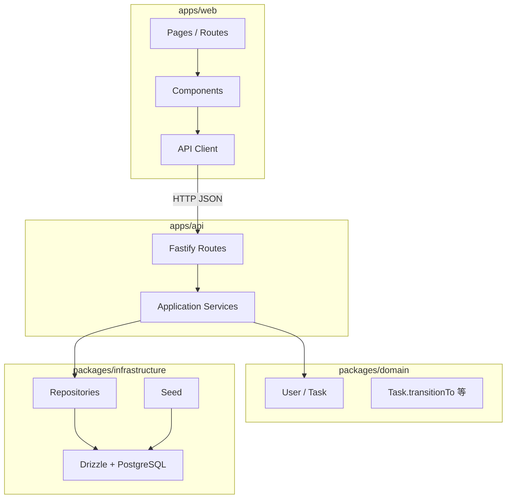
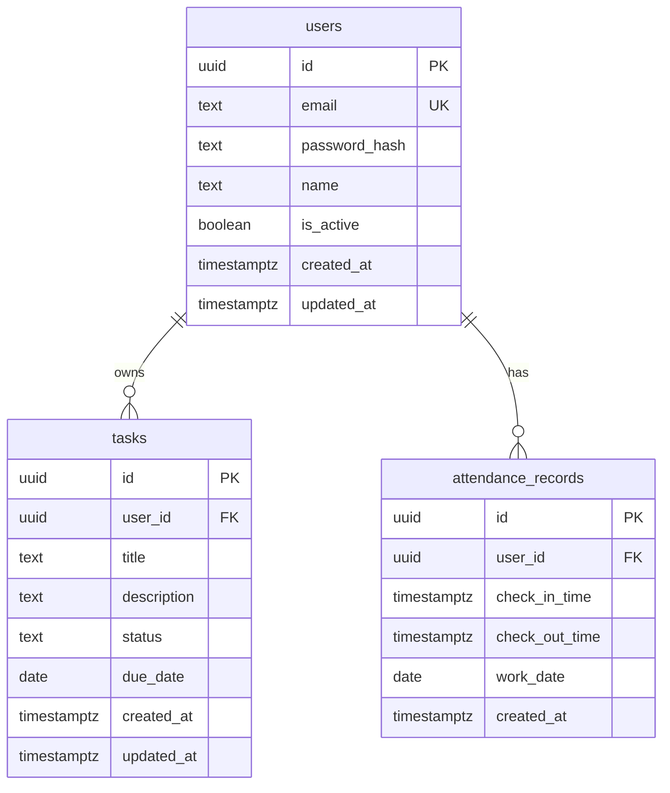

# 技术设计（design）

> Skill：`.gientech/skills/4p12s-technical-design.md`  
> 输入：[`user-stories.md`](./user-stories.md)、[`prd.md`](./prd.md) v0.1.0-replay、[`整体设计.md`](../整体设计.md)  
> 规则：`AGENTS.md`、`.gientech/rules/timezone.mdc`、`security.mdc`

## 元信息

| 项 | 值 |
|----|-----|
| **版本** | 0.1.0-replay |
| **登记日** | 2026-07-23 |
| **分支** | `replay/4p12s-from-design` |
| **状态** | 已确认（供 ⑥ 验证计划） |
| **技术栈** | 固定；禁止擅自更换（见 `整体设计.md` §2） |

---

## 1. 架构总览

### 1.1 分层与模块边界



| 层 | 允许依赖 | 禁止 |
|----|----------|------|
| UI（web） | API Client | 直连 DB、Domain 直接写库 |
| Application（api） | Domain、Infrastructure 接口 | UI 细节 |
| Domain | 无外部框架 | Drizzle、Fastify、React、fetch |
| Infrastructure | Drizzle、DB | 业务状态机规则（应由 Domain 执行） |

### 1.2 ⑧ 目标仓库结构

```
apps/web/                 # React 19 + Vite + React Router
apps/api/                 # Fastify + TypeScript
packages/domain/          # User / Task 纯领域
packages/infrastructure/  # Drizzle schema / Repository / seed
designdoc/                # 规格与 delivery
.gientech/                # skills / rules / wiki
```

---

## 2. 前端设计

### 2.1 路由

| 路径 | 页面 | 鉴权 | 故事 |
|------|------|------|------|
| `/login` | ログイン | 公开 | US-001 |
| `/dashboard` | ダッシュボード | 需登录 | US-001 着陆、F-004 |
| `/tasks` | タスク管理 | 需登录 | US-010～013 |
| `/attendance` | 打刻一覧 + 日次集計 | 需登录 | US-020、US-021 |
| `*` | 未匹配 → `/login` 或 404 简化页 | — | — |

**路由守卫**：无有效 JWT 时访问保护路由 → `Navigate` 至 `/login`（US-003 / AC-016）。

### 2.2 组件树（要点）

```
App
├── AuthProvider（token / user 状态）
├── LoginPage（react-hook-form + zod）
└── AppLayout（侧栏 + 顶栏）
    ├── Sidebar（ダッシュボード / タスク管理 / 打刻）
    ├── UserMenu（ログアウト）
    ├── DashboardPage
    ├── TasksPage
    │   ├── TaskTable
    │   ├── TaskFormModal（新規／編集）
    │   └── DeleteConfirmDialog
    └── AttendancePage
        ├── AttendanceTable
        └── DailyStatisticsTable
```

### 2.3 状态与数据流

| 状态 | 存放 | 说明 |
|------|------|------|
| JWT | `localStorage` 或 memory + 刷新策略 | ⑧ 实现时二选一并写 TASK；登出清除 |
| 当前用户 | AuthContext | login 响应写入 |
| タスク一覧 | 页面级 state / 简单 fetch | 变更后重新 GET |
| 打刻 | 页面级 state | 只读；无写操作 |

**数据流**：UI 事件 → API Client（`Authorization: Bearer <token>`）→ 解析 JSON → 更新 state → 日文错误提示。

### 2.4 表单与校验（日文）

| 表单 | 库 | 关键规则 |
|------|-----|----------|
| ログイン | RHF + zod | 邮箱格式；密码 ≥ 6（BR-001/002） |
| タスク | RHF + zod | タイトル必須（BR-003）；空标题前端阻止（AC-017） |

### 2.5 UI 文案要点（日文）

| 场景 | 文案 |
|------|------|
| 登录失败 | メールアドレスまたはパスワードが正しくありません |
| 任务空态 | タスクはありません |
| 打刻空态 | 打刻記録はありません |
| 非法状态 | 無効な状態遷移です |
| 削除确认 | 確認ダイアログ（确认／キャンセル） |

### 2.6 时间展示

- 使用共享工具，`timeZone: 'Asia/Tokyo'`
- 禁止用含糊 `new Date(string)` 解析无时区串（`timezone.mdc`）

---

## 3. 后端设计

### 3.1 模块职责

| 模块 | 职责 |
|------|------|
| `routes/auth` | login / logout |
| `routes/tasks` | CRUD；调用 Domain 状态机 |
| `routes/attendance` | 一覧 / 日次集計（只读） |
| `routes/health` | 存活探测 |
| `plugins/auth` | JWT 校验；注入 `userId` |
| Application | 编排 Repository + Domain |
| Domain | `Task.transitionTo`；标题非空 |
| Infrastructure | Drizzle schema、Repository、seed |

### 3.2 鉴权

| 项 | 设计 |
|----|------|
| 密码 | bcrypt，`SALT_ROUNDS=10`；禁止明文 |
| Token | JWT；密钥来自 `JWT_SECRET` 环境变量 |
| 请求头 | `Authorization: Bearer <token>` |
| 公开路径 | `GET /health`、`POST /api/auth/login` |
| 其他 `/api/*` | 无 token → **401** |
| 登出 | `POST /api/auth/logout`；可无状态（客户端删 token）；服务端可不维护黑名单（本期接受） |
| 登录失败 | 统一日文消息；不区分邮箱是否存在 |

### 3.3 错误模型

| HTTP | code（示例） | 日文 message | 场景 |
|------|--------------|--------------|------|
| 400 | `VALIDATION_ERROR` | フィールド固有／汎用校验文案 | 空标题、格式错误 |
| 400 | `INVALID_STATE_TRANSITION` | 無効な状態遷移です | BR-009 |
| 401 | `UNAUTHORIZED` | 認証が必要です | 无/无效 JWT |
| 404 | `NOT_FOUND` | 対象が見つかりません | 任务不存在或不属于当前用户 |
| 500 | `INTERNAL_ERROR` | サーバーエラーが発生しました | 未预期；生产不回堆栈 |

响应体约定：

```json
{
  "error": {
    "code": "INVALID_STATE_TRANSITION",
    "message": "無効な状態遷移です"
  }
}
```

成功写操作可返回实体 JSON；一覧返回数组或 `{ items: [] }`（⑧ 统一一种，TASK 写明）。

---

## 4. API 契约

### 4.1 一览

| 方法 | 路径 | 鉴权 | 说明 | 故事 |
|------|------|------|------|------|
| GET | `/health` | 否 | 健康检查 | US-030 |
| POST | `/api/auth/login` | 否 | 登录 → user + token | US-001 |
| POST | `/api/auth/logout` | 是* | 登出 | US-002 |
| GET | `/api/tasks` | 是 | 当前用户一覧，`created_at` 降序 | US-011 |
| POST | `/api/tasks` | 是 | 作成；默认 `todo` | US-010 |
| PATCH | `/api/tasks/:id` | 是 | 更新标题/说明/status | US-012* |
| DELETE | `/api/tasks/:id` | 是 | 削除 | US-013 |
| GET | `/api/attendance` | 是 | 一覧；query `startDate`/`endDate` 可选 | US-020 |
| GET | `/api/attendance/statistics` | 是 | 日次集計 | US-021 |

\* logout 鉴权可选；建议需登录以一致。

### 4.2 关键请求/响应

**POST `/api/auth/login`**

```json
// request
{ "email": "test@example.com", "password": "password123" }

// response 200
{
  "token": "<jwt>",
  "user": { "id": "...", "email": "...", "name": "テストユーザー" }
}
```

**POST `/api/tasks`**

```json
// request
{ "title": "報告書作成", "description": "任意", "dueDate": null }

// response 201
{
  "id": "...",
  "title": "報告書作成",
  "description": "任意",
  "status": "todo",
  "dueDate": null,
  "createdAt": "2026-07-23T10:00:00+09:00",
  "updatedAt": "2026-07-23T10:00:00+09:00"
}
```

**PATCH `/api/tasks/:id`**

```json
// request（字段均可选，但至少一个）
{ "status": "in_progress" }
// 或 { "title": "...", "description": "..." }
```

- `status` 变更必须经 `Task.transitionTo`
- `status === 'done'` 的任务：拒绝 status 与内容 PATCH → 400 `INVALID_STATE_TRANSITION` 或专用码（与 BR-009 一致）
- 禁止：`todo`→`done`；`done`→任意

**GET `/api/attendance/statistics`**

```json
// response 200
{
  "items": [
    {
      "workDate": "2026-07-21",
      "totalMinutes": 480,
      "checkInCount": 1
    }
  ]
}
```

### 4.3 时间格式

- API 输出：ISO 8601 **带 Tokyo 偏移**（如 `+09:00`）
- DB 存储：UTC（`timestamptz`）
- `work_date`：`date` 类型，语义为 Asia/Tokyo 日历日

---

## 5. 数据模型

### 5.1 ER



### 5.2 字段与约束

| 表 | 约束 / 说明 |
|----|-------------|
| users.email | UNIQUE；非空 |
| users.password_hash | bcrypt 哈希 |
| tasks.title | 非空 |
| tasks.status | `todo` \| `in_progress` \| `done`；默认 `todo` |
| tasks.user_id | FK → users；一覧按当前用户过滤 |
| attendance_records | 本期**无写 API**；仅 seed |

### 5.3 索引

| 表 | 索引 | 用途 |
|----|------|------|
| users | UNIQUE(email) | 登录查找 |
| tasks | INDEX(user_id) | 按用户一覧 |
| tasks | INDEX(user_id, status) | 可选过滤 |
| tasks | INDEX(user_id, created_at DESC) | 降序一覧 |
| attendance_records | INDEX(user_id, work_date) | 一覧与集計 |
| attendance_records | INDEX(user_id, check_in_time) | 区间查询 |

### 5.4 迁移与 Seed

- Drizzle migrations 管理 schema
- Seed：
  - 用户：`test@example.com` / `password123` / `テストユーザー`
  - 若干 `attendance_records`：覆盖同日、跨日（`work_date` = 出勤 Tokyo 日）

---

## 6. 领域规则与事务

### 6.1 タスク状态机（Domain）

```
todo ──→ in_progress ──→ done
  ↑            │
  └────────────┘
```

| 允许 | 禁止 |
|------|------|
| todo → in_progress | todo → done |
| in_progress → done | done → * |
| in_progress → todo | done 的内容 PATCH |

实现：`Task.transitionTo(next)`；非法抛领域错误 → Application 映射 400 `INVALID_STATE_TRANSITION`。

### 6.2 写路径事务

| 操作 | 事务边界 |
|------|----------|
| 创建任务 | 单行 INSERT；标题校验在 Domain/Application |
| PATCH 任务 | 读 → Domain 校验 → UPDATE；同事务 |
| DELETE 任务 | 校验归属后 DELETE |
| 登录 | 读用户 + bcrypt compare；无跨表写 |
| 打刻 | **无写路径**（BR-010） |

### 6.3 日次集計算法

1. 按 `user_id`（及可选日期范围）取 records
2. 对每条：`minutes = (check_out - check_in)`（UTC 差值）
3. 按 `work_date` 分组求和
4. 跨日记录仍归入出勤日 `work_date`（非退勤日）

---

## 7. 时区策略

| 层 | 规则 |
|----|------|
| DB | UTC `timestamptz` |
| 业务日 | Asia/Tokyo 日历日（`work_date`、due_date） |
| API | ISO 8601 带 `+09:00`（或文档约定后统一） |
| UI | `Intl` / 共享工具，`timeZone: 'Asia/Tokyo'` |

禁止：DB 存无时区本地时间；混用多展示时区。

---

## 8. 安全设计

| 项 | 措施 |
|----|------|
| 密码 | bcrypt；不明文；不入库密钥 |
| JWT | `JWT_SECRET` 环境变量；合理过期 |
| 输入 | zod / Domain 校验；Drizzle 参数化 |
| 授权 | 任务/打刻仅当前 `userId`；禁止越权 ID |
| XSS | React 默认转义；避免未消毒 HTML |
| 密钥 | `.env` 不提交；提供 `.env.example` |

---

## 9. 依赖与风险

| 依赖 | 说明 |
|------|------|
| PostgreSQL | 真实库；⑧ 配置 `DATABASE_URL` |
| Node 20+ | monorepo workspace |
| 环境变量 | `DATABASE_URL`、`JWT_SECRET`、`SALT_ROUNDS` |

| 风险 | 缓解 |
|------|------|
| JWT 登出无服务端黑名单 | 本期接受短过期 + 客户端删 token |
| 时区换算错误 | Domain/工具单测覆盖跨日 |
| 越权访问他人任务 | Repository 强制 `user_id` 条件；集成测覆盖 |
| 无脚手架 | ⑧ 前不编码；设计已锁定契约 |

---

## 10. 与用户故事映射

| 故事 | 设计落点 |
|------|----------|
| US-001～003 | Auth 路由、JWT、前端守卫、LoginPage |
| US-010～013 | tasks API、Task 实体、TasksPage、状态机 |
| US-020～021 | attendance 只读 API、集計、Tokyo 展示 |
| US-030 | `/health` |

---

## 11. 门禁结论

- [x] UI / Application / Domain / Infrastructure 边界清晰
- [x] 接口契约（路径、方法、请求/响应、错误码）完整
- [x] 数据模型与索引有说明
- [x] 鉴权与时区策略已写入
- [x] 服务依赖与风险已列
- [x] 未更改固定技术栈；UI 不直连 DB

**结论：通过** → 下一步：**⑥ 验证计划**（`.gientech/skills/4p12s-verification-plan.md`）
