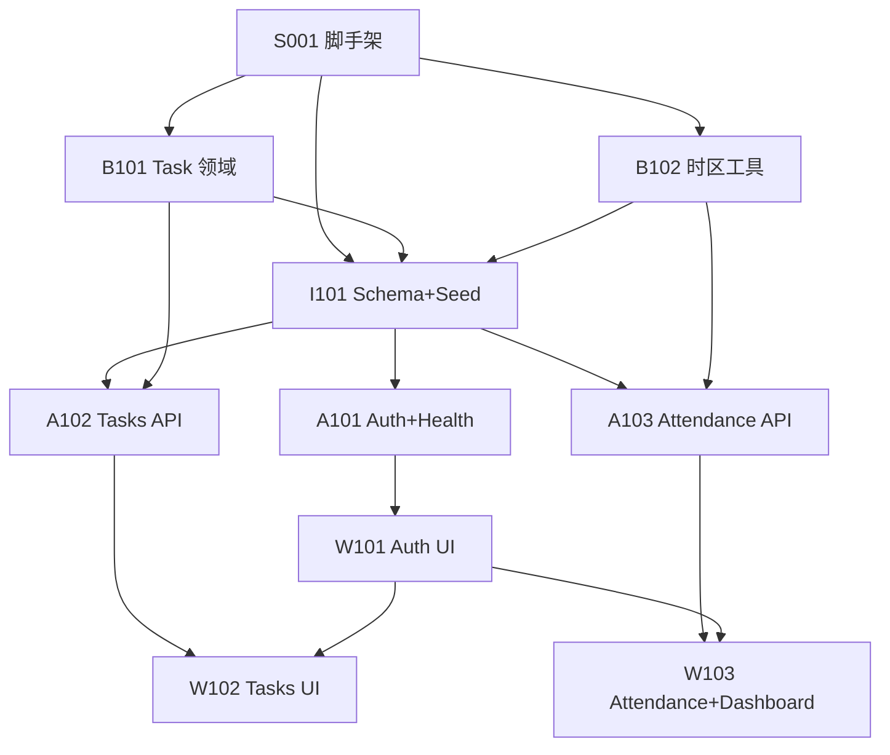

# 开发任务索引（tasks）

> Skill：`.gientech/skills/4p12s-implementation-tasks.md`  
> 输入：[`design.md`](./design.md) v0.1.0-replay、[`verification-plan.md`](../verification/verification-plan.md)、[`user-stories.md`](./user-stories.md)  
> 单任务目录：[`tasks/`](./tasks/)

## 元信息

| 项 | 值 |
|----|-----|
| **契约版本** | design.md `0.1.0-replay` |
| **验证计划** | verification-plan.md（V-001～026 / E2E-001～009） |
| **登记日** | 2026-07-23 |
| **状态** | 已确认（供 ⑧ 执行开发） |

## 依赖顺序（总览）

## 任务一览

| ID | 标题 | 依赖 | 对应 US / V | 可并行 | 状态 |
|----|------|------|-------------|--------|------|
| [TASK-S001](./tasks/TASK-S001.md) | Monorepo 脚手架与质量脚本 | — | 环境前提 | — | todo |
| [TASK-B101](./tasks/TASK-B101.md) | Task 领域实体与状态机 | S001 | US-012*；V-011～015 | 与 B102 | todo |
| [TASK-B102](./tasks/TASK-B102.md) | 时区与 work_date 工具 | S001 | V-022、V-025 | 与 B101 | todo |
| [TASK-I101](./tasks/TASK-I101.md) | Drizzle Schema / 迁移 / Seed | S001、B101、B102 | F-012；seed | — | todo |
| [TASK-A101](./tasks/TASK-A101.md) | Auth + Health API | I101 | US-001～003、030；V-001/003/006/023/026 | 与 A102/A103 部分 | todo |
| [TASK-A102](./tasks/TASK-A102.md) | Tasks REST API | I101、B101、A101* | US-010～013；V-007～016、024 | A101 JWT 插件宜先 | todo |
| [TASK-A103](./tasks/TASK-A103.md) | Attendance 只读 API | I101、B102、A101* | US-020～021；V-019～022 | 同上 | todo |
| [TASK-W101](./tasks/TASK-W101.md) | 登录 / 登出 / 路由守卫 UI | A101 | US-001～003；V-002/004/005 | — | todo |
| [TASK-W102](./tasks/TASK-W102.md) | タスク管理 UI | A102、W101 | US-010～013；V-008/010/017/018 | 与 W103 | todo |
| [TASK-W103](./tasks/TASK-W103.md) | 打刻 + ダッシュボード UI | A103、W101 | US-020～021、F-004；V-019/020 | 与 W102 | todo |

\* A102/A103 依赖 A101 的 JWT 鉴权插件（可先 stub 再合并，但验收前须真实 JWT）。

## ⑧ 执行建议顺序

1. S001 → B101 ∥ B102 → I101  
2. A101 → A102 ∥ A103  
3. W101 → W102 ∥ W103  
4. ⑧ 结束时：相关单元测试绿灯；集成/E2E 正式证据留 ⑨⑩

## 风险优先级

| 优先级 | 项 | 相关 TASK |
|--------|-----|-----------|
| P0 | 状态机被绕过 | B101、A102 |
| P0 | 鉴权/越权 | A101、A102、W101 |
| P0 | 时区跨日 | B102、A103、W103 |
| P1 | 空态文案 | W102、W103 |

## 门禁结论

- [x] 每个 TASK 可独立验证（含失败测试意图）
- [x] 依赖清晰、无环
- [x] 绑定 verification-plan V-* / E2E-*
- [x] 引用契约版本 `0.1.0-replay`
- [x] 无「整个模块一次做完」式过大任务

**结论：通过** → 下一步：**⑧ 执行开发**（`.gientech/skills/4p12s-implementation-execution.md`）
